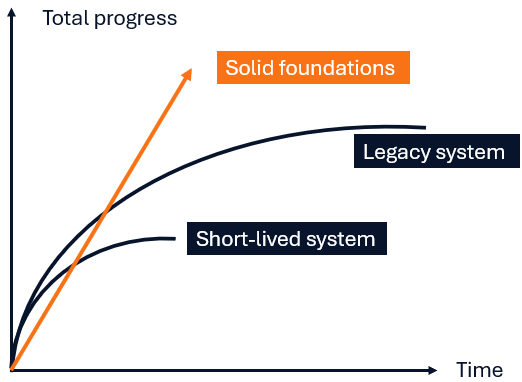

# Section 01 — Introduction

Operations research creates business value by helping organizations make better decisions. That value reaches the
business through **decision-support software**: software that runs repeatedly to turn data, mathematical models, and
business rules into recurring decisions. This book is about the engineering of decision-support systems, in particular,
what are the differences from traditional software, how can we tackle the software engineering problems that arise in
the intersection between operations research and software development.

---

## Decision-support software

Operations research turns data, business needs, and mathematics into a decision. Training and literature in the field
concentrate on the first half of that sentence: how to formulate a problem, and how to solve it. What happens to the
decision afterwards — who runs the model next month, on which machine, with whose data — gets far less attention.

Some example problems that require a decision recurrently are:

- Planning the annual extraction of resources from a mine.
- Building the monthly shift schedules of a retail store.
- Recovering the daily operation from a weather disruption in an airline.

These recurring decisions require software to be executed, and they can be classified as special type of software, a
[decision-support system](../appendix/glossary.md#decision-support-system). Because decision-support software runs
on a cadence rather than ending at a deliverable, it must be maintained, tested, deployed and evolved just as any other
important software.

---

## What goes wrong, and why

Decision-support software often has weak software engineering practices, especially in the components surrounding
the mathematical model. Some examples are:

- Usage of jupyter notebooks.
- Absence or lack of automated tests.
- Manual steps to deploy the application.

What are the consequences? the same consequences that happens in other software when unproper practices are used:

- Code works on one machine but is difficult to reproduce elsewhere.
- Systems are difficult for peers -and even for their original authors- to maintain or extend.
- Developers are afraid of modifying the system because the consequences are unpredictable.
- Applications eventually need to be rewritten rather than evolved.

Why do we introduce unproper practices in decision-support software? Following the framing by
[Kanewala & Bieman (2014)](https://doi.org/10.1016/j.infsof.2014.05.006) for scientific software: cultural and
technical reasons.

### Cultural reasons

Operations research scientists are trained deeply in mathematics, but rarely in software engineering, and
often do not see why the practices should apply to them. The consequence is visible in the literature.
[Ackoff (1979)](https://doi.org/10.1057/jors.1979.22) already observed operations research becoming identified with
its models rather than with implementing and maintaining them.
[Vidoni (2021)](https://doi.org/10.1080/01605682.2020.1865848) argues the field needs an "Operations Research
Engineering" practice of its own. [Vidoni & Cunico (2022)](https://doi.org/10.1007/s12532-022-00225-1) surveyed 168
modellers and found [technical debt](../appendix/glossary.md#technical-debt) in code and documentation to be
widespread — and, in most cases, introduced deliberately. The last finding is the one that matters for a manager: the
debt is not an accident of ignorance, it is a choice made under delivery pressure.

### Technical reasons

A decision-support system is a mixture of two disciplines (operations research and software engineering), and the
mixture raises new questions that are not obvious to answer. For example:

- How to automatically test an optimization model?
- How to design a decision-support system to be solver-agnostic?
- How should we design an experimentation platform to assess model changes?

### What is the cost

What does weak engineering cost, in practice? Short answer: business value.

Think of a system's total progress — features delivered, decisions
supported, questions the business can now ask — against time. John Ousterhout in the book "A Philosohpy of Software
Design" defines two approaches to develop software: strategic and tactical. Tactical programming has the mindset of
getting something working, without the required investment to sustain that delivery pace. Strategic programming
realizes that working code is not enough, and it cares for the long-term structure of the system.

The following figure uses that definition to show what I have seen in the industry regarding decision-support software:

1. **Short-lived system.** The system has working code and delivers business value, but on very weak foundations.
   Within about a year the system cannot absorb the changes the business asks for, and the organization rewrites it
   or decommissions it.
2. **Legacy system.** The system provides business value over some years, but at some point the foundations weaken.
   Either the original developers left, or maybe the engineering practices stopped. In the medium term the system
   becomes a "legacy system": it becomes difficult to maintain and extend. Progress stalls.
3. **Solid foundations.** Following a strategic programming approach the system may take slight more time to
   progress than other others, but soon the investments start to pay off to sustain speed in the long run. The system
   is easy to maintain and extend.

  

> [!NOTE]
> The curves are illustrative, after Ousterhout (2018) — an ordering, not measured data.

---

## Delegate the engineering to AI-coding assistants?

AI-coding assistants are pervasive nowadays. Yet adoption does not guarantee success.

The [2025 DORA report](https://dora.dev/research/2025/dora-report/) found that these tools *"primary role in software
development is that of an **amplifier**"*: they amplify both the strengths and weaknesses of the engineering
practices of a given team:

- A team with strong engineering foundations will move faster at good quality.
- A team with weak engineering foundations will move faster with higher technical debt.

Most OR teams are already working with coding agents, which means the **amplifier is already switched on**. That is
the reason the practices this book discusses matter now, not a reason to postpone them.

> [!IMPORTANT]
> Solid engineering practices are the prerequisite for capturing value from agentic development.

---

## How this book is organized

This book is one part of SEFOP, the Software Engineering Framework for Optimization Programs, which develops four
capabilities: **Train** (the skills a team needs), **Lead** (how such a team is staffed and led), **Deliver**
(working reference implementations), and **Go Agentic** (getting business value out of AI coding assistants). The
book covers Train and Lead. Deliver and Go Agentic live in sibling repositories at
[github.com/sefop](https://github.com/sefop). That division is why the chapters here use pseudocode rather than a
language: runnable code belongs to the repositories built for it, and the exercises that go with these chapters are
listed in the [practice repositories appendix](../appendix/practice-repositories.md).

### The book in nine sections

1. **01 — Introduction** (this section) — what decision-support software is, why its engineering is usually the weak
   half, and what that weakness costs.
2. **[02 — When a company needs decision-support software and an OR team](../02-do-you-need-dss/README.md)** —
   whether a recurring decision justifies software at all, whether to build the team in-house or buy from a vendor,
   and where the team belongs in the organization.
3. **[03 — The lifecycle of decision-support software](../03-software-development-lifecycle/README.md)** — the phases
   every piece of software passes through, and the twist each phase takes when the software produces decisions. It
   is the map for the sections that follow.
4. **[04 — Designing decision-support software](../04-design/README.md)** — drawing boundaries between data,
   business rules, the formulation, and the solver, so that each can change without breaking the others.
5. **[05 — Testing decision-support software](../05-testing/README.md)** — how to test a model whose correct answer
   is the very thing it computes: oracles worked out by hand, metamorphic relations, and differential testing.
6. **[06 — Deploying decision-support software](../06-deployment/README.md)** — getting a model, its solver, and its
   data into production, planning for runs that end badly, and measuring whether the decisions stay good.
7. **[07 — Working with legacy decision-support software](../07-working-with-legacy-dss/README.md)** — changing a
   system you inherited without breaking what already works, and fixing a bug so that it stays fixed.
8. **[08 — Leading the team](../08-leading-the-team/README.md)** — which expertise the team owns and which it
   borrows, and how to change what a team of scientists treats as part of the job.
9. **[09 — AI-assisted development of decision-support software](../09-ai-assisted-development/README.md)** — working
   with coding assistants on model code without accepting output nobody has verified.

Three references sit outside the sections and are meant to be used rather than read: the
[glossary](../appendix/glossary.md), which defines every software engineering term the book uses; the
[learning roadmap](../appendix/learning-roadmap.md), a suggested order for learning the practices; and the
[practice repositories](../appendix/practice-repositories.md), where the runnable exercises live.

---

[← Book contents](../../README.md) · [Next section: 02 When a company needs decision-support software and an OR team →](../02-do-you-need-dss/README.md)
