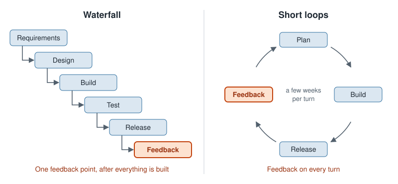
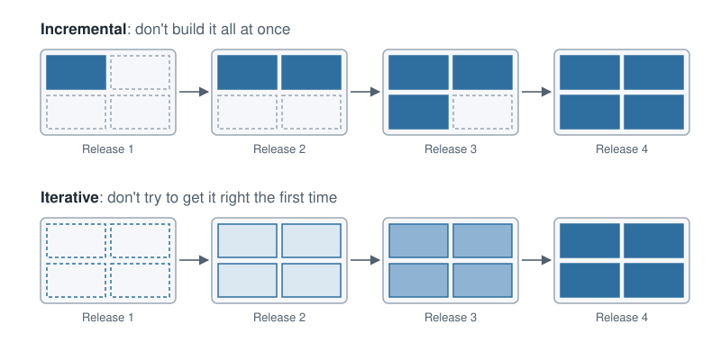

# Section 03: The lifecycle of decision-support software

## Introduction

Every piece of software moves through the same phases: someone works out what is needed, the team plans and designs
it, builds and tests it, releases it, runs it, and changes it for as long as it lives. That sequence is the
[software development lifecycle](../appendix/glossary.md#software-development-lifecycle). It is tempting to read it as
administration, a set of boxes a manager ticks. This section reads it as something more useful: the way a team
responds to the conditions software is built under. Those conditions make two abilities decisive, learning quickly
and adapting quickly, and a team's lifecycle is good exactly to the degree that it supports both.

**The difference this section addresses:** decision-support software goes through the same phases as any other
software, but several of those phases are harder to learn from and harder to adapt in when the software produces
decisions. The section builds the general case first and then names, phase by phase, where the difference bites.

### Out of scope

- **Design principles and the parts of a system.** Coupling, cohesion, single responsibility, information hiding and
  where the boundaries of a system go are in [the design section](../04-design/README.md). This section claims only
  that a team needs modularity, never how to get it.
- **How to test any of it.** Every oracle, technique and test-design idea is in
  [the testing section](../05-testing/README.md).
- **Tool tutorials.** Version control mechanics, continuous-integration configuration and environment management are
  in the [learning roadmap](../appendix/learning-roadmap.md).
- **What weak practice costs, and the failures that show it.** That case is made in
  [the introduction](../01-introduction/README.md).
- **Project-management frameworks.** Estimation techniques, backlog tools and the ceremonies of a named framework
  are not covered in this book.

The chapters argue from the general to the particular. [A different type of engineering](#ch-different-engineering)
names the two characteristics that set software apart: it is built on imperfect information, and it is highly
sensitive to tiny errors. Together they demand two abilities. [Learning quickly](#ch-learning) shows how a team
learns: agile development gives it short feedback loops, and the scientific method draws sound conclusions from each
loop. [Adapting quickly](#ch-adapting) shows what lets a team act on those conclusions without breaking what works.
[Decision-support software across the lifecycle](#ch-phases) applies all of it to decision-support software, one
phase at a time. Read them in order.

---

## A different type of engineering

A civil engineer designing a bridge works with two advantages. The requirements are known reasonably well before
anything is built: the span, the load, the soil. And the structure is robust to small errors: a beam a few
millimetres short does not bring the bridge down. Under those conditions, planning everything first and then
building it is a sound way to work.

Software engineering has neither advantage. It works with highly imperfect information, and it is highly sensitive to
tiny errors. Each characteristic deserves a closer look, because together they explain how software teams have to
work.

### Built on imperfect information

The requirements of a software system are not known before building starts, for three reasons:

1. **Users do not fully know what they want.** They know their problem, not the shape of the system that solves it.
2. **Users change their minds.** Seeing a first version changes what they ask for next.
3. **Building reveals what nobody stated.** A data source turns out to be incomplete, or two rules turn out to
   contradict each other, only once the code tries to use them.

Decision-support software feels all three more strongly. A crew planner can tell you, in detail, why a roster is
unacceptable. The same planner cannot write down the objective function that would have ranked it lower, and the
business rules that matter most often surface only when the first plan looks wrong to them. For this kind of
software, building the system is how the requirements are discovered.

### Highly sensitive to tiny errors

A bridge absorbs small mistakes. A program executes exactly what is written, so one wrong character can change what
it does, and nothing in the program notices. Two published cases show the scale:

- **Ariane 5, flight 501 (1996).** Thirty-seven seconds after lift-off, the rocket veered off course and was
  destroyed. The inquiry board traced the loss to one conversion: a 64-bit floating-point value, reused from Ariane 4
  code, did not fit into a 16-bit integer on the faster Ariane 5 trajectory. The overflow shut down both inertial
  reference systems.
- **Five retracted papers (2006).** A structural biology lab retracted three papers in *Science* and two in other
  journals after discovering that a homemade program had swapped two columns of data. The swap inverted the protein
  structures the papers reported, and years of work by other groups had built on them.

Decision-support software adds a quieter version of the same risk. A wrong sign in a constraint rarely crashes
anything: the solver returns a feasible, plausible-looking plan that is simply wrong, and no error message warns
anyone.

### What the two characteristics demand

Each characteristic calls for one ability:

- **Imperfect information demands learning quickly.** If the requirements are discovered by building, the team that
  finds out soonest what is wrong wastes the least work.
- **Sensitivity to tiny errors demands adapting quickly and safely.** What the team learns has to become a change to
  the code, and in a system where one character matters, every change risks breaking something that worked.

The rest of this section is about those two abilities: [how a team learns](#ch-learning) and
[how it adapts](#ch-adapting).

### Further reading

- J. L. Lions et al., "Ariane 5 Flight 501 Failure: Report by the Inquiry Board", European Space Agency, 1996: a
  short, readable account of how a single unprotected conversion destroyed a rocket.
- Greg Miller, "A Scientist's Nightmare: Software Problem Leads to Five Retractions", *Science* 314 (5807), 2006:
  the retractions from the scientist's side, and a warning every research group can apply.

---

## Learning quickly

Learning quickly takes two things: evidence that arrives often, and a sound way to draw conclusions from it. Agile
development supplies the first, and the scientific method supplies the second.

### Short feedback loops

A feedback loop is the time between a change and evidence about that change: build something small, show it to the
people who will use it, learn what is wrong, and feed the lesson into the next change. The shorter the loop, the less
work is built on a wrong assumption before someone notices.

The [waterfall](../appendix/glossary.md#waterfall) model has one loop, and it is as long as the project. It runs the
phases once, in order: gather all the requirements, design everything, build everything, test it, release it. It is
the civil engineer's process applied to software, and with imperfect information it learns late. The first real
feedback comes after release, when every phase has already spent its budget on assumptions that may be wrong.

  

The caricature is older than the recommendation. Royce's 1970 paper, the source of the staircase diagram, already
warned that the single pass "is risky and invites failure" and argued for building the system twice and feeding what
the first pass teaches into the second. The industry kept the diagram and dropped the advice.

[Agile](../appendix/glossary.md#agile) development organizes a team around short loops instead. Its value is the loop
itself, not its meetings or its vocabulary: a team that holds every ceremony but ships to users twice a year is
running waterfall with extra steps. The evidence for the loop is empirical: the survey research behind *Accelerate*
found that teams which release small changes often also report fewer failed changes and faster recovery, not more.

### Iterative and incremental

A short loop combines two different moves, and it helps to keep them apart:

- **[Incremental](../appendix/glossary.md#incremental-development):** do not build it all at once. Release one part
  of the system, finished, then the next.
- **[Iterative](../appendix/glossary.md#iterative-development):** do not try to get it right the first time. Release
  the whole system in a rough form, then improve it on every pass.

  

A decision-support team usually needs both. A vehicle-routing system for a distribution company might go live in one
region before the others, which is incremental: that region's dispatchers use real routes while the rest of the
system is still being built. Within that region, the formulation is revised after dispatchers react to the first
routes, which is iterative: a time-window rule nobody mentioned is added once they point at a route that breaks it.

### The scientific method

A short loop produces evidence, but evidence only helps a team that draws sound conclusions from it. The reader
already owns the discipline for that. A scientist applies skepticism, evidence, reproducibility and causality to a
claim about the world. Software engineering applies the same principles to one particular claim: *this code works*.
Nothing about the method changes; only its object does.

  

Six principles carry over, and each one makes a specific demand of code:

| Principle | What it demands of code |
|---|---|
| Skepticism | Do not trust that code works; demand evidence that it does |
| Evidence over authority | Who wrote the code does not matter, only what the evidence says |
| Relevance | Show that a change matters before spending effort on it |
| Testability | State what "works" means in a form that is objective and measurable |
| Reproducibility | Anyone should be able to run the check again and get the same result |
| Causality | Change one thing at a time, so the result shows what caused it |

### Each practice serves a principle

The engineering practices a team adopts are not rituals. Each one is a principle made cheap enough to apply on every
change:

- **[Static analysis](../appendix/glossary.md#static-analysis)** reads the code without running it and flags errors
  before a run. It serves skepticism.
- **[Automated tests](../appendix/glossary.md#automated-test)** write the hypothesis down and check it on demand.
  They serve testability and reproducibility.
- **[Continuous integration](../appendix/glossary.md#continuous-integration)** runs those tests on every change, so
  evidence arrives in minutes. It serves reproducibility.
- **[Pinned environments](../appendix/glossary.md#pinned-environment)** fix the exact versions of every library, so a
  result on one machine is a result on every machine. They serve reproducibility.
- **[Branches](../appendix/glossary.md#branch) and [pull requests](../appendix/glossary.md#pull-request)** isolate
  one change and put it in front of a reviewer before it joins the shared code. They serve causality and evidence
  over authority.

### Check yourself

1. A team builds the data loading, then the model, then the report, and shows nothing to users until all three are
   done. Is that incremental, iterative, both or neither?
2. A scheduling tool is released with a simplified model that ignores overtime rules, and the rules are added two
   releases later after supervisors review the schedules. Which move is that?

Each statement below was heard on a real team. Which principle does it break?

3. "No test needed: it is the same constraint as in another repository, and that one has worked for years."
4. "It was written by our principal engineer, so it is fine."
5. "This change cuts the model's run time from 10 seconds to 9.8 seconds."
6. "I will run 100 instances and see whether the results look OK."
7. "Follow the README, then call me: some steps are not written down."
8. "The tests pass either way. I was not asserting anything, only checking that it ran."

Answers

1. Neither, from the user's point of view. The work is split into parts, but no part reaches a user before the end,
   so no feedback arrives earlier than it would under waterfall.
2. Iterative: the whole tool exists from the first release, and a pass improves it in response to feedback.
3. Skepticism: past behaviour in a different codebase is not evidence about this one.
4. Evidence over authority.
5. Relevance: unless 0.2 seconds matters to a user, the effort is better spent elsewhere.
6. Testability: "looks OK" is not objective. State what a correct result must satisfy.
7. Reproducibility: a result that needs its author present cannot be repeated by anyone else.
8. Causality: a test that cannot fail cannot show that the code caused the result.

### Further reading

- Winston W. Royce, "Managing the Development of Large Software Systems", *Proceedings, IEEE WESCON*, 1970: the
  origin of the waterfall diagram, and an argument against using it as a single pass.
- Kent Beck et al., [*Manifesto for Agile Software Development*](https://agilemanifesto.org/), 2001: four lines and
  twelve principles, short enough to read in full.
- Craig Larman and Victor R. Basili, "Iterative and Incremental Development: A Brief History", *IEEE Computer*,
  2003: shows that iterative practice predates the word agile by decades.
- Jeff Patton, *User Story Mapping*, O'Reilly, 2014: the clearest treatment of incremental and iterative as separate
  moves.
- Nicole Forsgren, Jez Humble and Gene Kim, *Accelerate*, IT Revolution, 2018: the survey research linking frequent
  small releases with stability.

---

## Adapting quickly

Learning tells a team what to change. Adapting is making the change, and in software that means changing code that
already works. Because a program is sensitive to tiny errors, every such change risks breaking something, and a team
that cannot change safely stops changing at all. Three properties of the code decide how quickly and safely a team
can adapt.

### Keep complexity low

[Code complexity](../appendix/glossary.md#code-complexity) is how much a person has to hold in mind to understand
what a piece of code does: how many branches, how many interacting parts, how much hidden state. Every change starts
with understanding the code it touches, so complexity is a tax on every change. A function a reader can follow in
one pass can be changed in an afternoon; one that takes a day to understand makes every change a project.

### Modularity and isolation of changes

[Modularity](../appendix/glossary.md#modularity) builds a system from parts with clear boundaries. It gives a team
three things at once:

- **Isolation of changes.** A new requirement touches one part, and the rest stays as it was.
- **Small changes.** A change confined to one part is small enough to review and to reason about.
- **Easier testing.** A part with a clear boundary can be tested on its own, without running everything else.

### Safety mechanisms

A safety mechanism tells the team, quickly and without a person checking by hand, whether a change broke something.
The main one is an [automated test suite](../appendix/glossary.md#test-suite): a scalable, objective and reproducible
experiment that checks, on every change, that everything that worked before still works. Without it, every change
is a gamble on the sensitivity described in [A different type of engineering](#ch-different-engineering), and
people stop making changes.

The claim of this chapter is narrow. A team without these three properties cannot absorb change at the rate the
business asks for it, whatever process it follows: short loops deliver feedback that the code is too tangled, or too
unprotected, to act on. How to draw the boundaries and how to write the tests are large subjects of their own, and
this section does not teach them.

---

## Decision-support software across the lifecycle

Decision-support software goes through the same phases as any other software. What changes is how hard it is to learn
and to adapt in each of them. The table names that difference for every phase; the subsections below expand every
row except Planning.

| Phase | The difference for decision-support software |
|---|---|
| Elicitation | Users cannot state what they want as a model; requirements surface as reactions to plans |
| Planning | None: estimation, backlog management and iterations work as they do for any software |
| Design | The parts change at very different speeds: data every run, the formulation as the team learns, the solver rarely |
| Testing | The expected answer is the very thing the model exists to compute |
| Deployment | What ships is code together with a model, a solver and a solver license |
| Operation | A run that finishes is not the same as a run that produced a good decision |
| Evolution | Every change to the model can change decisions that users already trust |

### Elicitation

Elicitation is the work of finding out what the users need. It is where imperfect information is at its worst, so it
is where learning quickly pays off first. Four habits help.

**Ask in the planner's language.** Questions such as "what is your objective function?" or "what are your decision
variables?" get no useful answer, because planners reason in plans, not formulations. Ask what they can answer:

- What makes a plan good? What makes you reject one?
- What do you do by hand today, and in what order?
- When did a plan last go wrong, and what did you change?

The objective and the constraints are the team's translation of those answers, not something to ask for directly.

**Use a first model as a probe.** A deliberately simple model, run on real data, is the best elicitation tool the
team has. Show its plans to the planners and record every "no, because…": each one is a candidate rule, a missing
constraint or a weight in the objective. This is the short loop of [Learning quickly](#ch-learning) applied to
requirements, and it works because planners can judge a plan far better than they can describe one.

**Keep a trace.** Write down, for every rule in the model, where it came from: the conversation, the person, the plan
they rejected. That record is *traceability*. When a rule later looks wrong, the team can go back to its source
instead of guessing, and when the planner who stated it leaves, the reason stays.

**Separate hard constraints from preferences.** Planners state preferences as absolutes. "A driver never works more
than ten hours" may be law, or it may be what usually happens. The words give a clue: "by law", "the aircraft
cannot" and "the contract says" point to a hard constraint; "we try to", "usually" and "we prefer" point to a
preference. Ask what happens when the rule is broken: if the answer is a fine, a safety risk or an impossibility, it
is hard; if the answer is a complaint, it is a preference. Preferences belong in the model as soft constraints, whose
violation is allowed but penalized in the objective. Encoding every preference as a hard constraint is the most
common way a first model becomes infeasible on real data.

### Design

A decision-support system mixes parts that change at different speeds: the data changes on every run, business rules
every few months, the formulation whenever the team learns something about the problem, and the solver perhaps once
in the system's life. Good design keeps each of those changes inside one part, which is the modularity of
[Adapting quickly](#ch-adapting) applied to optimization. Staying solver-agnostic, supporting more than one solution
algorithm, and deciding where a new constraint belongs are the questions of
[the design section](../04-design/README.md).

### Testing

An ordinary test compares the output with an answer someone already knows. For the optimization model, that answer is
the thing the model exists to compute, so the usual method has nothing to compare against. Testing the formulation,
testing the output without knowing the optimum, and what integration and end-to-end tests look like around a solver
are the questions of [the testing section](../05-testing/README.md).

### Deployment

Releasing decision-support software ships more than code: the model, the solver it depends on, and the license that
solver needs on the production machine. A new solver version can change which of several equally good solutions comes
back, so a release can change decisions without a single line of the team's code changing. These are the questions of
[the deployment section](../06-deployment/README.md).

### Operation

Production is the longest feedback loop a team has, and the only one that runs on real decisions.
[Monitoring](../appendix/glossary.md#monitoring) keeps that loop open after release. For decision-support software,
it has to look beyond whether the program ran, in three layers, from the easiest to watch to the most telling:

| Layer | What to watch | What it catches |
|---|---|---|
| Run health | Did the run finish; how long it took; did it time out, prove infeasible, or stop with a large optimality gap | A model that no longer solves the instances it receives |
| Input health | Missing or late data; volumes or values far outside what the model has seen before | A model solving the wrong problem correctly |
| Decision health | How often planners override the plan; how much the plan changes between consecutive runs on nearly identical data | Plans that are feasible but that the business does not trust or cannot use |

Decision health is the layer only decision-support software has. A rising override rate is often the first sign that
a rule has changed in the business and not in the model. A plan that swings widely between two runs on almost the
same data erodes trust even when both plans are optimal.

**Compare the plan with the outcome.** The strongest evidence that a decision was good is what happened after it:
the cost actually incurred, the service level actually reached. Collect it, but read it with care, because the
comparison is confounded twice. Planners change the plan before executing it, so the outcome belongs partly to them.
And the world changes after the plan is made: demand shifts, a truck breaks down. A single run compared with its
outcome proves little. A trend over many runs, read next to the override rate, shows whether the model's decisions
are getting better or worse.

### Evolution

Most of a decision-support system's life is spent being changed. Users build trust in its decisions over months, and
a change to the model can shift decisions nobody asked to shift. Changing a system you inherited without breaking
what already works is the subject of [the legacy section](../07-working-with-legacy-dss/README.md).

### Check yourself

1. Rewrite "what is your objective function?" as a question a warehouse manager can answer.
2. Classify each statement as a hard constraint or a preference: (a) "Drivers cannot exceed eleven hours at the
   wheel; it is federal law." (b) "We never send two trucks to the same customer on one day." (c) "Refrigerated
   goods must travel in refrigerated trucks."
3. Which monitoring layer catches each symptom? (a) Every run for a week ends with a 12% optimality gap instead of
   the usual 1%. (b) A new customer's orders arrive in kilograms instead of tonnes. (c) Planners in one region have
   rejected half the plans since a new contract was signed.

Answers

1. For example: "When you compare two plans for the same day, how do you decide which one is better?" or "What would
   make you reject a plan outright?"
2. (a) Hard: breaking it is illegal. (b) Probably a preference: "never" is a claim to test by asking what happens
   when it is broken; if the answer is a complaint, penalize it instead of forbidding it. (c) Hard: breaking it
   spoils the goods.
3. (a) Run health. (b) Input health: the values are far outside what the model has seen. (c) Decision health: a
   rising override rate after a business change.

---

## Conclusion

Software is built on imperfect information and is highly sensitive to tiny errors, so a team succeeds by learning
quickly and adapting quickly.

- **Software is a different type of engineering** ([A different type of engineering](#ch-different-engineering)).
  Requirements are discovered by building, and one wrong character can change what a program does.
- **Learning takes short loops and the scientific method** ([Learning quickly](#ch-learning)). Agile supplies
  evidence often; the scientific method turns it into sound conclusions about whether the code works.
- **Adapting takes low complexity, modularity and safety mechanisms** ([Adapting quickly](#ch-adapting)). Without
  them, feedback arrives that nobody can safely act on.
- **The phases do not change; their difficulty does** ([Decision-support software across the lifecycle](#ch-phases)).
  Elicitation, design, testing, deployment, operation and evolution each take a turn of their own when the software
  produces decisions.

The sections that follow take those differences one at a time, starting with design.

---

[← Book contents](../../README.md) · [Next section: 04 Designing decision-support software →](../04-design/README.md)
