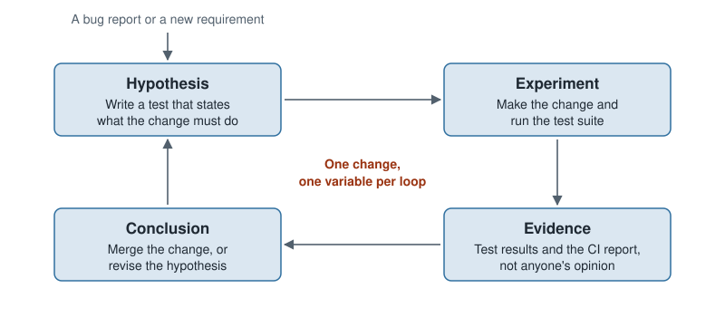

# Section 03 — The lifecycle of decision-support software

## Introduction

Every piece of software moves through the same phases: someone works out what is needed, the team plans and designs
it, builds and tests it, releases it, runs it, and changes it for as long as it lives. That sequence is the
[software development lifecycle](../appendix/glossary.md#software-development-lifecycle). It is tempting to read it as
administration, a set of boxes a manager ticks. This section reads it differently: the lifecycle a team follows is its
answer to one fact, that software is built under highly imperfect information. A team that answers well learns what
is wrong quickly and changes the code quickly. A team that answers badly finds out at the end.

Decision-support software makes that fact sharper. The people who will use the system cannot state what they want as
a model, and the evidence that a decision is good arrives slowly. **The difference this section addresses:** the
phases are the same as for any software, but in several of them learning and adapting are harder, and the section
names where.

### Ideas to develop

#### Elicitation

- **Avoid the mathematical vocabulary with the client.** Asking a planner "what is your objective function?" or
  "what are your variables?" gets no useful answer. The requirements have to be drawn out in the planner's own
  language: what a good plan looks like, what makes them reject one.
- **Business rules surface when the first plan looks wrong.** The rules that matter often reach the team only as a
  reaction to a plan. A first, deliberately incomplete model is an elicitation tool, not only a deliverable.

#### Operation

- **A run that finishes is not the same as a run that produced a good decision.** What to monitor, and how the team
  knows the model is behaving correctly in production, are open questions for this subsection.

### Out of scope

- **Design principles and the parts of a system.** Coupling, cohesion, single responsibility, information hiding and
  where the boundaries of a system go are in [the design section](../04-design/README.md). This section claims only
  that a team needs modularity, never how to get it.
- **How to test any of it.** Every oracle, technique and test-design idea is in
  [the testing section](../05-testing/README.md).
- **Tool tutorials.** Version control mechanics, continuous-integration configuration and environment management are
  in the [learning roadmap](../appendix/learning-roadmap.md).
- **What weak practice costs, and the failures that show it.** That case is made in
  [the introduction](../01-introduction/README.md).
- **Project-management frameworks.** Estimation techniques, backlog tools and the ceremonies of a named framework
  are not covered in this book.

The chapters argue from the general to the particular. Chapter 01 states the fact the whole section rests on:
building software is how its requirements are discovered. Chapter 02 draws the consequence, short feedback loops.
Chapters 03 and 04 name the two abilities those loops demand, learning quickly and adapting quickly. Chapter 05
applies all of it to decision-support software, one phase at a time. Read them in order.

## Chapters

| # | Chapter | After it you can… |
|:---:|---|---|
| 01 | [Software is a discovery process](#ch-discovery) | Explain why a plan made before building will be wrong, and what that costs under waterfall |
| 02 | [Short loops: iterative and incremental](#ch-short-loops) | Tell iterative from incremental work, and plan a release that does each |
| 03 | [Learning quickly: the scientific method applied to code](#ch-learning) | Name which scientific principle a team practice serves, and spot the violation in a claim that "the code works" |
| 04 | [Adapting quickly: modularity and safety nets](#ch-adapting) | Explain why no process lets a team change code fast without both |
| 05 | [The lifecycle of decision-support software](#ch-phases) | Name, for each phase, what makes it harder when the software produces decisions |
| 06 | [Conclusion](#ch-conclusion) | Recall in one page why the lifecycle is a loop, and where decision-support software strains it |

---

## 01 — Software is a discovery process

A civil engineer designing a bridge works with two advantages. The structure is robust to small errors: a beam a few
millimetres short does not bring the bridge down. And the requirements are known reasonably well before anything is
built: the span, the load, the soil. Planning everything first and then building it is a sound way to work under
those conditions.

Software has neither advantage. It is flexible and fragile at the same time: anything can be changed, and one wrong
character changes what the program does. And the requirements are not known before building starts, for three
reasons:

1. **Users do not fully know what they want.** They know their problem, not the shape of the system that solves it.
2. **Users change their minds.** Seeing a first version changes what they ask for next.
3. **Building reveals what nobody stated.** A data source turns out to be incomplete, or two rules turn out to
   contradict each other, only once the code tries to use them.

Decision-support software feels all three more strongly. A crew planner can tell you, in detail, why a roster is
unacceptable. The same planner cannot write down the objective function that would have ranked it lower, and the
business rules that matter most often surface only when the first plan looks wrong to them. For this kind of software,
building the system is how the requirements are discovered.

### Why waterfall loses here

The [waterfall](../appendix/glossary.md#waterfall) model runs the phases once, in order: gather all the requirements,
design everything, build everything, test it, release it. It is the civil engineer's process applied to software, and
it fails in two ways when requirements are discovered rather than known:

- **It learns late.** The first real feedback comes after release, when every phase has already spent its budget on
  assumptions that may be wrong.
- **It adapts expensively.** A requirement found late sends the team back through design and build, because the
  process treats each phase as finished once it hands over.

  

The caricature is older than the recommendation. Royce's 1970 paper, the source of the staircase diagram, already
warned that the single pass "is risky and invites failure" and argued for building the system twice and feeding what
the first pass teaches into the second. The industry kept the diagram and dropped the advice.

### Where this stops working

> [!WARNING]
> When requirements really are known and stable, planning first is not a mistake.

A calculation fixed by regulation, such as a tax rule implemented to the letter, leaves little to discover, and a
single pass can serve it well. The argument of this chapter holds to the degree that the problem is uncertain, and
most decision-support problems are.

### Further reading

- Winston W. Royce, "Managing the Development of Large Software Systems", *Proceedings, IEEE WESCON*, 1970 — the
  origin of the waterfall diagram, and an argument against using it as a single pass.

---

## 02 — Short loops: iterative and incremental

If requirements are discovered by building, the team's best move is to shorten the time between a change and evidence
about that change. That interval is a feedback loop: build something small, show it to the people who will use it,
learn what is wrong, and feed the lesson into the next change. The shorter the loop, the less work is built on a wrong
assumption before someone notices.

[Agile](../appendix/glossary.md#agile) development is the name for organizing a team around short loops. Its value is
the loop itself, not its meetings or its vocabulary: a team that holds every ceremony but ships to users twice a year
is running waterfall with extra steps. The evidence for the loop is empirical: the survey research behind *Accelerate*
found that teams which release small changes often also report fewer failed changes and faster recovery, not more.

A short loop combines two different moves, and it helps to keep them apart:

- **[Incremental](../appendix/glossary.md#incremental-development):** do not build it all at once. Release one part
  of the system, finished, then the next.
- **[Iterative](../appendix/glossary.md#iterative-development):** do not try to get it right the first time. Release
  the whole system in a rough form, then improve it on every pass.

  

A decision-support team usually needs both. A vehicle-routing system for a distribution company might go live in one
region before the others, which is incremental: that region's dispatchers use real routes while the rest of the
system is still being built. Within that region, the formulation is revised after dispatchers react to the first
routes, which is iterative: a time-window rule nobody mentioned is added once they point at a route that breaks it.

### Check yourself

1. A team builds the data loading, then the model, then the report, and shows nothing to users until all three are
   done. Is that incremental, iterative, both or neither?
2. A scheduling tool is released with a simplified model that ignores overtime rules, and the rules are added two
   releases later after supervisors review the schedules. Which move is that?

Answers

1. Neither, from the user's point of view. The work is split into parts, but no part reaches a user before the end,
   so no feedback arrives earlier than it would under waterfall.
2. Iterative: the whole tool exists from the first release, and a pass improves it in response to feedback.

### Further reading

- Kent Beck et al., [*Manifesto for Agile Software Development*](https://agilemanifesto.org/), 2001 — four lines and
  twelve principles; short enough to read in full.
- Craig Larman and Victor R. Basili, "Iterative and Incremental Development: A Brief History", *IEEE Computer*,
  2003 — shows that iterative practice predates the word agile by decades.
- Jeff Patton, *User Story Mapping*, O'Reilly, 2014 — the clearest treatment of incremental and iterative as separate
  moves.
- Nicole Forsgren, Jez Humble and Gene Kim, *Accelerate*, IT Revolution, 2018 — the survey research linking frequent
  small releases with stability.

---

## 03 — Learning quickly: the scientific method applied to code

A short loop produces evidence, but evidence only helps a team that draws sound conclusions from it. The reader
already owns the discipline for that: the scientific method. A scientist applies skepticism, evidence,
reproducibility and causality to a claim about the world. Software engineering applies the same principles to one
particular claim: *this code works*. Nothing about the method changes; only its object does.

  

Six principles carry over, and each one makes a specific demand of code:

| Principle | What it demands of code |
|---|---|
| Skepticism | Do not trust that code works; demand evidence that it does |
| Evidence over authority | Who wrote the code does not matter, only what the evidence says |
| Relevance | Show that a change matters before spending effort on it |
| Testability | State what "works" means in a form that is objective and measurable |
| Reproducibility | Anyone should be able to run the check again and get the same result |
| Causality | Change one thing at a time, so the result shows what caused it |

### Each practice serves a principle

The engineering practices a team adopts are not rituals. Each one is a principle made cheap enough to apply on every
change:

- **[Static analysis](../appendix/glossary.md#static-analysis)** reads the code without running it and flags errors
  before a run. It serves skepticism.
- **[Automated tests](../appendix/glossary.md#automated-test)** write the hypothesis down and check it on demand.
  They serve testability and reproducibility.
- **[Continuous integration](../appendix/glossary.md#continuous-integration)** runs those tests on every change, so
  evidence arrives in minutes. It serves reproducibility.
- **[Pinned environments](../appendix/glossary.md#pinned-environment)** fix the exact versions of every library, so a
  result on one machine is a result on every machine. They serve reproducibility.
- **[Branches](../appendix/glossary.md#branch) and [pull requests](../appendix/glossary.md#pull-request)** isolate
  one change and put it in front of a reviewer before it joins the shared code. They serve causality and evidence
  over authority.

### Check yourself

Each statement below was heard on a real team. Which principle does it break?

1. "No test needed: it is the same constraint as in another repository, and that one has worked for years."
2. "It was written by our principal engineer, so it is fine."
3. "This change cuts the model's run time from 10 seconds to 9.8 seconds."
4. "I will run 100 instances and see whether the results look OK."
5. "Follow the README, then call me: some steps are not written down."
6. "The tests pass either way. I was not asserting anything, only checking that it ran."

Answers

1. Skepticism: past behaviour in a different codebase is not evidence about this one.
2. Evidence over authority.
3. Relevance: unless 0.2 seconds matters to a user, the effort is better spent elsewhere.
4. Testability: "looks OK" is not objective. State what a correct result must satisfy.
5. Reproducibility: a result that needs its author present cannot be repeated by anyone else.
6. Causality: a test that cannot fail cannot show that the code caused the result.

---

## 04 — Adapting quickly: modularity and safety nets

Learning quickly is half of what a short loop demands. The other half is acting on what was learned, which in
software means changing code that already works. Two properties decide how cheaply a team can do that:

- **[Modularity](../appendix/glossary.md#modularity)** keeps a change small. When a system is built from parts with
  clear boundaries, a new requirement touches one part, and the rest stays as it was.
- **Safety nets** make the change safe to attempt. An automated test suite checks, in minutes, that everything that
  worked before still works. Without it, every change is a gamble, and people stop making them.

The claim of this chapter is narrow. A team without both cannot absorb change at the rate the business asks for it,
whatever process it follows: short loops deliver feedback that the code is too tangled, or too unprotected, to act on.
How to draw the boundaries and how to write the tests are large subjects of their own, and this section does not
teach them.

---

## 05 — The lifecycle of decision-support software

Decision-support software goes through the same phases as any other software. What changes is how hard it is to learn
and to adapt in each of them. The table names that twist for every phase; the subsections below expand every row
except Planning.

| Phase | The twist for decision-support software |
|---|---|
| Elicitation | Users cannot state what they want as a model; requirements surface as reactions to plans |
| Planning | None: estimation, backlog management and iterations work as they do for any software |
| Design | The parts change at very different speeds: data every run, the formulation as the team learns, the solver rarely |
| Testing | The expected answer is the very thing the model exists to compute |
| Deployment | What ships is code together with a model, a solver and a solver license |
| Operation | A run that finishes is not the same as a run that produced a good decision |
| Evolution | Every change to the model can change decisions that users already trust |

### Elicitation

Elicitation is the work of finding out what the users need. This subsection will cover how to draw requirements out
of planners who reason in plans rather than in formulations: which questions to ask in place of "what is your
objective function?", and how a first, deliberately incomplete model becomes the tool that surfaces the rules nobody
stated. It is the phase where [chapter 01](#ch-discovery) applies most directly.

### Design

A decision-support system mixes parts that change at different speeds: the data changes on every run, business rules
every few months, the formulation whenever the team learns something about the problem, and the solver perhaps once
in the system's life. Good design keeps each of those changes inside one part, which is the modularity of
[chapter 04](#ch-adapting) applied to optimization. Staying solver-agnostic, supporting more than one solution
algorithm, and deciding where a new constraint belongs are the questions of
[the design section](../04-design/README.md).

### Testing

An ordinary test compares the output with an answer someone already knows. For the optimization model, that answer is
the thing the model exists to compute, so the usual method has nothing to compare against. Testing the formulation,
testing the output without knowing the optimum, and what integration and end-to-end tests look like around a solver
are the questions of [the testing section](../05-testing/README.md).

### Deployment

Releasing decision-support software ships more than code: the model, the solver it depends on, and the license that
solver needs on the production machine. A new solver version can change which of several equally good solutions comes
back, so a release can change decisions without a single line of the team's code changing. These are the questions of
[the deployment section](../06-deployment/README.md).

### Operation

This subsection will cover what to watch once the system runs in production. A run that finishes without error can
still return a poor decision, or one that planners quietly override, and neither shows up in an error log. The
subsection will name the signals that reveal whether the model is behaving correctly, so that the feedback loop of
[chapter 02](#ch-short-loops) keeps running after release.

### Evolution

Most of a decision-support system's life is spent being changed. Users build trust in its decisions over months, and
a change to the model can shift decisions nobody asked to shift. Changing a system you inherited without breaking
what already works is the subject of [the legacy section](../07-working-with-legacy-dss/README.md).

---

## 06 — Conclusion

The lifecycle is a feedback loop, and decision-support software strains that loop in specific phases.

- **Requirements are discovered by building** ([chapter 01](#ch-discovery)). A plan made before building will be
  wrong, and waterfall finds out at the end.
- **Short loops make learning cheap** ([chapter 02](#ch-short-loops)). Release small, incremental parts and iterate
  on them while users react.
- **The scientific method is the discipline for learning** ([chapter 03](#ch-learning)). Every engineering practice
  applies one of its principles to the claim that the code works.
- **Adapting needs modularity and safety nets** ([chapter 04](#ch-adapting)). Without both, feedback arrives that
  nobody can act on.
- **The phases do not change; their difficulty does** ([chapter 05](#ch-phases)). Elicitation, design, testing,
  deployment, operation and evolution each take a twist when the software produces decisions.

The sections that follow take those twists one at a time, starting with design.

---

[← Book contents](../../README.md) · [Next section: 04 Designing decision-support software →](../04-design/README.md)
