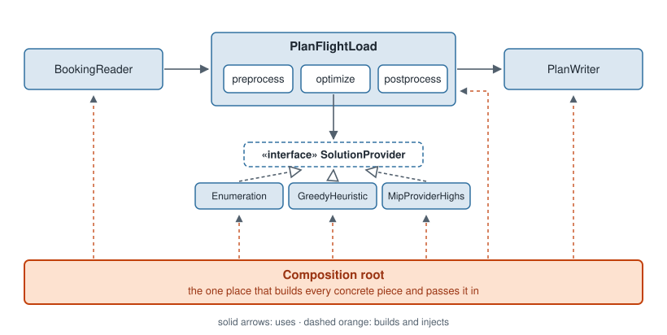

# Section 04: Designing decision-support software

## Introduction

A decision-support system is built from parts that change at different speeds. The data changes every run, business
rules change every few months, the formulation changes as the team learns the problem, and the solver may change once
in the system's life. **The difference this section addresses:** when those parts are tangled in one script, every
change to one of them risks breaking the others. Design is the practice of drawing boundaries between them, so that
each change stays where it belongs.

The section argues from the general to the particular. It starts with what design is for and the two forces every
design balances, derives the principles that follow from those forces, names the patterns that put the principles to
work, and ends with an architecture for the cargo loading system that uses all of them.

### Out of scope

- **How to test the design.** Tests are the safety net that makes a design change safe; how to write them is in
  [the testing section](../05-testing/README.md).
- **Deployment and infrastructure.** Servers, containers and solver licenses are in
  [the deployment section](../06-deployment/README.md).
- **User-interface design** and **enterprise architecture** beyond a single decision-support system. Neither is
  covered in this book.
- **A catalogue of patterns.** The patterns here are a small subset chosen for decision-support software; the
  further reading of [Patterns](#ch-patterns) points to complete catalogues.

[What design is for](#ch-design-purpose) introduces a tangled script that plans a flight's load, and every chapter
after it fixes one thing in that script. [Forces: coupling and cohesion](#ch-forces) diagnoses what is wrong with
it. [Principles](#ch-principles) states the rules that follow from the diagnosis, and [Patterns](#ch-patterns)
shows the reusable solutions that apply them. [From design to architecture](#ch-architecture) lifts the same ideas
to the scale of a whole system, and
[A clean architecture for the cargo loading system](#ch-cargo-architecture) shows where the script ends up. Read
them in order: each chapter uses only what the chapters before it defined.

## The running example

Every chapter designs the cargo loading system defined in [the appendix](../appendix/running-example.md): for one
departure, how many pallets of each tendered product to load, so that the revenue carried is as large as possible
without exceeding the aircraft's maximum weight or the capacity of its hold. The inputs are a booking list (pallets
tendered and pallets that must fly, per product), a product catalogue (weight, volume and revenue per pallet) and the
aircraft's two capacities. This section holds the model fixed: the formulation never changes, only the code around
it.

The pseudocode follows the conventions of the rest of the book: `function` and `class` declare code, `interface`
declares a set of operations without an implementation, and `record(...)` builds a plain group of named values.

---

<a id="ch-design-purpose"></a>

## What design is for

Software design is the set of decisions about how code is divided into parts and how those parts are connected. It is
not about how the code looks, and it is not a phase that ends before programming starts. Every function a team writes
is a design decision, whether anyone thinks of it that way or not.

The purpose of those decisions is to keep future change cheap. A program that runs correctly today has done half its
job; the other half is being changeable tomorrow, when the business asks for something new. A good design is one in
which the changes the team expects are small, local and safe.

### Parts that change at different speeds

What a decision-support system has to absorb is not one kind of change but several, each on its own clock.

<p align="center">
  
</p>

> [!NOTE]
> The ticks are illustrative, not measured: the point is the difference in rhythm, not the exact dates.

A design that serves a decision-support system keeps these clocks apart. A new data file should not touch the
formulation, a new business rule should not touch the solver, and a new solver should not touch the way the plan is
written.

### A script that plans a flight's load

Here is the cargo loading system as it is often first written: one function that does everything.

```
function plan_flight_load(booking_path, aircraft_path, plan_path):
    # read the inputs
    products = []
    for row in read_csv(booking_path):
        products.append(record(name=row[0], weight=number(row[1]),
                               volume=number(row[2]), revenue=number(row[3]),
                               tendered=integer(row[4]), must_fly=integer(row[5])))
    aircraft = read_csv(aircraft_path)[0]
    W = number(aircraft[0])
    V = number(aircraft[1])

    # committed freight must fit
    if sum(p.weight * p.must_fly for p in products) > W:
        write_text(plan_path, "INFEASIBLE: committed freight is too heavy")
        return
    if sum(p.volume * p.must_fly for p in products) > V:
        write_text(plan_path, "INFEASIBLE: committed freight does not fit")
        return

    # drop products whose single pallet can never fit
    products = [p for p in products if p.weight <= W and p.volume <= V]

    # build and solve the model
    model = highs.Model()
    x = {}
    for p in products:
        x[p.name] = model.add_integer_var(lower=p.must_fly, upper=p.tendered)
    model.add_constraint(sum(p.weight * x[p.name] for p in products) <= W)
    model.add_constraint(sum(p.volume * x[p.name] for p in products) <= V)
    model.maximize(sum(p.revenue * x[p.name] for p in products))
    model.solve(time_limit=60)

    # write the plan
    lines = ["product,pallets,revenue"]
    for p in products:
        n = model.value(x[p.name])
        lines.append(p.name + "," + text(n) + "," + text(n * p.revenue))
    write_text(plan_path, join(lines, "\n"))
```

The script works, and for a first experiment it is a reasonable thing to write. Now ask it to change:

- The booking list starts arriving as JSON from a web service instead of a CSV file.
- A new rule says dangerous goods may fill at most a quarter of the hold.
- A large instance takes too long, and the team wants a heuristic for it.
- The solver license changes, and HiGHS must be replaced by another library.

Each of these is a normal request in the life of a decision-support system, and each one forces the team to edit the
same function, read all of it to be sure nothing else breaks, and test all of it again. The rest of this section is
about why that happens and how to design it away.

---

<a id="ch-forces"></a>

## Forces: coupling and cohesion

Two forces decide how hard a design is to change. They were named in the 1970s, before most of today's languages
existed, and they still explain most of what goes wrong.

[Coupling](../appendix/glossary.md#coupling) is how much one part of a system depends on another. Two parts are
tightly coupled when a change to one forces a change to the other. [Cohesion](../appendix/glossary.md#cohesion) is
how closely the elements inside one part belong together. A part is cohesive when everything in it serves one
purpose, so that a single kind of change touches it and nothing else does.

A good design has **high cohesion and low coupling**: each part does one job completely, and the parts know as
little about each other as possible. Low coupling lets a change stay inside one part; high cohesion makes sure the
change has only one part to go to.

<p align="center">
  
</p>

### Diagnosing the script

The cargo script has both problems. It has **low cohesion**: one function holds input parsing, business rules,
preprocessing, the formulation, the solver and the output format. And its pieces are **tightly coupled**: the output
code reads values straight out of the solver's model object with `model.value`, so the way the plan is written
depends on which solver produced it.

The coupling shows up the moment something changes. Replacing the solver library touches every line that calls the
solver's model object, and those lines sit in two places: the model block and the output block.

<p align="center">
  
</p>

In a design with high cohesion and low coupling, the same change stays inside one box. The next chapter states the
principles that get the script there.

### Check yourself

1. In the script, `write the plan` calls `model.value`. Is that a problem of coupling or of cohesion?
2. A module called `utils` holds a CSV parser, a date formatter and a greedy knapsack heuristic. Which force does it
   violate?

<details>
<summary>Answers</summary>

1. Coupling: the output depends on the solver's model object, so changing the solver changes the output code.
2. Cohesion: the three things share a file but not a purpose, so three unrelated kinds of change all land on it.

</details>

### Further reading

- Edward Yourdon and Larry L. Constantine, *Structured Design*, Prentice Hall, 1979: the book that introduced
  coupling and cohesion as the measures of a design.
- John Ousterhout, *A Philosophy of Software Design*, Yaknyam Press, 2018: a short, modern treatment of complexity,
  with the idea of deep modules that hide a lot behind a small interface.

---

<a id="ch-principles"></a>

## Principles

The forces say what a good design looks like; the principles say how to get there. Each principle below is a rule
of thumb that raises cohesion, lowers coupling, or both. Each one also fixes one thing in the cargo script.

### Information hiding

[Information hiding](../appendix/glossary.md#information-hiding) means that each part of a system hides its
[implementation details](../appendix/glossary.md#implementation-detail) behind an
[interface](../appendix/glossary.md#interface): the set of operations the rest of the system is allowed to use.
Clients know *what* a part does, never *how*. Parnas stated the principle in 1972, and most of what follows builds on
it.

In the script, the optimization leaks its how: the output code reaches into the solver's model object. Hiding it
means that optimizing returns a plain result, a `LoadPlan`, and nothing about the model or the solver escapes:

```
record LoadPlan:
    feasible        # true, or false with a reason
    reason
    pallets         # product name -> pallets loaded
    revenue         # total revenue of the plan

function optimize(products, aircraft) -> LoadPlan:
    ...             # builds and solves the model; nothing of it is returned

function write_plan(plan, plan_path):
    ...             # reads plan.pallets; never sees a model
```

Now the output code depends on `LoadPlan` alone. The solver can change and the plan is written exactly as before.

### Single responsibility and DRY

The [single responsibility principle](../appendix/glossary.md#single-responsibility-principle) says that a part
should have only one reason to change. A responsibility is not "a thing the code does" but an axis of change: a
source of requests that could force an edit. Color each line of the script by the reason it would change, and its
six responsibilities become visible:

<p align="center">
  
</p>

Its twin is [don't repeat yourself](../appendix/glossary.md#dont-repeat-yourself), abbreviated DRY: each piece of
knowledge should live in exactly one place. The two are sides of one coin. Single responsibility keeps one reason to
change out of places where it does not belong; DRY keeps it from being copied into several. The script breaks DRY
too: the knowledge of how a plan is written lives in three places, the two `INFEASIBLE` messages and the CSV at the
end, so a new output format means three edits.

Split along its reasons to change, the script becomes a sequence of parts, each with one job:

```
function read_bookings(booking_path, aircraft_path) -> (products, aircraft)
function check_committed_freight(products, aircraft) -> LoadPlan or nothing
function drop_unfit_products(products, aircraft) -> products
function optimize(products, aircraft) -> LoadPlan
function write_plan(plan, plan_path)
```

`check_committed_freight` now returns an infeasible `LoadPlan` instead of writing a file, so `write_plan` is the
only place that knows the output format. One part still has two reasons to change: `optimize` holds both the
formulation and the calls to the solver library.
[A clean architecture for the cargo loading system](#ch-cargo-architecture) explains why that pair stays together.

### Dependency inversion

After the split, `optimize` still depends on one particular solver. The
[dependency inversion principle](../appendix/glossary.md#dependency-inversion-principle) says that high-level policy
should not depend on low-level details; both should depend on an
[abstraction](../appendix/glossary.md#abstraction). Here the policy is "find the best loadable plan", and the detail
is which algorithm or library finds it.

The optimize step therefore defines the interface it needs, and each algorithm implements it:

```
interface SolutionProvider:
    solve(products, aircraft) -> LoadPlan

class MipProviderHighs implements SolutionProvider:
    solve(products, aircraft) -> LoadPlan:
        ...             # the formulation, written with HiGHS; the only code that knows HiGHS exists
```

<p align="center">
  
</p>

The dependency is inverted in a precise sense. Before, the arrow ran from the policy down to the library. After, the
arrow from `MipProviderHighs` points *up*, to an interface owned by the policy. The detail now depends on the policy,
not the other way around.

### The rest of SOLID

Single responsibility and dependency inversion are two of the five principles known together as
[SOLID](../appendix/glossary.md#solid). The other three follow from the same forces:

- **Open-closed.** A part should be open for extension and closed for modification: new behaviour is added by adding
  code, not by editing code that works. Adding a column-generation provider means writing one new class that
  implements `SolutionProvider`; `MipProviderHighs` and the enumeration provider are not touched.
- **Liskov substitution.** Any implementation of an interface must be usable wherever the interface is expected,
  without surprises. Every `SolutionProvider` must return a loadable plan or say that none exists. A heuristic may
  return a plan that is not optimal, but a heuristic that returns an overweight plan when it runs out of time breaks
  the promise, and every part that trusts `LoadPlan` breaks with it.
- **Interface segregation.** No part should depend on operations it does not use. The plan writer needs the plan; it
  should not depend on an interface that also exposes the solver's gap, node count and log. Keep those in a separate
  record for the parts that want them.

### Check yourself

1. How many reasons to change does `read_bookings` have?
2. Which principle does this line break, inside the optimize step: `model = highs.Model()`?
3. A new `SolutionProvider` returns plans that ignore committed freight whenever the instance is large. Which
   principle does it break?

<details>
<summary>Answers</summary>

1. One: the format in which bookings and aircraft data arrive.
2. Dependency inversion: the policy depends directly on a concrete library instead of on `SolutionProvider`.
3. Liskov substitution: it cannot stand in for the other providers, because it breaks the promise that a plan is
   loadable.

</details>

### Further reading

- David L. Parnas, "On the Criteria To Be Used in Decomposing Systems into Modules", *Communications of the ACM* 15
  (12), 1972: the paper that introduced information hiding, and still one of the clearest arguments for it.
- Robert C. Martin, *Agile Software Development: Principles, Patterns, and Practices*, Prentice Hall, 2002: the
  source of the SOLID principles, each with worked examples.
- Andrew Hunt and David Thomas, *The Pragmatic Programmer*, Addison-Wesley, 1999: where DRY was named.

---

<a id="ch-patterns"></a>

## Patterns

A principle says what a good design achieves; a pattern says how a recurring problem is usually solved. A
[design pattern](../appendix/glossary.md#design-pattern) is a named, reusable solution to a problem that comes up
again and again in software design. Patterns matter for two reasons. They save a team from reinventing a solution
that others have already refined, and they give it a vocabulary: saying "the solver is a strategy" tells another
engineer a whole design in four words.

Three patterns carry the cargo design. They are a small subset of the many that exist; the further reading below
points to the full catalogues.

### Dependency injection

[Dependency injection](../appendix/glossary.md#dependency-injection) means that a part receives the parts it depends
on from outside, instead of creating them itself. It is the pattern that puts dependency inversion to work: once the
optimize step depends on `SolutionProvider`, something has to decide which providers it gets, and dependency
injection says that decision is made outside the optimize step.

```
class Optimize:
    constructor(providers):         # receives its providers; never builds one
        self.providers = providers
```

If every part receives what it needs, some place has to build the parts and pass them in. That place is the
[composition root](../appendix/glossary.md#composition-root): the one place in the program that knows every
concrete class, usually the program's entry point.

```
function main(args):
    providers = [EnumerationProvider(), GreedyHeuristicProvider(), MipProviderHighs(time_limit=60)]
    plan_flight_load = PlanFlightLoad(Preprocess(), Optimize(providers), Postprocess())
    reader = CsvBookingReader(args.booking_path, args.aircraft_path)
    writer = CsvPlanWriter(args.plan_path)

    products, aircraft = reader.read()
    plan = plan_flight_load.run(products, aircraft)
    writer.write(plan)
```

<p align="center">
  
</p>

The payoff is that changing a solver's time limit, or swapping the CSV reader for a JSON one, is a one-line edit in
`main`. Nothing else in the program knows which concrete parts were chosen, and a test can hand the optimize step a
fake provider without touching any other code.

### Strategy

The [strategy pattern](../appendix/glossary.md#strategy-pattern) puts a family of interchangeable algorithms behind
one interface, so that the code using them can switch between them at run time. It is the pattern operations
research scientists want most often, because a decision-support system rarely has one algorithm for every instance:
enumeration is exact and fast for tiny instances, a MIP solver is exact for medium ones, and a heuristic is the only
option when the instance is too large to solve in time.

```
class Optimize:
    run(products, aircraft) -> LoadPlan:
        provider = self.choose(products)
        return provider.solve(products, aircraft)

    choose(products) -> SolutionProvider:
        if count_selections(products) <= SMALL: return self.providers.enumeration
        if size(products) <= MEDIUM:            return self.providers.mip
        return self.providers.heuristic
```

<p align="center">
  
</p>

The choice belongs to the optimize step and to no one else. Preprocessing and postprocessing never learn which
provider ran: that is information hiding, and it means a new provider changes one class and one selection rule.

### Adapter

The [adapter pattern](../appendix/glossary.md#adapter-pattern) translates between an interface the system expects
and one it is given. The cargo system expects products and an aircraft; the outside world supplies a CSV file, a
JSON document, or a request from a web page. Each source gets an adapter that turns it into the same entities:

```
interface BookingReader:
    read() -> (products, aircraft)

class CsvBookingReader implements BookingReader:
    read() -> (products, aircraft):
        ...         # the only code that knows the CSV column order

class JsonBookingReader implements BookingReader:
    read() -> (products, aircraft):
        ...         # the only code that knows the JSON field names
```

The first change request from [What design is for](#ch-design-purpose), bookings arriving as JSON, is now one new
class and one line in the composition root.

### Further reading

- Erich Gamma, Richard Helm, Ralph Johnson and John Vlissides, *Design Patterns: Elements of Reusable
  Object-Oriented Software*, Addison-Wesley, 1994: the catalogue of 23 patterns, including strategy and adapter,
  known as the Gang of Four book.
- Eric Freeman and Elisabeth Robson, *Head First Design Patterns*, 2nd edition, O'Reilly, 2020: a gentler
  introduction to the same patterns, with many small examples.
- Mark Seemann and Steven van Deursen, *Dependency Injection Principles, Practices, and Patterns*, Manning, 2019: the
  full treatment of dependency injection and the composition root.

---

<a id="ch-architecture"></a>

## From design to architecture

Design happens at every level of a program: a function, a class, a package, a whole program, a set of programs
across a company. The principles and patterns so far apply from a function up to a program. Near the top of that
range, design gets a different name: [software architecture](../appendix/glossary.md#software-architecture) is the
design of a whole system, meaning the few large decisions about its parts and their boundaries that are expensive to
reverse later.

An architecture is the principles of the earlier chapters applied to the largest parts of a system. Many
architectures exist; this chapter describes one that fits decision-support software well.

### Clean architecture

[Clean architecture](../appendix/glossary.md#clean-architecture), described by Robert C. Martin, arranges a system
in four concentric rings:

<p align="center">
  
</p>

- **Entities** hold the business objects and the rules that are true of them regardless of any application.
- **Use cases** hold what this application does with the entities: the steps of one request, from its input to its
  answer.
- **Interface adapters** translate between the use cases and the outside world: reading files, answering web
  requests, writing reports.
- **Frameworks and drivers** are the tools the system runs on: a web framework, a database, the file system.

One rule holds the rings together, the **dependency rule**: code may depend only on code in its own ring or in a ring
further in. An entity never mentions a use case; a use case never mentions a web framework or a file format.
Dependency inversion is what makes the rule possible, because whenever an inner ring needs something from an outer
one, it defines an interface and lets the outer ring implement it.

The rule exists for a reason worth stating plainly. The outer rings hold what is volatile and incidental: file
formats, web frameworks, databases, all of which change for reasons that have nothing to do with the business. The
inner rings hold what the system is actually for. Pointing every dependency inward means the incidental can change
without touching the essential.

### Further reading

- Robert C. Martin, *Clean Architecture: A Craftsman's Guide to Software Structure and Design*, Prentice Hall, 2017:
  the source of the four rings and the dependency rule.

---

<a id="ch-cargo-architecture"></a>

## A clean architecture for the cargo loading system

The problem, from [the appendix](../appendix/running-example.md): a load planner receives a booking list for one
departure, and the system proposes how many pallets of each product to load, maximizing revenue within the aircraft's
weight and hold capacities, loading no more than was tendered and at least what must fly. This chapter places every
piece of the tangled script in the four rings.

<p align="center">
  
</p>

### The rings, from the inside out

**Entities.** `Product`, `BookingList` (the products tendered for one departure), `Aircraft` and `LoadPlan`,
together with the rules that hold for them in any
application: a pallet count is a whole number, a plan never loads more than was tendered. They depend on nothing.

**Use case.** `PlanFlightLoad` receives the data as entities and returns a `LoadPlan`, in three steps:

```
class PlanFlightLoad:
    constructor(preprocess, optimize, postprocess)

    run(products, aircraft) -> LoadPlan:
        checked = self.preprocess.run(products, aircraft)      # committed freight fits? drop unfit products
        if not checked.feasible:
            return LoadPlan.infeasible(checked.reason)
        plan = self.optimize.run(checked.products, aircraft)   # chooses a SolutionProvider
        return self.postprocess.run(plan)                      # the plan as the planner reads it
```

- **Preprocess** applies the business rules that can be checked before solving and drops products that can never
  fit.
- **Optimize** chooses a `SolutionProvider` by instance size and returns its plan. It is the only step that knows the
  providers exist.
- **Postprocess** turns the provider's answer into the plan the planner reads, for example sorted by revenue with
  totals.

**Interface adapters.** `CsvBookingReader` and `JsonBookingReader` turn their sources into entities; `CsvPlanWriter`
writes a `LoadPlan`; a `WebController` does both for a web page. Every read and every write happens here, so the use
case never sees a file.

**Frameworks and drivers.** The file system, the web framework, and the composition root that builds everything.

One request flows inward to the use case and back out:

<p align="center">
  
</p>

### Why the solution providers live in the use-case ring

`MipProviderHighs` imports a solver library, and the dependency rule says the use-case ring should not depend on
outer tools. Yet the design keeps every provider, `MipProviderHighs` included, inside the use-case ring, next to the
optimize step.

The reason is what the rule protects. The outer rings exist for details that are incidental to the business, such as
file formats and web frameworks. A MIP provider is not incidental: it contains the formulation, the variables,
constraints and objective of the cargo model, which is the core algorithm of the whole system. The formulation is
written in the solver's API, and the two cannot be separated without building a modelling layer of their own. Moving
the provider outward would put the system's most important logic in the ring meant for its least important details.

What keeps the design clean is the boundary that does exist: `MipProviderHighs` is one encapsulated package, the only
code that imports the solver library, reachable only through `SolutionProvider`. Replacing the solver means writing
one new provider and changing one line in the composition root.

### Where the script went

| In the tangled script | In the clean architecture |
|---|---|
| Read the inputs | `CsvBookingReader`, an interface adapter |
| Committed freight must fit | Preprocess, in the use case, returning an infeasible `LoadPlan` |
| Drop products that can never fit | Preprocess, in the use case |
| Build and solve the model | `MipProviderHighs`, one `SolutionProvider` chosen by optimize |
| Write the plan | `CsvPlanWriter`, an interface adapter, reading only the `LoadPlan` |
| `highs`, `time_limit`, file paths | The composition root |

Each of the four change requests from [What design is for](#ch-design-purpose) now lands in one place: a JSON source
is a new adapter, a dangerous-goods rule is a change to preprocess, a heuristic is a new provider, and a new solver is
a new provider and a line in the composition root.

### Where this stops working

> [!WARNING]
> Keeping the solver inside the use-case ring means the inner ring still changes when the solver library changes.

The change is confined to one package, which is usually enough. A team that must switch solver vendors often, for
example because of licensing, may be better served by a solver-agnostic modelling layer that moves the dependency
outward, at the price of a new layer to build and maintain. And the whole architecture is a cost as well as a
benefit: more parts mean more files and more indirection. For a two-week prototype whose only question is whether the
model is worth building, the tangled script may be the right design.

---

<a id="ch-conclusion"></a>

## Conclusion

Design exists to keep change cheap, and a decision-support system has to absorb changes that arrive on very
different clocks.

- **Design is for change** ([What design is for](#ch-design-purpose)). The parts of a decision-support system change
  at different speeds, and a good design keeps each change inside one part.
- **Two forces decide it** ([Forces: coupling and cohesion](#ch-forces)). Aim for high cohesion and low coupling.
- **Principles turn the forces into rules** ([Principles](#ch-principles)). Hide details behind interfaces, give each
  part one reason to change, and make policy depend on abstractions rather than on solvers.
- **Patterns apply the principles** ([Patterns](#ch-patterns)). Inject dependencies from one composition root, put
  algorithms behind a strategy, and adapt each outside source to the same entities.
- **Architecture is design at the scale of a system** ([From design to architecture](#ch-architecture)). In clean
  architecture, dependencies point inward, toward what the system is for.
- **The cargo system fits the rings** ([A clean architecture for the cargo loading system](#ch-cargo-architecture)).
  The use case runs preprocess, optimize and postprocess, and the choice of algorithm stays inside optimize.

A design is only as safe to change as the tests that check it, which is where the book goes next.

---

[← Book contents](../../README.md) · [Next section: 05 Testing decision-support software →](../05-testing/README.md)
