# Section 04: Designing decision-support software

## Introduction

A decision-support system is built from parts that change at different speeds. The data changes every run, business
rules change every few months, the formulation changes as the team learns the problem, and the solver may change once
in the system's life. **The difference this section addresses:** when those parts are tangled in one script, every
change to one of them risks breaking the others, and none of them can be checked on its own. Design is the practice
of drawing boundaries between them, so that each change stays where it belongs and each part can be tested alone.

The section argues from the general to the particular. It starts with what design is for and the two forces every
design balances, derives the principles that follow from those forces, names the patterns that put the principles to
work, and ends with an architecture for the cargo loading system that uses all of them.

### Out of scope

- **How to write the tests.** Design makes a system testable; the tests themselves are in
  [the testing section](../05-testing/README.md).
- **Deployment and infrastructure.** Servers, containers and solver licenses are in
  [the deployment section](../06-deployment/README.md).
- **User-interface design** and **enterprise architecture** beyond a single decision-support system. Neither is
  covered in this book.
- **A catalogue of patterns.** The patterns here are a small subset chosen for decision-support software; the
  further reading of [Patterns](#ch-patterns) points to complete catalogues.

[What design is for](#ch-design-purpose) introduces **Pseudocode: tangled script**, a single function that plans a
flight's load, and every chapter after it fixes one thing in that pseudocode. [Forces: coupling and cohesion](#ch-forces)
diagnoses what is wrong with it. [Principles](#ch-principles) states the rules that follow from the diagnosis, and
[Patterns](#ch-patterns) shows the reusable solutions that apply them.
[From design to architecture](#ch-architecture) lifts the same ideas to the scale of a whole system, and
[A clean architecture for the cargo loading system](#ch-cargo-architecture) shows where every line of the tangled
script ends up. Read them in order: each chapter uses only what the chapters before it defined.

## The running example

Every chapter designs the cargo loading system defined in [the appendix](../appendix/running-example.md): for one
departure, how many pallets of each tendered product to load, so that the revenue carried is as large as possible
without exceeding the aircraft's maximum weight or the capacity of its hold. The inputs are a booking list (pallets
tendered and pallets that must fly, per product), a product catalogue (weight, volume and revenue per pallet) and the
aircraft's two capacities. This section holds the model fixed: the formulation never changes, only the code around
it.

### How to read the pseudocode and figures

Every pseudocode block and figure has a name, shown in bold above it, and the text refers to it by that name.
Pseudocode also carries the name as its first line, for example `// pseudocode: tangled-script`.

The pseudocode is written as structured English, one action per line, with only the detail the point needs. Every
function is marked [`public` or `private`](../appendix/glossary.md#public-and-private): any part of the program may call
a public function, and only the code around it may call a private one. The difference between the two is central to this
section, so no function is left unmarked. A few more keywords appear: `class` groups data with the functions that use
it, `interface` lists public functions without implementing them, `implements` says that a class provides everything an
interface lists, and `record` is a plain group of named values.

---

<a id="ch-design-purpose"></a>

## What design is for

Software design is the set of decisions about how code is divided into parts and how those parts are connected. It is
not about how the code looks, and it is not a phase that ends before programming starts. Every function a team writes
is a design decision, whether anyone thinks of it that way or not.

The purpose of those decisions is to keep future change cheap. A program that runs correctly today has done half its
job; the other half is being changeable tomorrow, when the business asks for something new. Two properties make
change cheap, and a good design has both:

- **[Modularity](../appendix/glossary.md#modularity).** The system is built from parts with clear boundaries, so a
  change stays inside one part.
- **[Testability](../appendix/glossary.md#testability).** Each part can be checked on its own, quickly, without
  running the others. A change is only cheap if the team can confirm, in minutes, that it broke nothing.

The two support each other. A part with a clear boundary is easy to test in isolation, and a part that is hard to
test is usually a sign that its boundary is in the wrong place.

### Parts that change at different speeds

What a decision-support system has to absorb is not one kind of change but several, each on its own clock.

<a id="fig-change-speeds"></a>

**Figure: change speeds**

<p align="center">
  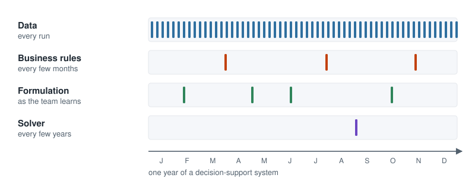
</p>

> [!NOTE]
> The ticks in **Figure: change speeds** are illustrative, not measured: the point is the difference in rhythm, not
> the exact dates.

A design that serves a decision-support system keeps these clocks apart. A new data file should not touch the
formulation, a new business rule should not touch the solver, and a new solver should not touch the way the plan is
written.

### A function that plans a flight's load

Here is the cargo loading system as it is often first written: one function that does everything. It reads the
bookings, checks the committed freight, builds the model, hands it to a solver library (the software that solves
optimization models), and writes the plan as a comma-separated values (CSV) file.

<a id="pseudo-tangled-script"></a>

**Pseudocode: tangled script**

```
// pseudocode: tangled-script
public function plan_flight_load(booking_file, aircraft_file, plan_file):
    products = read each row of booking_file as a product
    capacity = read weight and volume limits from aircraft_file
    if committed freight exceeds capacity:
        write "INFEASIBLE" to plan_file
        stop
    remove products whose single pallet cannot fit in the aircraft
    model = create a model with the solver library
    add variables, constraints and objective to model
    solve model with a 60-second time limit
    pallets = for each product, ask model for the value of its variable
    write pallets and revenue as CSV to plan_file
```

**Pseudocode: tangled script** works, and for a first experiment it is a reasonable thing to write. Now ask it to
change:

1. The booking list starts arriving as a JSON (JavaScript Object Notation) document from a web service instead of a
   CSV file.
2. A new rule says dangerous goods may fill at most a quarter of the hold.
3. A large instance takes too long, and the team wants a heuristic for it.
4. The team must move to a different solver library.
5. The team wants to test the rule that removes products that cannot fit, without running a solver at all.

Each of these is a normal request in the life of a decision-support system. The first four force the team to edit the
same function, read all of it to be sure nothing else breaks, and run all of it again. The fifth is impossible as
written: the rule sits between reading files and calling the solver, so the only way to check it is to run the whole
function, files and solver included. The rest of this section is about why that happens and how to design it away.

---

<a id="ch-forces"></a>

## Forces: coupling and cohesion

Two forces decide how hard a design is to change. They were named in the 1970s, before most of today's languages
existed, and they still explain most of what goes wrong.

[Coupling](../appendix/glossary.md#coupling) is how much one part of a system depends on another. Two parts are
tightly coupled when a change to one forces a change to the other. [Cohesion](../appendix/glossary.md#cohesion) is
how closely the elements inside one part belong together. A part is cohesive when everything in it serves one
purpose, so that a single kind of change touches it and nothing else does.

A good design has **high cohesion and low coupling**: each part does one job completely, and the parts know as
little about each other as possible. Low coupling lets a change stay inside one part; high cohesion makes sure the
change has only one part to go to. **Figure: tangled and grouped** shows the difference on the pieces of
[Pseudocode: tangled script](#pseudo-tangled-script), each dot coloured by the job it does.

<a id="fig-tangled-and-grouped"></a>

**Figure: tangled and grouped**

<p align="center">
  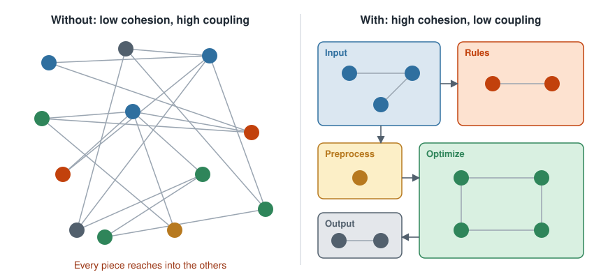
</p>

### Diagnosing the tangled script

[Pseudocode: tangled script](#pseudo-tangled-script) has both problems. It has **low cohesion**: one function holds input
parsing, business rules, preprocessing, the formulation, the solver calls and the output format. And its pieces are
**tightly coupled**: the line that collects the pallets asks the solver's model object for each value, so writing
the plan depends on which solver produced it.

The cost shows up the moment something changes. Suppose the plan must now be written as a JSON (JavaScript Object
Notation) document instead of comma-separated values (CSV). **Figure: change ripple** marks the lines of
[Pseudocode: tangled script](#pseudo-tangled-script) that must change.

<a id="fig-change-ripple"></a>

**Figure: change ripple**

<p align="center">
  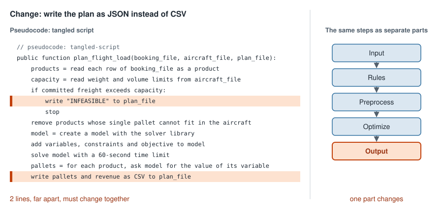
</p>

The two lines are far apart, and nothing in the function says they belong together; a developer who changes one can
easily miss the other. In a design with high cohesion and low coupling, the same change stays inside one part, the
one that writes the plan. The next chapter states the principles that get there.

### Check yourself

1. In [Pseudocode: tangled script](#pseudo-tangled-script), the line that collects `pallets` asks `model` for each value.
   Is that a problem of coupling or of cohesion?
2. A module called `utils` holds a CSV parser, a date formatter and a greedy knapsack heuristic. Which force does it
   violate?

<details>
<summary>Answers</summary>

1. Coupling: collecting the plan depends on the solver's model object, so changing the solver changes that line.
2. Cohesion: the three things share a file but not a purpose, so three unrelated kinds of change all land on it.

</details>

### Further reading

- Edward Yourdon and Larry L. Constantine, *Structured Design*, Prentice Hall, 1979: the book that introduced
  coupling and cohesion as the measures of a design.
- John Ousterhout, *A Philosophy of Software Design*, Yaknyam Press, 2018: a short, modern treatment of complexity,
  with the idea of deep modules that hide a lot behind a small interface.

---

<a id="ch-principles"></a>

## Principles

The forces say what a good design looks like; the principles say how to get there. Each principle below is a rule
of thumb that raises cohesion, lowers coupling, or both, and each one fixes one thing in
[Pseudocode: tangled script](#pseudo-tangled-script). The table at the end of the chapter summarizes which force each
principle moves.

### Information hiding

[Information hiding](../appendix/glossary.md#information-hiding) means that each part of a system hides its
[implementation details](../appendix/glossary.md#implementation-detail) behind an
[interface](../appendix/glossary.md#interface): the set of public functions the rest of the system is allowed to
use. Clients know *what* a part does, never *how*. David Parnas stated the principle in 1972, and most of what
follows builds on it.

[Pseudocode: tangled script](#pseudo-tangled-script) leaks its how: the plan is assembled by asking the solver's model
object for values. Hiding it means that optimizing returns a plain result, a `LoadPlan`, and nothing about the model
or the solver escapes.

<a id="pseudo-load-plan"></a>

**Pseudocode: load plan**

```
// pseudocode: load-plan
record LoadPlan:
    feasible: true or false
    reason: why no plan exists, when feasible is false
    pallets: for each product, the pallets loaded
    revenue: the total revenue of the plan

private function optimize(products, capacity) -> LoadPlan:
    build and solve the model
    copy the value of each variable into a LoadPlan
    return the LoadPlan                  // the model itself never leaves this function
```

Writing the plan now depends on `LoadPlan` alone. The solver can change and the plan is written exactly as before.

### Single responsibility and don't repeat yourself

The [single responsibility principle](../appendix/glossary.md#single-responsibility-principle) (SRP) says that a part
should have only one reason to change. A responsibility is not "a thing the code does" but an axis of change: a
source of requests that could force an edit. **Figure: reasons to change** shades each line of
[Pseudocode: tangled script](#pseudo-tangled-script) by the reason it would change, and six responsibilities become
visible in one function.

<a id="fig-reasons-to-change"></a>

**Figure: reasons to change**

<p align="center">
  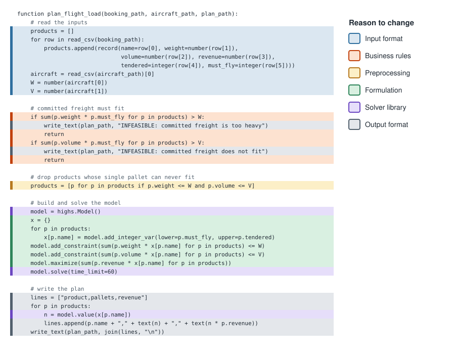
</p>

Its twin is [don't repeat yourself](../appendix/glossary.md#dont-repeat-yourself) (DRY): each piece of knowledge
should live in exactly one place. The two are sides of one coin. Single responsibility keeps one reason to change
out of places where it does not belong; don't repeat yourself keeps it from being copied into several. The tangled
script breaks this rule too: the knowledge of how a plan is written lives in two lines, which is exactly why
**Figure: change ripple** needed two edits.

Split along its reasons to change, the function becomes a sequence of private functions, each with one job.

<a id="pseudo-split-by-responsibility"></a>

**Pseudocode: split by responsibility**

```
// pseudocode: split-by-responsibility
public function plan_flight_load(booking_file, aircraft_file, plan_file):
    products, capacity = read_bookings(booking_file, aircraft_file)
    plan = check_committed_freight(products, capacity)
    if there is no plan yet:
        products = drop_unfit_products(products, capacity)
        plan = optimize(products, capacity)
    write_plan(plan, plan_file)

private function read_bookings(booking_file, aircraft_file) -> products, capacity
private function check_committed_freight(products, capacity) -> an infeasible LoadPlan, or nothing
private function drop_unfit_products(products, capacity) -> products
private function optimize(products, capacity) -> LoadPlan
private function write_plan(plan, plan_file)
```

`check_committed_freight` now returns an infeasible `LoadPlan` instead of writing a file, so `write_plan` is the
only place that knows the output format. And the fifth change request from
[What design is for](#ch-design-purpose) becomes possible: `drop_unfit_products` takes products and a capacity and
returns products, so it can be tested with a handful of values and no files or solver.

One part still has two reasons to change: `optimize` holds both the formulation and the calls to the solver library.
[A clean architecture for the cargo loading system](#ch-cargo-architecture) explains why that pair stays together.

### Dependency inversion

After the split, `optimize` still depends on one particular solver library. From here on the examples use Gurobi, a
widely used commercial solver, but any solver library plays the same role. The
[dependency inversion principle](../appendix/glossary.md#dependency-inversion-principle) says that high-level
policy should not depend on low-level details; both should depend on an
[abstraction](../appendix/glossary.md#abstraction). Here the policy is "find the best loadable plan", and the detail
is which algorithm or library finds it.

The optimize step therefore defines the interface it needs, and each algorithm implements it. The first
implementation solves the mixed-integer programming (MIP) formulation of the appendix with Gurobi.

<a id="pseudo-solution-provider"></a>

**Pseudocode: solution provider**

```
// pseudocode: solution-provider
interface SolutionProvider:
    public function solve(products, capacity) -> LoadPlan

class MipProviderGurobi implements SolutionProvider:
    public function solve(products, capacity) -> LoadPlan:
        build the model with the Gurobi library      // the only code that knows Gurobi exists
        solve it and copy the values into a LoadPlan
```

**Figure: dependency inversion** draws the change. Its boxes use a simplified form of the
[Unified Modeling Language](../appendix/glossary.md#unified-modeling-language) (UML), a standard notation for
drawing software: a box per class or interface, its name on top, its members below, `+` for public and `-` for
private, and a hollow arrowhead pointing from a class to the interface it implements.

<a id="fig-dependency-inversion"></a>

**Figure: dependency inversion**

<p align="center">
  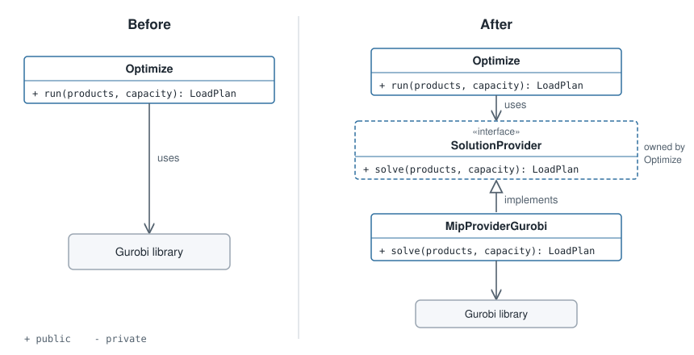
</p>

The dependency is inverted in a precise sense. Before, the arrow ran from the policy down to the library. After, the
arrow from `MipProviderGurobi` points *up*, to an interface owned by the policy. The detail now depends on the
policy, not the other way around.

### The rest of SOLID

Single responsibility and dependency inversion are two of five principles known together as
[SOLID](../appendix/glossary.md#solid), an acronym of their initials. The other three follow from the same forces:

- **Open-closed.** A part should be open for extension and closed for modification: new behaviour is added by adding
  code, not by editing code that works. Adding a column-generation provider means writing one new class that
  implements `SolutionProvider`; `MipProviderGurobi` is not touched.
- **Liskov substitution.** Any implementation of an interface must be usable wherever the interface is expected,
  without surprises. Every `SolutionProvider` must return a loadable plan or say that none exists. A heuristic may
  return a plan that is not optimal, but a heuristic that returns an overweight plan when it runs out of time breaks
  the promise, and every part that trusts `LoadPlan` breaks with it.
- **Interface segregation.** No part should depend on functions it does not use. Writing the plan needs the plan; it
  should not depend on an interface that also exposes the solver's gap, node count and log. Keep those in a separate
  record for the parts that want them.

### How each principle moves the forces

| Principle | Coupling | Cohesion | Why |
|---|:---:|:---:|---|
| Information hiding | lowers | | Clients depend on what a part does, not on how it does it |
| Single responsibility | | raises | Each part gathers the code for one reason to change |
| Don't repeat yourself | lowers | raises | One decision lives in one place, so fewer parts depend on it |
| Dependency inversion | lowers | | Policy depends on an interface, not on a particular algorithm or library |
| Open-closed | lowers | | New behaviour arrives as new code, so working parts need no edit |
| Liskov substitution | lowers | | Clients can rely on the interface alone, whatever stands behind it |
| Interface segregation | lowers | raises | Clients see only the functions they use, and each interface serves one kind of client |

### Check yourself

1. In [Pseudocode: split by responsibility](#pseudo-split-by-responsibility), how many reasons to change does
   `read_bookings` have?
2. Which principle does this line break, inside `optimize`: `model = create a model with the Gurobi library`?
3. A new `SolutionProvider` returns plans that ignore committed freight whenever the instance is large. Which
   principle does it break?

<details>
<summary>Answers</summary>

1. One: the format in which bookings and aircraft data arrive.
2. Dependency inversion: the policy depends directly on a particular library instead of on `SolutionProvider`.
3. Liskov substitution: it cannot stand in for the other providers, because it breaks the promise that a plan is
   loadable.

</details>

### Further reading

- David L. Parnas, "On the Criteria To Be Used in Decomposing Systems into Modules", *Communications of the ACM* 15
  (12), 1972: the paper that introduced information hiding, and still one of the clearest arguments for it.
- Robert C. Martin, *Agile Software Development: Principles, Patterns, and Practices*, Prentice Hall, 2002: the
  source of the SOLID principles, each with worked examples.
- Andrew Hunt and David Thomas, *The Pragmatic Programmer*, Addison-Wesley, 1999: where "don't repeat yourself" was
  named.

---

<a id="ch-patterns"></a>

## Patterns

A principle says what a good design achieves; a pattern says how a recurring problem is usually solved. A
[design pattern](../appendix/glossary.md#design-pattern) is a named, reusable solution to a problem that comes up
again and again in software design. Patterns matter for two reasons. They save a team from reinventing a solution
that others have already refined, and they give it a vocabulary: saying "the solver is a strategy" tells another
engineer a whole design in four words.

Three patterns carry the cargo design. They are a small subset of the many that exist; the further reading below
points to the full catalogues. Each is drawn in the simplified Unified Modeling Language (UML) introduced in
[Principles](#ch-principles): interfaces on top, the classes that implement them below, `+` for public and `-` for
private.

### Dependency injection

[Dependency injection](../appendix/glossary.md#dependency-injection) means that a part receives the parts it depends
on from outside, instead of creating them itself. It is the pattern that puts dependency inversion to work: once the
optimize step depends on `SolutionProvider`, something has to decide which providers it gets, and dependency
injection says that decision is made outside the optimize step.

<a id="pseudo-inject-providers"></a>

**Pseudocode: inject providers**

```
// pseudocode: inject-providers
class Optimize:
    private providers
    public function constructor(providers):      // runs when an Optimize is created
        keep providers                           // receives its providers; never builds one
```

If every part receives what it needs, some part of the program has to build the concrete pieces and pass them in.
Where that happens is a detail; what matters is that it happens outside the parts that use them. This book calls that
place the [composition root](../appendix/glossary.md#composition-root).

<a id="pseudo-composition-root"></a>

**Pseudocode: composition root**

```
// pseudocode: composition-root
public function start_program(settings):
    providers = create an enumeration provider, a MipProviderGurobi with settings.time_limit, a greedy heuristic
    optimize = create Optimize with providers
    plan_flight_load = create PlanFlightLoad with a preprocess step, optimize and a postprocess step
    reader = create a CsvBookingReader for settings.booking_file
    writer = create a CsvPlanWriter for settings.plan_file
    products, capacity = reader.read()
    writer.write(plan_flight_load.run(products, capacity))
```

<a id="fig-dependency-injection"></a>

**Figure: dependency injection**

<p align="center">
  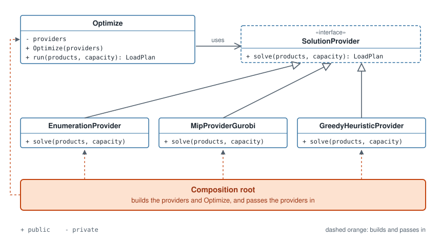
</p>

The payoff is twofold. Changing a solver's time limit, or swapping the comma-separated values (CSV) reader for a JSON
(JavaScript Object Notation) one, is a one-line edit in [Pseudocode: composition root](#pseudo-composition-root); nothing else
knows which concrete parts were chosen. And a test can hand `Optimize` a fake provider that returns a fixed plan, so the
optimize step can be tested without a solver.

### Strategy

The [strategy pattern](../appendix/glossary.md#strategy-pattern) puts a family of interchangeable algorithms behind
one interface, so that the code using them can switch between them while the program runs. It is the pattern
operations research scientists want most often, because a decision-support system rarely has one algorithm for every
instance: enumeration is exact and fast for tiny instances, a mixed-integer programming (MIP) solver is exact for
medium ones, and a heuristic is the only option when the instance is too large to solve in time.

<a id="pseudo-strategy"></a>

**Pseudocode: strategy**

```
// pseudocode: strategy
class Optimize:
    private providers
    public function run(products, capacity) -> LoadPlan:
        provider = choose(products)
        return provider.solve(products, capacity)
    private function choose(products) -> SolutionProvider:
        if the instance is small: return the enumeration provider
        if the instance is medium: return the MIP provider
        otherwise: return the greedy heuristic provider
```

<a id="fig-strategy"></a>

**Figure: strategy**

<p align="center">
  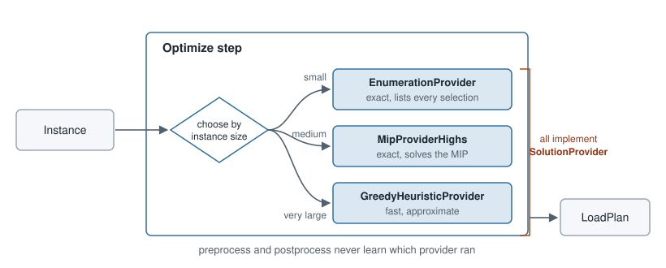
</p>

`choose` is private: the choice belongs to `Optimize` and to no one else. Preprocessing and postprocessing never
learn which provider ran, which is information hiding again, and a new provider changes one class and one rule in
`choose`.

### Adapter

The [adapter pattern](../appendix/glossary.md#adapter-pattern) translates between an interface the system expects
and one it is given. The cargo system expects products and a capacity; the outside world supplies a CSV file, a JSON
document from a web service, or a request from a web page.
Each source gets an adapter that turns it into the same entities.

<a id="pseudo-booking-readers"></a>

**Pseudocode: booking readers**

```
// pseudocode: booking-readers
interface BookingReader:
    public function read() -> products, capacity

class CsvBookingReader implements BookingReader:
    private file
    public function read() -> products, capacity:
        turn each row of file into a product with parse_row
    private function parse_row(row) -> product         // the only code that knows the column order

class JsonBookingReader implements BookingReader:
    private address
    public function read() -> products, capacity:
        fetch the document from address and turn it into products with parse_document
    private function parse_document(document) -> products, capacity   // the only code that knows the field names
```

<a id="fig-adapter"></a>

**Figure: adapter**

<p align="center">
  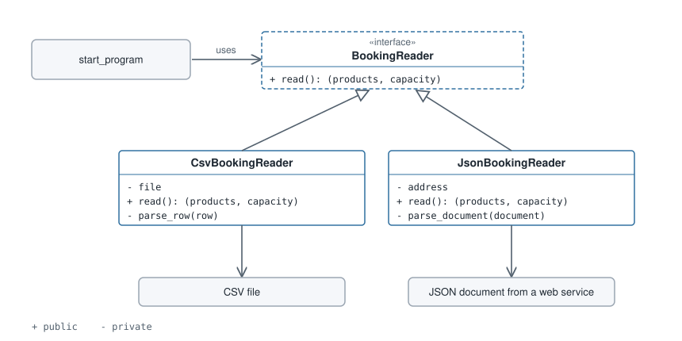
</p>

The first change request from [What design is for](#ch-design-purpose), bookings arriving as JSON, is now one new
class and one line in [Pseudocode: composition root](#pseudo-composition-root).

### Further reading

- Erich Gamma, Richard Helm, Ralph Johnson and John Vlissides, *Design Patterns: Elements of Reusable
  Object-Oriented Software*, Addison-Wesley, 1994: the catalogue of 23 patterns, including strategy and adapter,
  known as the Gang of Four book.
- Eric Freeman and Elisabeth Robson, *Head First Design Patterns*, 2nd edition, O'Reilly, 2020: a gentler
  introduction to the same patterns, with many small examples.
- Mark Seemann and Steven van Deursen, *Dependency Injection Principles, Practices, and Patterns*, Manning, 2019: the
  full treatment of dependency injection and the composition root.

---

<a id="ch-architecture"></a>

## From design to architecture

Design happens at every level of a program: a function, a class, a package, a whole program, a set of programs
across a company. The principles and patterns so far apply from a function up to a program. Near the top of that
range, design gets a different name: [software architecture](../appendix/glossary.md#software-architecture) is the
design of a whole system, meaning the few large decisions about its parts and their boundaries that are expensive to
reverse later.

An architecture is the principles of the earlier chapters applied to the largest parts of a system. Many
architectures exist; this chapter describes one that fits decision-support software well.

### Clean architecture

[Clean architecture](../appendix/glossary.md#clean-architecture), described by Robert C. Martin, arranges a system
in four concentric rings, shown in **Figure: clean architecture**.

<a id="fig-clean-architecture"></a>

**Figure: clean architecture**

<p align="center">
  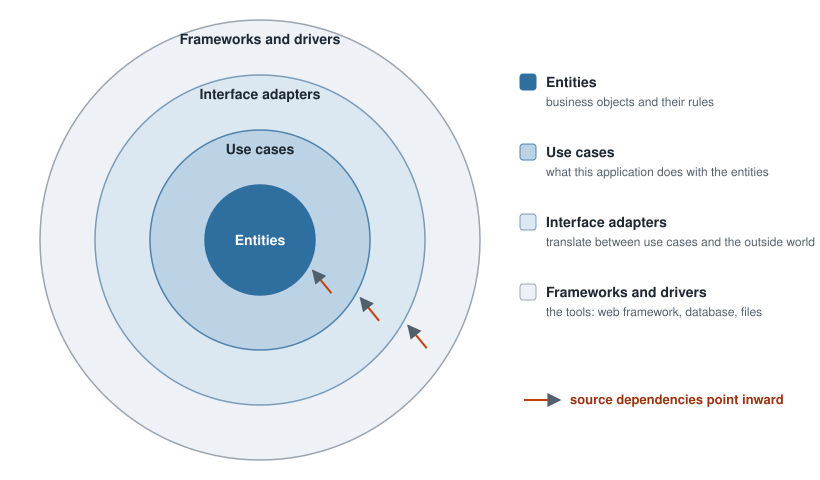
</p>

- **Entities** hold the business objects and the rules that are true of them regardless of any application.
- **Use cases** hold what this application does with the entities: the steps of one request, from its input to its
  answer.
- **Interface adapters** translate between the use cases and the outside world: reading files, answering web
  requests, writing reports.
- **Frameworks and drivers** are the tools the system runs on: a web framework, a database, the file system.

One rule holds the rings together, the **dependency rule**: code may depend only on code in its own ring or in a ring
further in. An entity never mentions a use case; a use case never mentions a web framework or a file format.
Dependency inversion is what makes the rule possible, because whenever an inner ring needs something from an outer
one, it defines an interface and lets the outer ring implement it.

The rule exists for a reason worth stating plainly. The outer rings hold what is volatile and incidental: file
formats, web frameworks, databases, all of which change for reasons that have nothing to do with the business. The
inner rings hold what the system is actually for. Pointing every dependency inward means the incidental can change
without touching the essential, and the essential can be tested without the incidental.

### Further reading

- Robert C. Martin, *Clean Architecture: A Craftsman's Guide to Software Structure and Design*, Prentice Hall, 2017:
  the source of the four rings and the dependency rule.

---

<a id="ch-cargo-architecture"></a>

## A clean architecture for the cargo loading system

The problem, from [the appendix](../appendix/running-example.md): a load planner receives a booking list for one
departure, and the system proposes how many pallets of each product to load, maximizing revenue within the aircraft's
weight and hold capacities, loading no more than was tendered and at least what must fly. This chapter places every
line of [Pseudocode: tangled script](#pseudo-tangled-script) in the four rings of **Figure: clean architecture**.

<a id="fig-cargo-architecture"></a>

**Figure: cargo architecture**

<p align="center">
  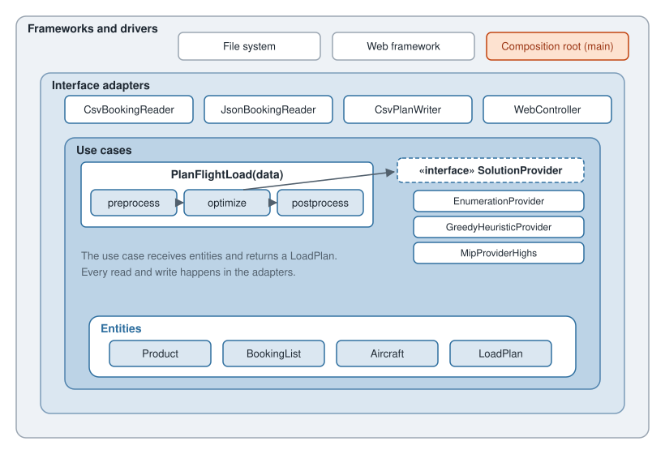
</p>

### The rings, from the inside out

**Entities.** `Product`, `BookingList` (the products tendered for one departure), `Aircraft` (with its weight and
volume capacity) and `LoadPlan`, together with the rules that hold for them in any application: a pallet count is a
whole number, a plan never loads more than was tendered. They depend on nothing.

**Use case.** `PlanFlightLoad` receives the data as entities and returns a `LoadPlan`, in three steps.

<a id="pseudo-plan-flight-load"></a>

**Pseudocode: plan flight load**

```
// pseudocode: plan-flight-load
class PlanFlightLoad:
    private preprocess, optimize, postprocess
    public function run(products, capacity) -> LoadPlan:
        checked = preprocess.run(products, capacity)       // committed freight fits? drop unfit products
        if checked is infeasible: return an infeasible LoadPlan with its reason
        plan = optimize.run(checked.products, capacity)    // chooses a SolutionProvider
        return postprocess.run(plan)                       // the plan as the planner reads it
```

- **Preprocess** applies the business rules that can be checked before solving and drops products that can never
  fit.
- **Optimize** chooses a `SolutionProvider` by instance size, as in [Pseudocode: strategy](#pseudo-strategy), and returns
  its plan. It is the only step that knows the providers exist.
- **Postprocess** turns the provider's answer into the plan the planner reads, for example sorted by revenue with
  totals.

**Interface adapters.** `CsvBookingReader` and `JsonBookingReader` turn comma-separated values (CSV) and JSON
(JavaScript Object Notation) sources into entities; `CsvPlanWriter` writes a `LoadPlan`; a `WebController` does both
for a web page. Every read and every write happens here, so the use case never sees a file.

**Frameworks and drivers.** The file system, the web framework, and the composition root that builds everything.

**Figure: request flow** follows one request inward to the use case and back out.

<a id="fig-request-flow"></a>

**Figure: request flow**

<p align="center">
  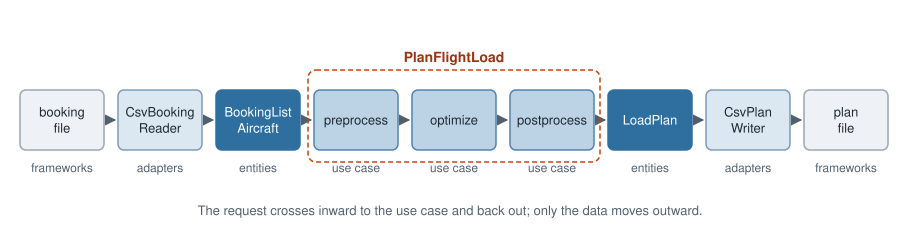
</p>

### Why the solution providers live in the use-case ring

`MipProviderGurobi`, the provider that solves the mixed-integer programming (MIP) formulation, uses the Gurobi
library, and the dependency rule says the use-case ring should not depend on outer tools. Yet the design keeps every
provider, `MipProviderGurobi` included, inside the use-case ring, next to the optimize step.

The reason is what the rule protects. The outer rings exist for details that are incidental to the business, such as
file formats and web frameworks. A MIP provider is not incidental: it contains the formulation, the variables,
constraints and objective of the cargo model, which is the core algorithm of the whole system. The formulation is
written with the solver library, and the two cannot be separated without building a modelling layer of their own.
Moving the provider outward would put the system's most important logic in the ring meant for its least important
details.

What keeps the design clean is the boundary that does exist: `MipProviderGurobi` is one encapsulated package, the
only code that uses the Gurobi library, reachable only through `SolutionProvider`. Replacing the solver means writing
one new provider and changing one line in [Pseudocode: composition root](#pseudo-composition-root).

### Where the tangled script went

| In [Pseudocode: tangled script](#pseudo-tangled-script) | In the clean architecture |
|---|---|
| Read the bookings and the aircraft's capacity | `CsvBookingReader`, an interface adapter |
| Check the committed freight | Preprocess, in the use case, returning an infeasible `LoadPlan` |
| Remove products that cannot fit | Preprocess, in the use case |
| Create, build and solve the model | `MipProviderGurobi`, one `SolutionProvider` chosen by optimize |
| Ask the model for each value | Inside `MipProviderGurobi`, which returns a `LoadPlan` |
| Write the plan | `CsvPlanWriter`, an interface adapter, reading only the `LoadPlan` |
| The 60-second time limit and the file names | [Pseudocode: composition root](#pseudo-composition-root) |

Each of the five change requests from [What design is for](#ch-design-purpose) now lands in one place: a JSON source
is a new adapter, a dangerous-goods rule is a change to preprocess, a heuristic is a new provider, a new solver is a
new provider and a line in the composition root, and the rule that removes unfit products is tested by calling
preprocess with a few values.

---

<a id="ch-conclusion"></a>

## Conclusion

Design exists to keep change cheap, through modularity and testability, and a decision-support system has to absorb
changes that arrive on very different clocks.

- **Design is for change** ([What design is for](#ch-design-purpose)). A good design keeps each change inside one
  part and lets each part be tested on its own.
- **Two forces decide it** ([Forces: coupling and cohesion](#ch-forces)). Aim for high cohesion and low coupling.
- **Principles turn the forces into rules** ([Principles](#ch-principles)). Hide details behind interfaces, give each
  part one reason to change, and make policy depend on abstractions rather than on solvers.
- **Patterns apply the principles** ([Patterns](#ch-patterns)). Inject dependencies from one composition root, put
  algorithms behind a strategy, and adapt each outside source to the same entities.
- **Architecture is design at the scale of a system** ([From design to architecture](#ch-architecture)). In clean
  architecture, dependencies point inward, toward what the system is for.
- **The cargo system fits the rings** ([A clean architecture for the cargo loading system](#ch-cargo-architecture)).
  The use case runs preprocess, optimize and postprocess, and the choice of algorithm stays inside optimize.

A design is only as safe to change as the tests that check it, which is where the book goes next.

---

[← Book contents](../../README.md) · [Next section: 05 Testing decision-support software →](../05-testing/README.md)
