# Section 04: Designing decision-support software

<a id="ch-introduction"></a>

## 1. Introduction

A decision-support system is built from parts that change at different speeds. The data changes
every run, business rules change every few months, the formulation changes as the team learns the
problem, and the solver may change once in the system's life. **The difference this section
addresses:** when those parts are tangled in one script, every change to one of them risks breaking
the others, and none of them can be checked on its own. Design is the practice of drawing boundaries
between them and stating what each part promises across its boundary, so that each change stays
where it belongs and each part can be tested alone.

The section argues from the general to the particular. It starts with what design is for and the two
forces every design balances, derives the principles that follow from those forces, and states what
a boundary promises. It then names the patterns that put the principles to work, first for software
in general and then for the optimization step of a decision-support system, and ends with an
architecture for one complete system that uses all of them.

[2. What design is for](#ch-design-purpose) introduces **Pseudocode: tangled script**, a single
function that does the work of a whole system, and six requests to change it.
[3. Forces: coupling and cohesion](#ch-forces) diagnoses what is wrong with it, and
[4. Principles](#ch-principles) states the rules that follow from the diagnosis.
[5. Contracts](#ch-contracts) says what a part promises once it has a boundary, and writes the
promise of the optimization step. [6. Design patterns](#ch-patterns) shows the reusable solutions
that apply the principles. [7. From design to architecture](#ch-architecture) lifts the same ideas
to the scale of a whole system, and [8. DSS patterns](#ch-dss-patterns) does for the optimization
step what design patterns do for classes: it names the arrangements that recur.
[9. A clean architecture for the cargo loading system](#ch-cargo-architecture) shows where every
line of the tangled script ends up and what each part promises to the tests of the next section.
Read them in order: each chapter uses only what the chapters before it defined. The system they
design is defined in [The cargo model example](#the-cargo-model-example), next.

### The cargo model example

Every chapter designs the cargo loading system defined in
[the appendix](../appendix/cargo_model_example.md): for one departure, how many pallets of each
product to load, so that the revenue carried is as large as possible without exceeding the
aircraft's maximum weight or the capacity of its hold. The inputs are a booking list (the products
offered and the pallets of each that must fly), a product catalogue (weight, volume and revenue per
pallet) and the aircraft's two capacities. This section holds the model fixed: the formulation never
changes, only the code around it.

### How to read the pseudocode and figures

Every pseudocode block and figure has a name, shown in bold above it, and the text refers to it by
that name. Pseudocode also carries the name as its first line, for example
`// pseudocode: tangled-script`.

The pseudocode is written as structured English, one action per line, with only the detail the point
needs. A function is written as its name, its inputs and, after `returns`, what it gives back. Every
function is marked [`public` or `private`](../appendix/glossary.md#public-and-private): any part of
the program may call a public function, and only the code around it may call a private one. The
difference between the two is central to this section, so no function is left unmarked. A few more
keywords appear: `class` groups data with the functions that use it, `interface` lists public
functions without implementing them, `implements` says that a class provides everything an interface
lists, and `record` is a plain group of named values. A comment that starts with `requires`,
`returns` or `raises` states a promise, and [5. Contracts](#ch-contracts) explains how to read it.

---

<a id="ch-design-purpose"></a>

## 2. What design is for

Software design is the set of decisions about how code is divided into parts and how those parts are
connected. It is not about how the code looks, and it is not a phase that ends before programming
starts. Every function a team writes is a design decision, whether anyone thinks of it that way or
not.

The purpose of those decisions is to keep future change cheap. A program that runs correctly today
has done half its job; the other half is being changeable tomorrow, when the business asks for
something new. Two properties make change cheap, and a good design has both:

- **[Modularity](../appendix/glossary.md#modularity).** The system is built from parts with clear
  boundaries, so a change stays inside one part.
- **[Testability](../appendix/glossary.md#testability).** Each part can be checked on its own,
  quickly, without running the others. A change is only cheap if the team can confirm, in minutes,
  that it broke nothing.

The two support each other. A part with a clear boundary is easy to test in isolation, and a part
that is hard to test is usually a sign that its boundary is in the wrong place.

### Parts that change at different speeds

What a decision-support system has to absorb is not one kind of change but several, each on its own
clock.

<a id="fig-change-speeds"></a>

**Figure: change speeds**

<p align="center">
  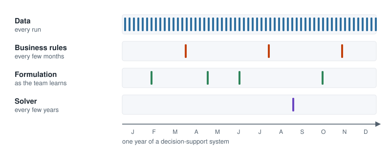
</p>

> [!NOTE] The ticks in **Figure: change speeds** are illustrative, not measured: the point is the
> difference in rhythm, not the exact dates.

A design that serves a decision-support system keeps these clocks apart. A new data file should not
touch the formulation, a new solver should not touch the way the plan is written, and when a change
does have to cross several parts, the design should make it plain which ones.

### A function that plans a flight's load

Here is the cargo loading system as it is often first written: one function that does everything. It
reads the bookings, checks the committed freight, builds the model, hands it to a solver library
(the software that solves optimization models), and writes the plan as a comma-separated values
(CSV) file.

<a id="pseudo-tangled-script"></a>

**Pseudocode: tangled script**

```
// pseudocode: tangled-script
public plan_flight_load(booking_file, aircraft_file, plan_file)
    products = read each row of booking_file as a product
    capacity = read weight and volume limits from aircraft_file
    if committed freight exceeds capacity:
        write "INFEASIBLE" to plan_file
        stop
    remove products whose single pallet cannot fit in the aircraft
    model = create a model with the solver library
    add variables, constraints and objective to model
    solve model with a 60-second time limit
    pallets = for each product, ask model for the value of its variable
    write pallets and revenue as CSV to plan_file
```

**Pseudocode: tangled script** works, and for a first experiment it is a reasonable thing to write.
Now ask it to change:

1. The booking list starts arriving as a JSON (JavaScript Object Notation) document from a web
   service instead of a CSV file.
2. A new rule says dangerous goods may fill at most a quarter of the hold.
3. A large instance takes too long, and the team wants a heuristic for it.
4. The team must move to a different solver library.
5. The team wants to test the rule that removes products that cannot fit, without running a solver
   at all.
6. The solver reaches its 60-second limit holding a load it has not proven to be the best one, and
   the load planner wants to know that before acting on it.

Each of these is a normal request in the life of a decision-support system. The first four force the
team to edit the same function, read all of it to be sure nothing else breaks, and run all of it
again. The fifth is impossible as written: the rule sits between reading files and calling the
solver, so the only way to check it is to run the whole function, files and solver included. The
sixth has no answer at all. The script writes whatever the model holds when the solver stops, in the
same format as a proven optimum, and if the solver found no load in time, the line that asks the
model for values fails.

The fifth request shows something that holds for every program. A test runs one part alone: it
hands the part an input and compares what comes back with what was expected. Whether that is
possible is decided when the code is written, not when the test is. **Pseudocode: tangled script**
has no part to run alone, takes nothing but files and gives back nothing but a file, so no amount
of effort from the person testing can check the rule on its own. Design is therefore a prerequisite
for testing: a team can only test what its design lets a test reach.

The rest of this section is about why that happens and how to design it away. One caution before
starting: a good design does not make every change small. The second request is a new constraint on
the load itself, and no arrangement of the code can keep that inside one part. What a good design
does is show exactly which parts such a change reaches, and
[9. A clean architecture for the cargo loading system](#ch-cargo-architecture) returns to it.

---

<a id="ch-forces"></a>

## 3. Forces: coupling and cohesion

Two forces decide how hard a design is to change. They were named in the 1970s, before most of
today's languages existed, and they still explain most of what goes wrong.

[Coupling](../appendix/glossary.md#coupling) is how much one part of a system depends on another.
Two parts are tightly coupled when a change to one forces a change to the other.
[Cohesion](../appendix/glossary.md#cohesion) is how closely the elements inside one part belong
together. A part is cohesive when everything in it serves one purpose, so that a single kind of
change touches it and nothing else does.

A good design has **high cohesion and low coupling**: each part does one job completely, and the
parts know as little about each other as possible. Low coupling lets a change stay inside one part;
high cohesion makes sure the change has only one part to go to. **Figure: tangled and grouped**
shows the difference on the pieces of [Pseudocode: tangled script](#pseudo-tangled-script), each dot
coloured by the job it does.

<a id="fig-tangled-and-grouped"></a>

**Figure: tangled and grouped**

<p align="center">
  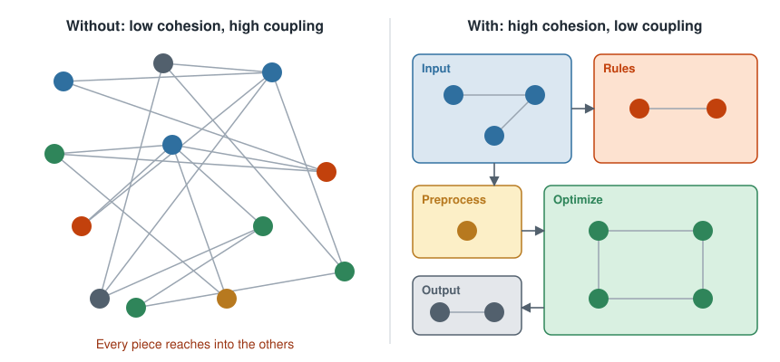
</p>

Low coupling does not mean no coupling. The part that writes the plan must depend on what a load is:
which products, how many pallets, what revenue. It does not need to depend on which library computed
the load. Lowering coupling means keeping the first dependence and removing the second.

### Diagnosing the tangled script

[Pseudocode: tangled script](#pseudo-tangled-script) has both problems. It has **low cohesion**: one
function holds input parsing, business rules, preprocessing, the formulation, the solver calls and
the output format. And its pieces are **tightly coupled**: the line that collects the pallets asks
the solver's model object for each value, so writing the plan depends on which solver produced it.

The cost shows up the moment something changes. Suppose the plan must now be written as a JSON
(JavaScript Object Notation) document instead of comma-separated values (CSV). **Figure: change
ripple** marks the lines of [Pseudocode: tangled script](#pseudo-tangled-script) that must change.

<a id="fig-change-ripple"></a>

**Figure: change ripple**

<p align="center">
  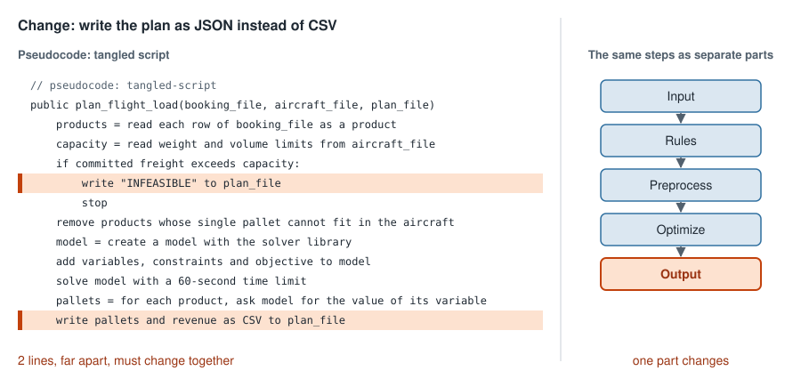
</p>

The two lines are far apart, and nothing in the function says they belong together; a developer who
changes one can easily miss the other. In a design with high cohesion and low coupling, the same
change stays inside one part, the one that writes the plan. The next chapter states the principles
that get there.

### Check yourself

1. In [Pseudocode: tangled script](#pseudo-tangled-script), the line that collects `pallets` asks
   `model` for each value. Is that a problem of coupling or of cohesion?
2. A module called `utils` holds a CSV parser, a date formatter and a greedy knapsack heuristic.
   Which force does it violate?

<details>
<summary>Answers</summary>

1. Coupling: collecting the plan depends on the solver's model object, so changing the solver
   changes that line.
2. Cohesion: the three things share a file but not a purpose, so three unrelated kinds of change all
   land on it.

</details>

### Further reading

- Edward Yourdon and Larry L. Constantine, _Structured Design_, Prentice Hall, 1979: the book that
  introduced coupling and cohesion as the measures of a design.
- John Ousterhout, _A Philosophy of Software Design_, Yaknyam Press, 2018: a short, modern treatment
  of complexity, with the idea of deep modules that hide a lot behind a small interface.

---

<a id="ch-principles"></a>

## 4. Principles

The forces say what a good design looks like; the principles say how to get there. Each principle
below is a rule of thumb that raises cohesion, lowers coupling, or both, and each one fixes one
thing in [Pseudocode: tangled script](#pseudo-tangled-script). The table at the end of the chapter
summarizes which force each principle moves.

### Information hiding

[Information hiding](../appendix/glossary.md#information-hiding) means that each part of a system
hides its [implementation details](../appendix/glossary.md#implementation-detail) behind an
[interface](../appendix/glossary.md#interface): the set of public functions the rest of the system
is allowed to use. Clients know _what_ a part does, never _how_. David Parnas stated the principle
in 1972, and most of what follows builds on it.

[Pseudocode: tangled script](#pseudo-tangled-script) leaks its how: the plan is assembled by asking
the solver's model object for values. Hiding it means that optimizing returns a plain result, a
`Solution`, and nothing about the model or the solver escapes.

<a id="pseudo-plain-result"></a>

**Pseudocode: plain result**

```
// pseudocode: plain-result
record Solution
    picked                        // product name -> whole number of pallets, 0 when left behind
    objective_value               // revenue of the load
    total_weight                  // weight of the load
    total_volume                  // volume of the load

private optimize(products, capacity) returns Solution
    build and solve the model
    copy the value of each variable into a Solution
    return the Solution                  // the model itself never leaves this function
```

Writing the plan now depends on `Solution` alone. The solver can change and the plan is written
exactly as before. What `optimize` should return when it has no load to offer is a question this
record does not answer yet; [5. Contracts](#ch-contracts) does.

### Single responsibility and don't repeat yourself

The [single responsibility principle](../appendix/glossary.md#single-responsibility-principle) (SRP)
says that a part should have only one reason to change. A responsibility is not "a thing the code
does" but an axis of change: a source of requests that could force an edit. **Figure: reasons to
change** shades each line of [Pseudocode: tangled script](#pseudo-tangled-script) by the reason it
would change, and six responsibilities become visible in one function.

<a id="fig-reasons-to-change"></a>

**Figure: reasons to change**

<p align="center">
  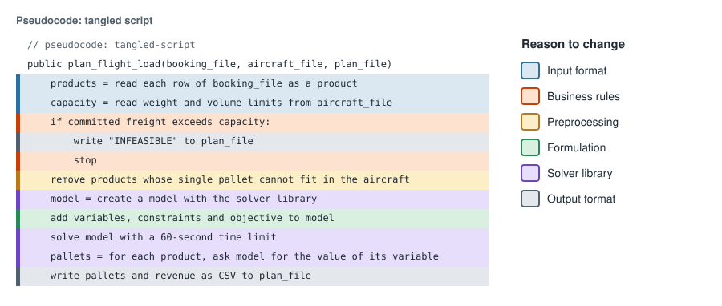
</p>

Its twin is [don't repeat yourself](../appendix/glossary.md#dont-repeat-yourself) (DRY): each piece
of knowledge should live in exactly one place. The two are sides of one coin. Single responsibility
keeps one reason to change out of places where it does not belong; don't repeat yourself keeps it
from being copied into several. The tangled script breaks this rule too: the knowledge of how a plan
is written lives in two lines, which is exactly why **Figure: change ripple** needed two edits.

Split along its reasons to change, the function becomes a sequence of private functions, each with
one job.

<a id="pseudo-split-by-responsibility"></a>

**Pseudocode: split by responsibility**

```
// pseudocode: split-by-responsibility
public plan_flight_load(booking_file, aircraft_file, plan_file)
    products, capacity = read_bookings(booking_file, aircraft_file)
    products = drop_unfit_products(products, capacity)
    solution = optimize(products, capacity)
    write_plan(solution, plan_file)

private read_bookings(booking_file, aircraft_file) returns products, capacity
private drop_unfit_products(products, capacity) returns products
private optimize(products, capacity) returns Solution, or nothing when it has no load
private write_plan(solution, plan_file)
```

`optimize` now reports that it has no load instead of writing a file, so `write_plan` is the only
place that knows the output format. And the fifth change request from
[2. What design is for](#ch-design-purpose) becomes possible: `drop_unfit_products` takes products
and a capacity and returns products, so it can be tested with a handful of values and no files or
solver.

One part still has two reasons to change: `optimize` holds both the formulation and the calls to the
solver library. [8. DSS patterns](#ch-dss-patterns) lays out the ways to arrange that pair, and
[9. A clean architecture for the cargo loading system](#ch-cargo-architecture) explains why this
system keeps them together.

### Dependency inversion

After the split, `optimize` still depends on one particular solver library. From here on the
examples use Gurobi, a widely used commercial solver, but any solver library plays the same role.
The [dependency inversion principle](../appendix/glossary.md#dependency-inversion-principle) says
that high-level policy should not depend on low-level details; both should depend on an
[abstraction](../appendix/glossary.md#abstraction). Here the policy is "find the best loadable
plan", and the detail is which algorithm or library finds it.

The optimize step therefore defines the interface it needs, and each algorithm implements it. The
first implementation solves the mixed-integer programming (MIP) formulation of the appendix with
Gurobi.

<a id="pseudo-solution-provider"></a>

**Pseudocode: solution provider**

```
// pseudocode: solution-provider
interface SolutionProvider
    public solve(products, capacity) returns Solution

class MipProviderGurobi implements SolutionProvider
    public solve(products, capacity) returns Solution
        build the model with the Gurobi library      // the only code that knows Gurobi exists
        solve it and copy the values into a Solution
```

**Figure: dependency inversion** draws the change. Its boxes use a simplified form of the
[Unified Modeling Language](../appendix/glossary.md#unified-modeling-language) (UML), a standard
notation for drawing software: a box per class or interface, its name on top, its members below, `+`
for public and `-` for private, and a hollow arrowhead pointing from a class to the interface it
implements.

<a id="fig-dependency-inversion"></a>

**Figure: dependency inversion**

<p align="center">
  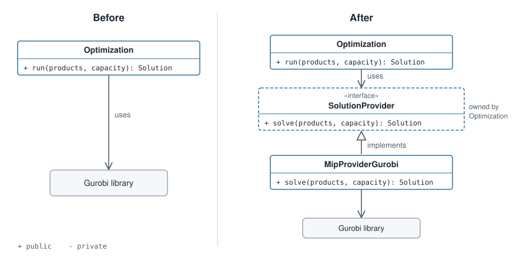
</p>

The dependency is inverted in a precise sense. Before, the arrow ran from the policy down to the
library. After, the arrow from `MipProviderGurobi` points _up_, to an interface owned by the policy.
The detail now depends on the policy, not the other way around.

### The rest of SOLID

Single responsibility and dependency inversion are two of five principles known together as
[SOLID](../appendix/glossary.md#solid), an acronym of their initials. Two more follow from the same
forces:

- **Open-closed.** A part should be open for extension and closed for modification: new behaviour is
  added by adding code, not by editing code that works. Adding a heuristic means writing one new
  class that implements `SolutionProvider`; `MipProviderGurobi` is not touched. The new class still
  has to be shown to work, and the code that chooses between providers still changes.
- **Interface segregation.** No part should depend on functions it does not use. Writing the plan
  needs the load; it should not depend on an interface that also exposes the solver's gap, node
  count and log. Keep those in a separate record for the parts that want them.

The fifth, [Liskov substitution](../appendix/glossary.md#liskov-substitution-principle), says that
every implementation of an interface must behave as the interface promises. It cannot be stated
before the idea of a promise, so it waits for [5. Contracts](#ch-contracts).

### When splitting stops helping

Every boundary has a cost: another name to learn, a record to agree on, a connection to maintain.
Split a part when it owns knowledge the rest should not need, when it offers something useful on its
own, or when it isolates a likely source of change. A one-line helper can make code easier to read,
but it does not deserve a public interface, and a design with an interface for every function is as
hard to change as the tangled script, for the opposite reason. The split above stops at four
functions because the script has that many independent reasons to change outside the optimize step,
not because four is a good number.

### How each principle moves the forces

| Principle             | Coupling | Cohesion | Why                                                                                   |
| --------------------- | :------: | :------: | ------------------------------------------------------------------------------------- |
| Information hiding    |  lowers  |          | Clients depend on what a part does, not on how it does it                             |
| Single responsibility |          |  raises  | Each part gathers the code for one reason to change                                   |
| Don't repeat yourself |  lowers  |  raises  | One decision lives in one place, so fewer parts depend on it                          |
| Dependency inversion  |  lowers  |          | Policy depends on an interface, not on a particular algorithm or library              |
| Open-closed           |  lowers  |          | New behaviour arrives as new code, so working parts need no edit                      |
| Interface segregation |  lowers  |  raises  | Clients see only the functions they use, and each interface serves one kind of client |
| Liskov substitution   |  lowers  |          | Clients can rely on the interface alone, whatever stands behind it                    |

### Check yourself

1. In [Pseudocode: split by responsibility](#pseudo-split-by-responsibility), how many reasons to
   change does `read_bookings` have?
2. Which principle does this line break, inside `optimize`:
   `model = create a model with the Gurobi library`?

<details>
<summary>Answers</summary>

1. One: the format in which bookings and aircraft data arrive.
2. Dependency inversion: the policy depends directly on a particular library instead of on
   `SolutionProvider`.

</details>

### Further reading

- David L. Parnas, "On the Criteria To Be Used in Decomposing Systems into Modules", _Communications
  of the ACM_ 15 (12), 1972: the paper that introduced information hiding, and still one of the
  clearest arguments for it.
- Robert C. Martin, _Agile Software Development: Principles, Patterns, and Practices_, Prentice
  Hall, 2002: the source of the SOLID principles, each with worked examples.
- Andrew Hunt and David Thomas, _The Pragmatic Programmer_, Addison-Wesley, 1999: where "don't
  repeat yourself" was named.

---

<a id="ch-contracts"></a>

## 5. Contracts

Splitting two parts creates an obligation to say how they cooperate. The split of the last chapter
left one question open: what does `optimize` give back when it has no load, or when it has one it
could not prove to be the best? A caller that only knows the name of a function and the shape of its
result cannot answer that, and the sixth change request from
[2. What design is for](#ch-design-purpose) asks exactly that question. A boundary without a stated
promise only moves the uncertainty from inside a function to the line between two.

### Interface and contract

The [interface](../appendix/glossary.md#interface) of a part is everything it offers to the code
that calls it. The same thing goes by other names, and this book uses them interchangeably:
[contract](../appendix/glossary.md#contract), signature and
[abstraction](../appendix/glossary.md#abstraction). For each function it states:

- its name, its inputs and its output,
- what the function **requires** of its caller,
- what it **returns**, and what the caller may conclude from each possible result,
- which errors it **raises**, and when.

The first item is the first line of the function. The other three are promises, written as comments
above it, and they belong to the interface as much as the first line does. On its own,
`run(instance) returns Result` does not say whether the load it returns respects the capacities, or
whether a better one exists.

[Information hiding](../appendix/glossary.md#information-hiding) and the contract are two halves of
one decision. Hiding says what the caller must not rely on: the algorithm, the solver, the model
object. The contract says what the caller may rely on. Hiding too little leaks the mechanism. Hiding
too much is the opposite mistake: whether a load is proven to be the best one is not an
implementation detail if the caller's next step depends on it, and neither is the difference between
"no load exists" and "no load was found".

### The cargo optimization contract

The optimize step becomes a class, `Optimization`, with one public function, `run`. It receives the
whole problem as one record, an `Instance`, and returns one record, a `Result`.

<a id="pseudo-optimization-contract"></a>

**Pseudocode: optimization contract**

```
// pseudocode: optimization-contract
record Product
    name
    weight                        // per pallet, positive
    volume                        // per pallet, positive
    revenue                       // per pallet, not negative
    committed_quantity            // pallets that must fly, 0 by default

record Instance
    products                      // list of Product, each name used once
    weight_capacity               // not negative
    volume_capacity               // not negative

record Solution
    picked                        // product name -> whole number of pallets, 0 when left behind
    objective_value               // revenue of the load
    total_weight                  // weight of the load
    total_volume                  // volume of the load

record Result
    status                        // optimal, feasible, infeasible or not_found
    solution                      // a Solution when status is optimal or feasible, absent otherwise

class Optimization
    // requires: an instance that respects the comments on Product and Instance
    // returns:  a Result whose status is
    //             optimal     the solution is a feasible load, and no feasible load earns more
    //             feasible    the solution is a feasible load; a better one may exist
    //             infeasible  no feasible load exists for this instance
    //             not_found   the search stopped with no load and no proof that none exists
    // raises:   InvalidInstance when the instance breaks what is required
    public run(instance) returns Result
```

A _feasible load_ is one that respects every constraint of the model in
[the appendix](../appendix/cargo_model_example.md): whole pallets, every committed pallet loaded,
and neither capacity exceeded. The totals a `Solution` reports are the true totals of its load.
**Figure: optimization contract** shows the four results side by side.

<a id="fig-optimization-contract"></a>

**Figure: optimization contract**

<p align="center">
  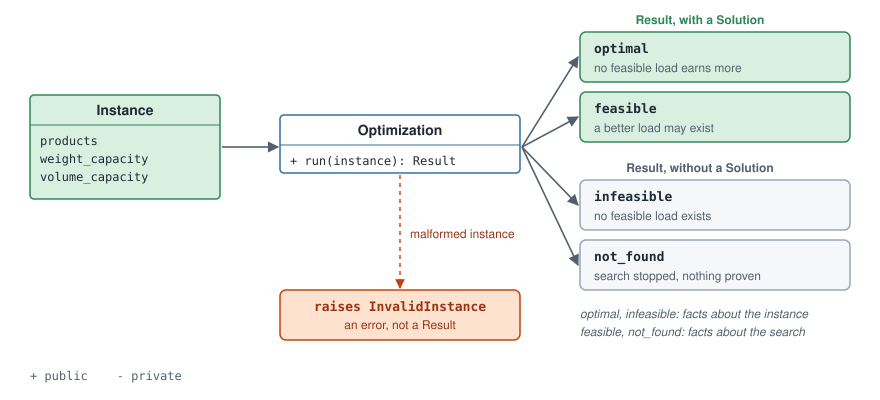
</p>

The four statuses separate two kinds of fact. `optimal` and `infeasible` are facts about the
instance: they stay true whichever algorithm is used and however long it runs. `feasible` and
`not_found` are facts about the search: more time or another algorithm could turn the first into
`optimal` and the second into anything else. The sixth change request is now answerable. A solver
stopped at its time limit returns `feasible` with the load it holds, or `not_found` if it holds
none, and the load planner is told which.

### Malformed is not infeasible

Two instances can have no plan for very different reasons. An instance whose committed freight
weighs more than the aircraft can carry is a correct description of an impossible flight: the answer
is a `Result` with status `infeasible`, and the planner can act on it. An instance with a negative
weight, or the same product listed twice, describes nothing: there is no answer to give, and `run`
raises `InvalidInstance`.

The difference matters to the caller. A status is an answer and is passed on to the planner. An
error means the request never made sense, and it goes to whoever supplied the data. For the same
reason a crash inside the solver is raised as an error and is not turned into a status: reporting it
as `infeasible` would tell the planner that no load exists when nobody knows that.

### What the contract leaves free

A contract is as useful for what it does not promise as for what it does.

- **The algorithm.** Nothing says how the load is found. A solver, a heuristic and a search over all
  loads can all stand behind `run`.
- **The choice among ties.** When two loads earn the same revenue, either may be returned. Replacing
  the algorithm can change which one comes back, and that is not a change of behaviour, because no
  promise was made about it.
- **How long it takes.** The contract says what each status means, not how quickly it arrives. A
  time limit is a setting of the part that searches, and it shows up in the contract only through
  the status it leads to.

Whatever is left free can change without telling the callers. Whatever is promised cannot. One
promise needs care in a numerical program: a solver works with rounded numbers, so "whole pallets"
and "within capacity" must be read with a stated tolerance, which
[the testing section](../05-testing/README.md#difficulty-floating-point) takes up.

### Every implementation keeps the promise

The last of the [SOLID](../appendix/glossary.md#solid) principles can now be stated. **Liskov
substitution** says that any implementation of an interface must be usable wherever the interface is
expected, without the caller noticing: it must accept everything the contract accepts and keep
everything the contract promises.

`SolutionProvider` from [4. Principles](#ch-principles) takes the same contract as `Optimization`:
`solve(instance) returns Result`, with the same four statuses. A heuristic can implement it
honestly, because the contract has a status for a load that may not be the best one. What it may not
do is claim more than it knows. A heuristic that labels its load `optimal` breaks the contract, and
so does one that returns an overweight load when it runs out of time, or one that answers
`infeasible` whenever it finds nothing. Each of them takes an `Instance` and returns a `Result`, as
the interface asks, and still breaks its promises. Every part that trusts a `Result` breaks with
it.

### From the contract to the tests

A contract is also the list of things a test can check. Each promise above becomes an experiment:
build an instance, call `run`, and compare the `Result` with what the contract says it must be. The
algorithm, the ties and the running time are left free, so no test should depend on them.
[The testing section](../05-testing/README.md#ch-model-testing) starts from **Pseudocode:
optimization contract** and works out how to check each status, including `optimal`, whose expected
value is the very thing the model exists to compute.

### Check yourself

1. A provider stops at its time limit holding a feasible load and no proof that it is the best one.
   Which status does it return?
2. A new provider answers `infeasible` whenever its search finds no load. Which principle does it
   break?
3. After a change of solver, the same instance returns a different load with the same revenue. Has
   the contract been broken?
4. An instance lists a product with a weight of zero. Is the result `infeasible`?

<details>
<summary>Answers</summary>

1. `feasible`, with the load. `optimal` would promise something it has not established.
2. Liskov substitution: `infeasible` promises that no feasible load exists, and finding none is not
   a proof. The honest status is `not_found`.
3. No. The contract promises a load that no feasible load beats, not a particular one among ties.
4. No. The contract requires positive weights, so the instance is malformed and `run` raises
   `InvalidInstance`.

</details>

### Further reading

- Bertrand Meyer, "Applying 'Design by Contract'", _Computer_ 25 (10), 1992: the paper that framed
  an interface as an agreement of obligations and guarantees between a caller and a routine.
- Barbara H. Liskov and Jeannette M. Wing, "A Behavioral Notion of Subtyping", _ACM Transactions on
  Programming Languages and Systems_ 16 (6), 1994: the precise statement of what it means for one
  implementation to stand in for another.

---

<a id="ch-patterns"></a>

## 6. Design patterns

A principle says what a good design achieves; a pattern says how a recurring problem is usually
solved. A [design pattern](../appendix/glossary.md#design-pattern) is a named, reusable solution to
a problem that comes up again and again in software design. Patterns matter for two reasons. They
save a team from reinventing a solution that others have already refined, and they give it a
vocabulary: saying "the solver is a strategy" tells another engineer a whole design in four words.

Three patterns carry the cargo design. They are a small subset of the many that exist; the further
reading below points to the full catalogues. Each is drawn in the simplified Unified Modeling
Language (UML) introduced in [4. Principles](#ch-principles): interfaces on top, the classes that
implement them below, `+` for public and `-` for private. From here on, every provider takes an
`Instance` and returns a `Result`, as [5. Contracts](#ch-contracts) defined them.

### Dependency injection

[Dependency injection](../appendix/glossary.md#dependency-injection) means that a part receives the
parts it depends on from outside, instead of creating them itself. It is the pattern that puts
dependency inversion to work: once `Optimization` depends on `SolutionProvider`, something has to
decide which providers it gets, and dependency injection says that decision is made outside
`Optimization`.

<a id="pseudo-inject-providers"></a>

**Pseudocode: inject providers**

```
// pseudocode: inject-providers
class Optimization
    private providers
    public constructor(providers)                // runs when an Optimization is created
        keep providers                           // receives its providers; never builds one
```

If every part receives what it needs, some part of the program has to build the concrete pieces and
pass them in. Where that happens is a detail; what matters is that it happens outside the parts that
use them. This book calls that place the
[composition root](../appendix/glossary.md#composition-root).

<a id="pseudo-composition-root"></a>

**Pseudocode: composition root**

```
// pseudocode: composition-root
public start_program(settings)
    providers = create a MipProviderGurobi with settings.time_limit, and a GreedyHeuristicProvider
    optimization = create Optimization with providers
    plan_flight_load = create PlanFlightLoad with a preprocess step, optimization and a postprocess step
    reader = create a CsvBookingReader for settings.booking_file
    writer = create a CsvPlanWriter for settings.plan_file
    booking_list, aircraft = reader.read()
    writer.write(plan_flight_load.run(booking_list, aircraft))
```

<a id="fig-dependency-injection"></a>

**Figure: dependency injection**

<p align="center">
  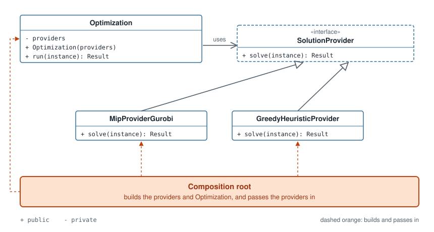
</p>

The payoff is twofold. Changing a solver's time limit, or swapping the comma-separated values (CSV)
reader for a JSON (JavaScript Object Notation) one, is a one-line edit in
[Pseudocode: composition root](#pseudo-composition-root); nothing else knows which concrete parts
were chosen. And a test can hand `Optimization` a stand-in provider that returns a fixed `Result`,
so the code around the solver can be tested without a solver. The testing section calls such a
stand-in a [test double](../appendix/glossary.md#test-double).

### Strategy

The [strategy pattern](../appendix/glossary.md#strategy-pattern) puts a family of interchangeable
algorithms behind one interface, so that the code using them can switch between them while the
program runs. It is the pattern operations research scientists want most often, because a
decision-support system rarely has one algorithm for every instance: a mixed-integer programming
(MIP) solver proves the best load when the instance is small enough to finish in time, and a
heuristic is the only option when it is not.

<a id="pseudo-strategy"></a>

**Pseudocode: strategy**

```
// pseudocode: strategy
class Optimization
    private providers
    public run(instance) returns Result
        provider = choose(instance)
        return provider.solve(instance)
    private choose(instance) returns SolutionProvider
        if the MIP provider is expected to finish in time on this instance: return the MIP provider
        otherwise: return the greedy heuristic provider
```

<a id="fig-strategy"></a>

**Figure: strategy**

<p align="center">
  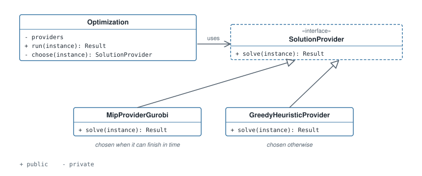
</p>

`choose` is private: the choice belongs to `Optimization` and to no one else. The rule inside it is
one possible policy, not a law. A real one is tuned on measured running times, and it may look at
more than size. Whatever the rule, `choose` only picks; it never changes what the `Result` means. If
the heuristic ran, the status says `feasible`, and the caller decides whether that is good enough.
Strategy works only because of Liskov substitution: `Optimization` can pass on whatever its provider
returns because every provider keeps the same contract.

### Adapter

The [adapter pattern](../appendix/glossary.md#adapter-pattern) translates between an interface the
system expects and one it is given. The cargo system expects two business records, a `BookingList`
and an `Aircraft`, which
[9. A clean architecture for the cargo loading system](#ch-cargo-architecture) defines. The outside
world supplies a CSV file, a JSON document from a web service, or a request from a web page. Each
source gets an adapter that turns it into the same records.

<a id="pseudo-booking-readers"></a>

**Pseudocode: booking readers**

```
// pseudocode: booking-readers
interface BookingReader
    public read() returns BookingList, Aircraft

class CsvBookingReader implements BookingReader
    private file
    public read() returns BookingList, Aircraft
        turn each row of file into a booking with parse_row
    private parse_row(row) returns Booking             // the only code that knows the column order

class JsonBookingReader implements BookingReader
    private address
    public read() returns BookingList, Aircraft
        fetch the document from address and turn it into the records with parse_document
    private parse_document(document) returns BookingList, Aircraft   // the only code that knows the field names
```

<a id="fig-adapter"></a>

**Figure: adapter**

<p align="center">
  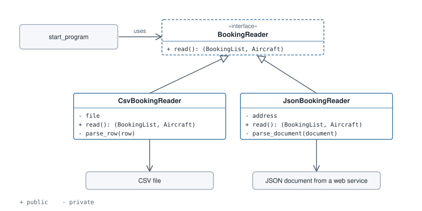
</p>

An adapter translates the form of the data and keeps its meaning. If one source reports weights in
kilograms and the model works in tonnes, the conversion belongs in that source's adapter, in one
named place, so that no other part ever sees a kilogram. The first change request from
[2. What design is for](#ch-design-purpose), bookings arriving as JSON, is now one new class and one
line in [Pseudocode: composition root](#pseudo-composition-root).

### Further reading

- Erich Gamma, Richard Helm, Ralph Johnson and John Vlissides, _Design Patterns: Elements of
  Reusable Object-Oriented Software_, Addison-Wesley, 1994: the catalogue of 23 patterns, including
  strategy and adapter, known as the Gang of Four book.
- Eric Freeman and Elisabeth Robson, _Head First Design Patterns_, 2nd edition, O'Reilly, 2020: a
  gentler introduction to the same patterns, with many small examples.
- Mark Seemann and Steven van Deursen, _Dependency Injection Principles, Practices, and Patterns_,
  Manning, 2019: the full treatment of dependency injection and the composition root.

---

<a id="ch-architecture"></a>

## 7. From design to architecture

Design happens at every level of a program: a function, a class, a package, a whole program, a set
of programs across a company. The principles and patterns so far apply from a function up to a
program. Near the top of that range, design gets a different name:
[software architecture](../appendix/glossary.md#software-architecture) is the design of a whole
system, meaning the few large decisions about its parts and their boundaries that are expensive to
reverse later.

An architecture is the principles of the earlier chapters applied to the largest parts of a system.
Many architectures exist; this chapter describes one that fits decision-support software well.

### Clean architecture

[Clean architecture](../appendix/glossary.md#clean-architecture), described by Robert C. Martin,
arranges a system in four concentric rings, shown in **Figure: clean architecture**.

<a id="fig-clean-architecture"></a>

**Figure: clean architecture**

<p align="center">
  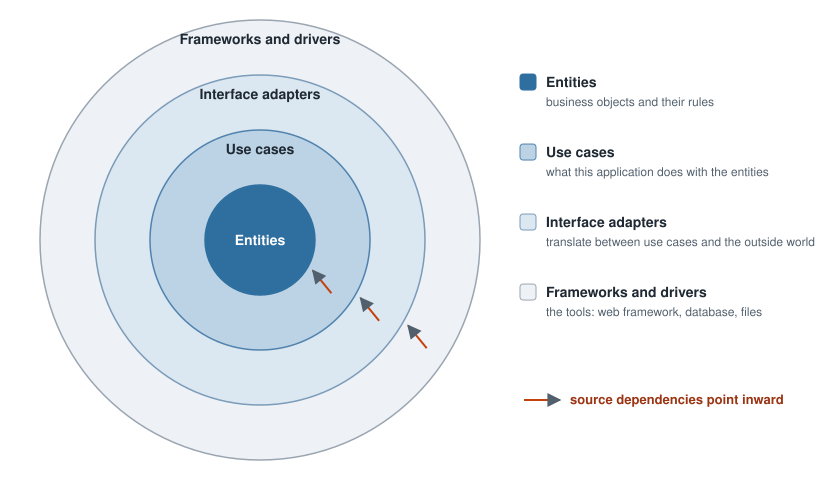
</p>

- **Entities** hold the business objects and the rules that are true of them regardless of any
  application.
- **Use cases** hold what this application does with the entities: the steps of one request, from
  its input to its answer.
- **Interface adapters** translate between the use cases and the outside world: reading files,
  answering web requests, writing reports.
- **Frameworks and drivers** are the tools the system runs on: a web framework, a database, the file
  system.

One rule holds the rings together, the **dependency rule**: code may depend only on code in its own
ring or in a ring further in. An entity never mentions a use case; a use case never mentions a web
framework or a file format.

The rule exists for a reason worth stating plainly. The outer rings hold what is volatile and
incidental: file formats, web frameworks, databases, all of which change for reasons that have
nothing to do with the business. The inner rings hold what the system is actually for. Pointing
every dependency inward means the incidental can change without touching the essential, and the
essential can be tested without the incidental.

### Calls go outward, dependencies point inward

The dependency rule seems to forbid something every program does: a use case has to read a file and
call a solver, and both live further out. The rule is about what the source code of a part mentions,
not about what happens while the program runs, and the two can point in opposite directions.

<a id="fig-flow-and-dependency"></a>

**Figure: calls and dependencies**

<p align="center">
  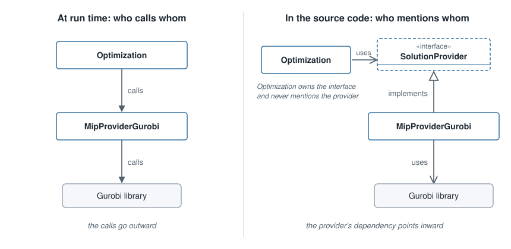
</p>

At run time, `Optimization` calls a provider and the provider calls a library: the calls go outward.
In the source code, `Optimization` mentions only `SolutionProvider`, an interface it owns, and the
provider is the one that mentions the interface. This is dependency inversion from
[4. Principles](#ch-principles) at the scale of a system. Whenever an inner ring needs something
from an outer one, it defines an interface with a [contract](../appendix/glossary.md#contract) and
lets the outer ring implement it. The composition root is the one place allowed to know every
concrete class, because assembling them is its job.

### Further reading

- Robert C. Martin, _Clean Architecture: A Craftsman's Guide to Software Structure and Design_,
  Prentice Hall, 2017: the source of the four rings and the dependency rule.

---

<a id="ch-dss-patterns"></a>

## 8. DSS patterns

[6. Design patterns](#ch-patterns) name arrangements of classes that recur in any software. The
optimization step of a decision-support system (DSS) has recurring arrangements of its own, of
models and algorithms. Operations research has names for the algorithms. It has no settled names for
the ways the software around them is arranged, so teams describe the same arrangement in different
words and rediscover its consequences each time. This chapter proposes four names, each a
[DSS pattern](../appendix/glossary.md#dss-pattern), in the same form as a design pattern: the
problem it answers, its structure, and its consequences. As with design patterns, the gain is a
vocabulary.

### The building block: a provider

Every pattern is built from one piece, the `SolutionProvider` of the earlier chapters, a
[solution provider](../appendix/glossary.md#solution-provider): it takes an `Instance` and returns a
`Result` under the contract of [5. Contracts](#ch-contracts). Providers come in two kinds, told
apart by what they can establish.

- An **exact provider** can prove things about the instance. It may return any of the four statuses.
  A mixed-integer programming (MIP) solver run on a formulation is the usual one.
- A **heuristic provider** searches without proving. It returns `feasible` when it finds a load and
  `not_found` when it does not, and never `optimal`. It may return `infeasible` only where it has a
  proof. In the cargo model one sum is a proof: if the committed freight alone exceeds a capacity,
  no load exists. A [heuristic](../appendix/glossary.md#heuristic) built by hand and a metaheuristic
  such as simulated annealing are both of this kind.

Each pattern below is a way of arranging providers, and each arrangement is, seen from outside, one
provider again: its caller calls one `solve` and reads one `Result`. That is what lets the patterns
be swapped and nested without the rest of the system noticing. **Figure: DSS patterns** shows the
four together. In every figure of this chapter an exact provider is blue, a heuristic provider is
orange, a record is green, and a dashed outline marks what the caller sees as one provider.

<a id="fig-dss-patterns"></a>

**Figure: DSS patterns**

<p align="center">
  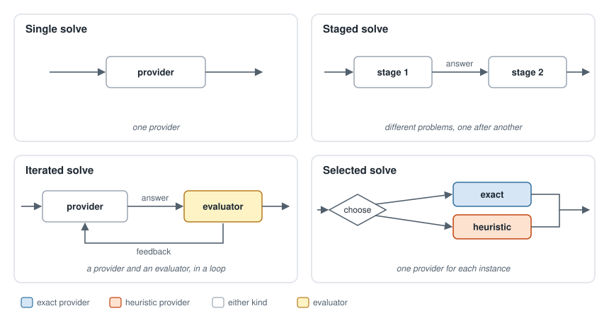
</p>

### Single solve

**Problem.** One algorithm handles every instance the system will meet, in the time the user can
wait.

**Structure.** One provider, exact or heuristic.

<a id="fig-single-solve"></a>

**Figure: single solve**

<p align="center">
  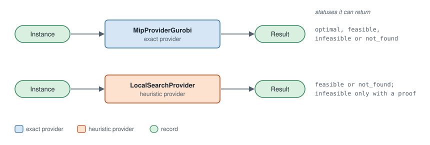
</p>

**Consequences.**

- It is the simplest arrangement to build, to explain and to test: one algorithm, one set of
  promises.
- The status comes straight from the provider. With an exact provider the planner can be told a load
  is proven best; with a heuristic one, never.
- Everything rests on that one algorithm keeping up. When instances outgrow it, the pattern has to
  change, and a design that put the algorithm behind `SolutionProvider` can change it without
  touching its callers.

**Commonly seen in** blending and product-mix models, small assignment problems, and vehicle routing
solved by one metaheuristic. A small MIP solved directly and a lone metaheuristic are the same
pattern with a different kind of provider.

### Staged solve

**Problem.** The decision is too large or too mixed for one model, and it splits into decisions that
can be taken one after another.

**Structure.** Two or more providers in a row. The answer of one stage becomes part of the input of
the next, so the stages solve different problems. As an illustration, suppose the cargo system also
had to place each pallet in the hold so that the aircraft stays balanced. That is not part of the
cargo system in this book. A staged solve would first choose the pallets, with the model of the
appendix, and then assign the chosen pallets to positions with a second model.

<a id="fig-staged-solve"></a>

**Figure: staged solve**

<p align="center">
  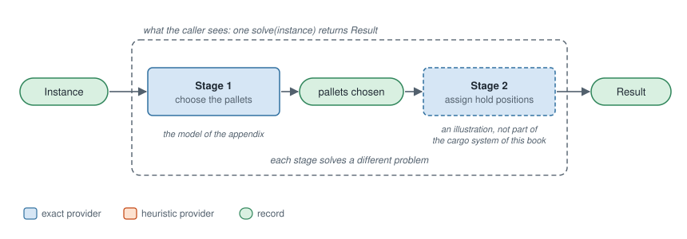
</p>

**Consequences.**

- Each stage is small enough to solve, and can be built and tested on its own, with its own
  contract.
- Two optimal stages do not make an optimal whole. The first stage decides without knowing what its
  choice costs the second. The honest status for the whole is `feasible`, unless the team can show
  that the stages add up to an optimum.
- A later stage can fail on an instance that has an answer: the first stage may pick pallets that
  cannot be balanced when another choice could. The status is then `not_found`, not `infeasible`.
  Sending the failure back to the first stage to choose again is possible, and it is a larger
  design.
- The stages are coupled through the record that passes between them. That record is an interface
  and deserves a contract of its own.

**Commonly seen in** airline planning, where fleet assignment, aircraft routing and crew pairing are
solved in that order; in production planning, where lot sizes are set before the schedule; and in
models with ranked objectives solved one objective at a time. **Also called** decomposition, or
hierarchical or multi-stage planning.

### Seeded solve

**Problem.** An exact method is too slow to find a first good load, and a heuristic finds one
quickly but cannot prove anything about it.

**Structure.** Two providers on the same instance. The heuristic runs first, and its load starts the
search of the exact provider.

<a id="fig-seeded-solve"></a>

**Figure: seeded solve**

<p align="center">
  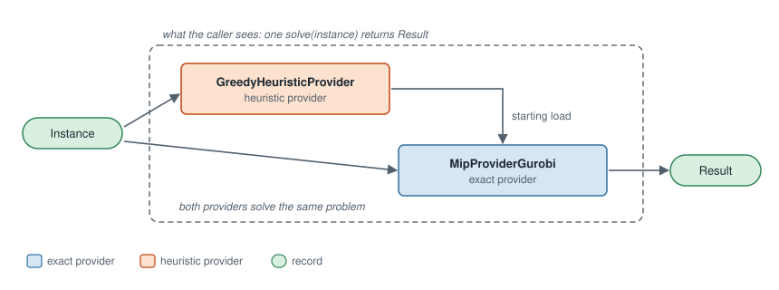
</p>

**Consequences.**

- The result is never worse than the seed, and if time runs out there is still a load to return, so
  `not_found` becomes rare.
- Unlike a lone heuristic, the arrangement can still prove the best load, so all four statuses
  remain possible.
- The seed must be feasible for the exact provider's model. If the two disagree on one constraint,
  the solver discards the seed without complaint and the benefit is lost silently, which makes the
  agreement worth a test.
- There are two algorithms to maintain for one problem, and a change to the rules reaches both.

**Commonly seen in** scheduling and routing models where a construction heuristic starts a MIP.
**Also called** a warm start, and one member of the family known as matheuristics.

### Selected solve

**Problem.** Instances differ so much that no single algorithm suits them all.

**Structure.** Several providers, and one is chosen for each instance. This is the strategy pattern
of [6. Design patterns](#ch-patterns) applied to the optimization step.

<a id="fig-selected-solve"></a>

**Figure: selected solve**

<p align="center">
  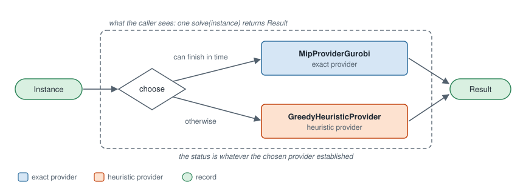
</p>

**Consequences.**

- The status depends on which provider ran, so two similar instances can come back with different
  guarantees. Callers must read the status and never assume one.
- The rule that chooses is itself something to tune and to test, and it drifts: a threshold measured
  on one solver version or one machine is wrong on the next.
- Every provider must keep the same contract. Selection is only safe because of Liskov substitution.

**Commonly seen in** systems that serve both a quick re-plan during operations and a long overnight
plan, and in systems whose instances range from a handful of items to thousands. **Also called**
algorithm selection, or an algorithm portfolio.

### The four patterns side by side

| Pattern        | Structure                                        | Statuses it can honestly return                          | Main cost                                       |
| -------------- | ------------------------------------------------ | -------------------------------------------------------- | ----------------------------------------------- |
| Single solve   | One provider                                     | All four if exact; never `optimal` if heuristic          | Rests on one algorithm keeping up               |
| Staged solve   | Providers in a row, each on a different problem  | Usually `feasible`; `not_found` when a later stage fails | The whole is not optimal; stages share a record |
| Seeded solve   | A heuristic starts an exact search, same problem | All four                                                 | Two algorithms that must agree on one model     |
| Selected solve | One provider chosen per instance                 | Whatever the chosen provider established                 | A choosing rule to tune; guarantees vary by run |

Because each pattern looks like one provider from outside, they nest. A selected solve can send its
large instances to a seeded solve, and a staged solve can use a selected solve as its first stage.
The names make such a design sayable in one sentence: the cargo system of the next chapter is a
selected solve between a single exact solve and a single heuristic solve.

### Where the formulation lives

A second choice is independent of the first. Every exact provider holds a formulation, and that
formulation has to be written in something. There are three placements, drawn in **Figure:
formulation placement** against the rings of [7. From design to architecture](#ch-architecture).

<a id="fig-formulation-placement"></a>

**Figure: formulation placement**

<p align="center">
  
</p>

1. **In the provider, inside the use case.** The formulation is written directly with the solver's
   own library, in a provider that sits with the use cases.
2. **In the provider, outside the use case.** The same code, placed in an outer ring. The use cases
   know only the `SolutionProvider` interface.
3. **In a [modelling layer](../appendix/glossary.md#modelling-layer).** The formulation is written
   once in a solver-independent modelling library, which translates it for whichever solver is
   configured. The library may be bought, open source or built in house.

| Placement                         | What it gives                                                                                         | What it costs                                                                                                                                                              |
| --------------------------------- | ----------------------------------------------------------------------------------------------------- | -------------------------------------------------------------------------------------------------------------------------------------------------------------------------- |
| In the provider, inside use case  | The least code; every feature of the solver is available; the formulation is in one obvious place     | The use-case ring mentions a vendor library, a known exception to the dependency rule; the use cases cannot run without the solver; a new solver means a new formulation   |
| In the provider, outside use case | The dependency rule holds without exception; the use cases can be built and tested without the solver | A new solver still means a new formulation; exact and heuristic providers end up in different rings                                                                        |
| In a modelling layer              | The solver becomes a setting; one formulation serves several solvers                                  | One more layer to learn, upgrade and debug, and to build if it is in house; only the features the layer exposes; the system now depends on the layer instead of the solver |

The last cost is easy to miss. A modelling layer does not remove the outside dependency, it replaces
one with another, and the new one sits between the team and every solver feature it might want.

The placement interacts with the pattern, and a layer that suits one pattern can work against
another:

| Pattern                 | In the provider, inside or outside the use case                                 | In a modelling layer                                                                                                                 |
| ----------------------- | ------------------------------------------------------------------------------- | ------------------------------------------------------------------------------------------------------------------------------------ |
| Single solve, exact     | Simplest when one solver is settled                                             | Fits well: one model, built once, and solver independence is the whole gain                                                          |
| Single solve, heuristic | No formulation to place                                                         | No formulation to place                                                                                                              |
| Staged solve            | Each stage keeps its model and can change it and solve it again                 | Fits badly: each stage is translated again, and handing a model or its answer to the next stage is limited to what the layer exposes |
| Seeded solve            | The seed is handed to the solver through the solver's own starting-load feature | Works only if the layer exposes starting loads for the chosen solver                                                                 |
| Selected solve          | Each exact provider decides for itself                                          | Helps only the exact providers; the heuristic ones never use it                                                                      |

### Check yourself

1. A system solves one MIP to decide which aircraft type flies each route, then a second MIP to
   assign crews to the result. Each MIP is solved to proven optimality. Which pattern is it, and
   which status should the whole return?
2. A team says "our heuristic gives the solver a head start". Which pattern is that, and can it
   return `optimal`?
3. A team adopts a modelling layer so that it no longer depends on an outside library. What is wrong
   with that reasoning?

<details>
<summary>Answers</summary>

1. A staged solve. The whole should return `feasible`: the first model chose aircraft without
   knowing what its choice costs in crews, so two optimal stages do not prove the best combined
   plan.
2. A seeded solve. Yes: the exact provider can still prove that its final load is the best one,
   starting from the seed.
3. The layer is itself an outside library. The system depends on it instead of on the solver, which
   is a real gain only if changing or mixing solvers is worth more than the layer costs.

</details>

### Further reading

- John R. Rice, "The Algorithm Selection Problem", _Advances in Computers_ 15, 1976: the paper that
  framed choosing an algorithm from the features of an instance as a problem of its own.
- Vittorio Maniezzo, Marco Antonio Boschetti and Thomas Stützle, _Matheuristics: Algorithms and
  Implementations_, Springer, 2021: combinations of heuristics and exact methods, of which the
  seeded solve is the simplest.
- Cynthia Barnhart, Peter Belobaba and Amedeo R. Odoni, "Applications of Operations Research in the
  Air Transport Industry", _Transportation Science_ 37 (4), 2003: a survey of an industry that plans
  in stages, and of what solving the stages separately costs.

---

<a id="ch-cargo-architecture"></a>

## 9. A clean architecture for the cargo loading system

The problem, from [the appendix](../appendix/cargo_model_example.md): a load planner receives a
booking list for one departure, and the system proposes how many pallets of each product to load,
maximizing revenue within the aircraft's weight and hold capacities and loading at least what must
fly. This chapter makes the two choices of [8. DSS patterns](#ch-dss-patterns) for that system,
places every line of [Pseudocode: tangled script](#pseudo-tangled-script) in the four rings of
**Figure: clean architecture**, and lists what each part promises.

### The two choices

- **Pattern: a selected solve.** `Optimization` chooses between `MipProviderGurobi`, an exact
  provider, and `GreedyHeuristicProvider`, a heuristic one, as in
  [Pseudocode: strategy](#pseudo-strategy). The third change request, a heuristic for large
  instances, is the reason.
- **Placement: in the provider, inside the use case.** The formulation is written with the Gurobi
  library inside `MipProviderGurobi`, which sits in the use-case ring. The reason is argued below,
  once the rings are in place.

<a id="fig-cargo-architecture"></a>

**Figure: cargo architecture**

<p align="center">
  
</p>

### Two vocabularies

The system speaks two languages, and the optimization contract is the border between them.

Outside the border are the business records, in the words of the load planner: a `BookingList` of
bookings, an `Aircraft`, and what the planner receives, a `LoadPlan` or the news that there is none.

<a id="pseudo-cargo-records"></a>

**Pseudocode: cargo records**

```
// pseudocode: cargo-records
record Booking
    product_name
    weight, volume, revenue       // per pallet, as the product catalogue states them
    committed_pallets             // pallets that must fly on this departure

record BookingList
    bookings                      // list of Booking for one departure

record Aircraft
    weight_capacity
    volume_capacity

record LoadPlan
    pallets                       // for every product on the booking list, the pallets to load
    revenue, weight, volume       // totals of the plan
    proven_best                   // true only when the Result's status was optimal

record NoPlan
    reason                        // why there is no plan, in words the planner can act on
```

Inside the border are the records of
[Pseudocode: optimization contract](#pseudo-optimization-contract), in the words of the model: an
`Instance`, a `Solution`, a `Result`.

The two look alike in a system this small, and it is tempting to use one set for both. They are kept
apart because they change for different reasons. A booking may gain a customer, a destination or a
handling code that the model never sees; the formulation may gain a variable that no planner should
ever read. With one set of records, each of those changes would reach readers, writers and providers
alike. With two, the readers and writers depend only on the business records, the providers depend
only on the contract, and two small steps translate between them.

### The rings, from the inside out

**Entities.** `Booking`, `BookingList`, `Aircraft`, `LoadPlan` and `NoPlan`, together with the rules
that hold for them in any application: a pallet count is a whole number, never negative. They depend
on nothing.

**Use case.** `PlanFlightLoad` receives the business records and returns a `LoadPlan` or a `NoPlan`,
in three steps.

<a id="pseudo-plan-flight-load"></a>

**Pseudocode: plan flight load**

```
// pseudocode: plan-flight-load
class PlanFlightLoad
    private preprocess, optimization, postprocess
    public run(booking_list, aircraft) returns LoadPlan or NoPlan
        instance = preprocess.run(booking_list, aircraft)      // business records -> Instance
        result = optimization.run(instance)                    // chooses a SolutionProvider
        return postprocess.run(result, booking_list)           // Result -> LoadPlan or NoPlan
```

- **Preprocess** translates into the model's vocabulary. It rejects records that make no sense, such
  as a negative weight, with an error; builds the `Instance`; and leaves out products that can never
  fit, those with no committed pallet whose single pallet exceeds a capacity.
- **Optimization** chooses a `SolutionProvider` and returns its `Result`. It is the only step that
  knows the providers exist. The use-case ring also holds the `SolutionProvider` interface, both
  providers, and the records of the contract.
- **Postprocess** translates back. `optimal` and `feasible` become a `LoadPlan` that lists every
  product on the booking list, including the ones preprocess left out, with `proven_best` true only
  for `optimal`. `infeasible` becomes a `NoPlan` saying that the committed freight does not fit the
  aircraft, and `not_found` a `NoPlan` saying that no load was found in the time allowed.

**Interface adapters.** `CsvBookingReader` and `JsonBookingReader` turn comma-separated values (CSV)
and JSON (JavaScript Object Notation) sources into business records; `CsvPlanWriter` writes a
`LoadPlan` or a `NoPlan`; a `WebController` does both for a web page. Every read and every write
happens here, so the use case never sees a file.

**Frameworks and drivers.** The file system, the web framework, the Gurobi library, and the
composition root that builds everything.

**Figure: request flow** follows one request inward to the use case and back out.

<a id="fig-request-flow"></a>

**Figure: request flow**

<p align="center">
  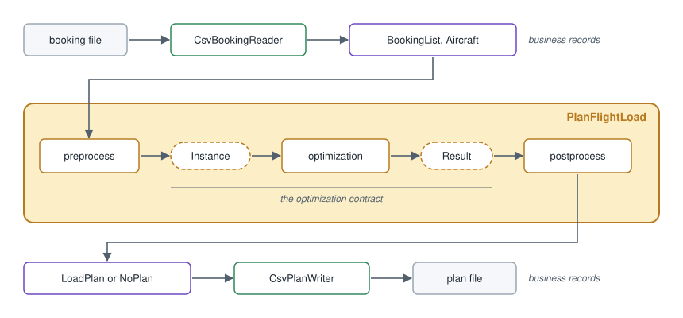
</p>

### Why the MIP provider lives in the use-case ring

`MipProviderGurobi` mentions the Gurobi library, and the dependency rule says the use-case ring
should not mention outer tools. The cargo design keeps it there anyway. The reason is cost, weighed
over the three placements of [8. DSS patterns](#ch-dss-patterns).

- **A modelling layer** would turn the solver into a setting. The cargo system has one small model,
  one solver, and no plan to change it. The layer would be one more thing to learn and upgrade for a
  benefit that may never be used.
- **The provider outside the use case** would restore the rule on paper. It is the same code in a
  different package: replacing the solver would still mean rewriting the formulation, and the two
  providers would sit in two rings for no gain to this system.
- **The provider inside the use case** leaves one exception, written down and contained.
  `MipProviderGurobi` is the only code that mentions the Gurobi library, and it is reachable only
  through `SolutionProvider`.

The choice has a price, and it should be stated with it. The use-case ring cannot be built or run
without the Gurobi library, except for the parts tested with a stand-in provider. And replacing the
solver means writing a new provider, formulation included, and changing one line in
[Pseudocode: composition root](#pseudo-composition-root). That is contained work. It is not a
one-line change.

The answer would change with the facts. If two solvers had to be supported at once, say for
customers with different licences, a modelling layer would start to pay. If the use cases had to run
where the solver cannot be installed, the provider would move outward. Writing the reason down, as
here, lets the next team tell whether it still holds.

### The promises at each boundary

Every arrow that crosses a boundary in **Figure: cargo architecture** carries a promise, and the
tests of the next section check them one by one.

| Part               | Receives                         | Promises                                                                                                                      | Checked in the testing section by                                                                                                                                                                                |
| ------------------ | -------------------------------- | ----------------------------------------------------------------------------------------------------------------------------- | ---------------------------------------------------------------------------------------------------------------------------------------------------------------------------------------------------------------- |
| `BookingReader`    | A source                         | The business records the source describes, or an error for a source it cannot read                                            | [7. Integration testing](../05-testing/README.md#ch-integration), on real files                                                                                                                                     |
| Preprocess         | `BookingList`, `Aircraft`        | A well-formed `Instance` without the products that can never fit, or an error for records that make no sense                  | [3. Unit testing](../05-testing/README.md#ch-unit-testing), with a handful of values and no solver                                                                                                                  |
| `Optimization`     | `Instance`                       | A `Result` under [Pseudocode: optimization contract](#pseudo-optimization-contract)                                           | [8. Testing an optimization model](../05-testing/README.md#ch-model-testing), [9. Test oracles](../05-testing/README.md#ch-oracles) and [10. Testing a mixed-integer program without optimality guaranteed](../05-testing/README.md#ch-mip-no-optimality) |
| `SolutionProvider` | `Instance`                       | The same contract, whichever provider stands behind it                                                                        | The same tests, run on each provider                                                                                                                                                                             |
| Postprocess        | `Result`, `BookingList`          | A `LoadPlan` listing every product, with `proven_best` true only for `optimal`, or a `NoPlan` whose reason matches the status | [3. Unit testing](../05-testing/README.md#ch-unit-testing), on `Result` records built by hand                                                                                                                       |
| `PlanFlightLoad`   | `BookingList`, `Aircraft`        | The three steps in order, passing on whatever `Optimization` established                                                      | [6. Mocks](../05-testing/README.md#ch-mocks), with a stand-in for `Optimization`                                                                                                                                    |
| `CsvPlanWriter`    | `LoadPlan` or `NoPlan`           | A complete plan file that says what the record says                                                                           | [7. Integration testing](../05-testing/README.md#ch-integration), on real files                                                                                                                                     |
| The whole system   | A booking file, an aircraft file | A plan file the planner can act on                                                                                            | [11. Testing a decision-support system](../05-testing/README.md#ch-dss-testing)                                                                                                                                      |

Only one row is hard to test, and the design has made it small: `Optimization` is the one part whose
expected answer is the very thing it exists to compute. Every other row has an answer that can be
written down before the code runs.

### Where the tangled script went

| In [Pseudocode: tangled script](#pseudo-tangled-script) | In the clean architecture                                                     |
| ------------------------------------------------------- | ----------------------------------------------------------------------------- |
| Read the bookings and the aircraft's capacity           | `CsvBookingReader`, an interface adapter                                      |
| Check the committed freight                             | No longer a separate step: a provider establishes it and returns `infeasible` |
| Write "INFEASIBLE"                                      | Postprocess turns `infeasible` into a `NoPlan`; `CsvPlanWriter` writes it     |
| Remove products that cannot fit                         | Preprocess, in the use case                                                   |
| Create, build and solve the model                       | `MipProviderGurobi`, one `SolutionProvider` chosen by `Optimization`          |
| Ask the model for each value                            | Inside `MipProviderGurobi`, which returns a `Result`                          |
| Write the plan                                          | `CsvPlanWriter`, an interface adapter, reading only the `LoadPlan`            |
| The 60-second time limit and the file names             | [Pseudocode: composition root](#pseudo-composition-root)                      |

### The six change requests, answered

The requests from [2. What design is for](#ch-design-purpose) now land as follows.

1. **Bookings as JSON.** One new adapter, `JsonBookingReader`, and one line in the composition root.
2. **Dangerous goods limited to a quarter of the hold.** This one does not stay in one part, and no
   design could make it. It is a new constraint on the load, so it changes what "feasible" means: a
   `Booking` and a `Product` gain a field, the readers fill it, the contract's definition of a
   feasible load gains a rule, and each provider must respect it, the formulation in
   `MipProviderGurobi` and the greedy rule alike. What the design gives is the list. Postprocess,
   the writer, `PlanFlightLoad` and the composition root are untouched, and the tests of the
   contract say when every provider has caught up.
3. **A heuristic for large instances.** One new provider and one rule in `choose`. The `Result` it
   returns says `feasible`, and the plan says `proven_best` is false.
4. **A different solver library.** One new provider, formulation included, and one line in the
   composition root. Nothing else mentions the old library.
5. **Testing the rule that removes unfit products.** A test calls preprocess with a few bookings and
   reads the `Instance`. No file and no solver are involved.
6. **A load that is not proven best.** The provider returns `feasible`, postprocess sets
   `proven_best` to false, and the writer tells the planner.

### Check yourself

1. The team adds a `WebController` that shows the plan on a web page. Which rings change?
2. `MipProviderGurobi` crashes with a licence error. What does `PlanFlightLoad` return?
3. Postprocess receives a `Result` with status `not_found`. Why must the `NoPlan` it returns not say
   that the committed freight does not fit?

<details>
<summary>Answers</summary>

1. Interface adapters, where the controller lives, and frameworks and drivers, where the composition
   root builds it. The use cases and entities are untouched.
2. Nothing: the error is raised, not turned into a status. A licence failure says nothing about
   whether a load exists, so it must not reach the planner as a `NoPlan`.
3. Because `not_found` does not establish it. The search stopped with nothing proven, and a load may
   well exist. Saying otherwise would turn a fact about the search into a false fact about the
   flight.

</details>

---

<a id="ch-conclusion"></a>

## 10. Conclusion

Design exists to keep change cheap, through modularity and testability, and a decision-support
system has to absorb changes that arrive on very different clocks.

- **Design is for change** ([2. What design is for](#ch-design-purpose)). A good design keeps each
  change inside as few parts as possible, shows which ones, and lets each part be tested on its own.
- **Two forces decide it** ([3. Forces: coupling and cohesion](#ch-forces)). Aim for high cohesion
  and low coupling.
- **Principles turn the forces into rules** ([4. Principles](#ch-principles)). Hide details behind
  interfaces, give each part one reason to change, and make policy depend on abstractions rather
  than on solvers. Stop splitting when it stops helping.
- **A boundary needs a promise** ([5. Contracts](#ch-contracts)). State what a part requires,
  returns and raises. For the optimization step, say whether a load is proven best, and never report
  "none found" as "none exists".
- **Design patterns apply the principles** ([6. Design patterns](#ch-patterns)). Inject dependencies
  from one composition root, put algorithms behind a strategy, and adapt each outside source to the
  same records.
- **Architecture is design at the scale of a system**
  ([7. From design to architecture](#ch-architecture)). In clean architecture, dependencies point
  inward, toward what the system is for, even when the calls go outward.
- **The optimization step has patterns of its own** ([8. DSS patterns](#ch-dss-patterns)). Single,
  staged, seeded and selected solve each say which statuses they can honestly return, and where the
  formulation lives is a separate choice with its own price.
- **The cargo system makes its choices in the open**
  ([9. A clean architecture for the cargo loading system](#ch-cargo-architecture)). A selected
  solve, a formulation kept with its solver for a stated reason, two vocabularies, and a promise at
  every boundary.

A design is only as safe to change as the tests that check its promises, which is where the book
goes next: [the testing section](../05-testing/README.md) takes the contract of this section and
asks how to know that the code keeps it.

---

[← Book contents](../../README.md) ·
[Next section: 05 Testing decision-support software →](../05-testing/README.md)
