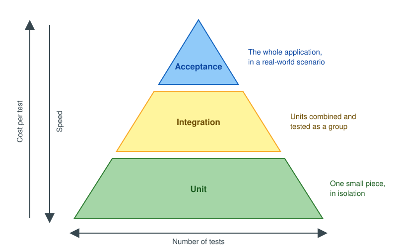
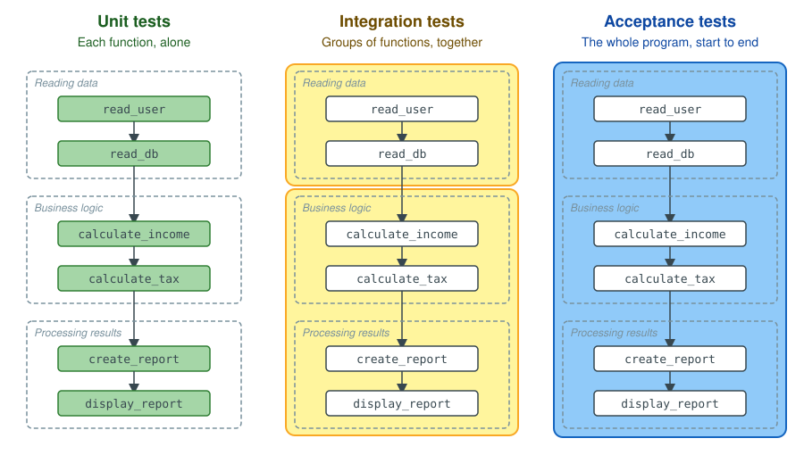
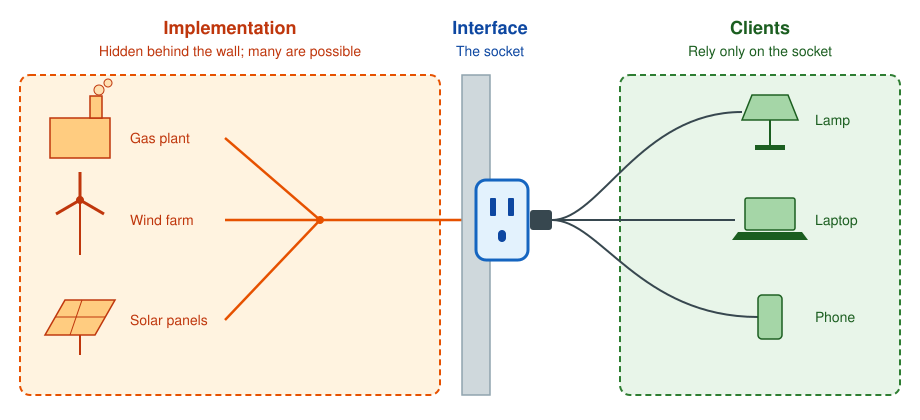

# Section 05 — Testing decision-support software

## Introduction

Testing matters in the [software development lifecycle](../appendix/glossary.md#software-development-lifecycle)
because it serves both abilities a team needs: [learning quickly](../03-software-development-lifecycle/README.md#ch-learning)
and [adapting quickly](../03-software-development-lifecycle/README.md#ch-adapting). For learning, a test is how the
scientific method reaches code: it writes a hypothesis about what the code must do in a form anyone can check, and
running it is the experiment that confirms or refutes it. For adapting, testing is one of two pillars. Design is the
other: it keeps each change small and confined to one part, as [the design section](../04-design/README.md) shows. An
[automated test suite](../appendix/glossary.md#test-suite) then shows, on every change, that everything that worked
before still works. With both pillars in place, a team can change working code as often as the business asks.

### Types of tests

Tests fall into two families, told apart by the question each one answers.

| Type | The question it answers | Examples |
|---|---|---|
| [Functional](../appendix/glossary.md#functional-test) | Does the program provide its services correctly? | A sum is right; bad input is rejected |
| [Non-functional](../appendix/glossary.md#non-functional-test) | How well does the program provide them? | Security, speed, usability, availability, scalability |

This section is about functional tests.

### Hierarchy of functional tests

Functional tests come in three levels, told apart by how much of the program each one runs. A
[unit test](../appendix/glossary.md#unit-test) checks one small piece of code in isolation. An
[integration test](../appendix/glossary.md#integration-test) combines several units and checks that they work
together. An [end-to-end test](../appendix/glossary.md#end-to-end-test) runs the whole application in a real-world
scenario, the way its users would.

<a id="fig-test-pyramid"></a>

**Figure: test pyramid**

<p align="center">
  
</p>

Take a small program that reads a user's records, computes their income and tax, and reports the result.
[Figure: test levels](#fig-test-levels) draws it once per level and colors what a single test of that level runs.

<a id="fig-test-levels"></a>

**Figure: test levels**

<p align="center">
  
</p>

As [Figure: test pyramid](#fig-test-pyramid) shows, each step up runs more of the program, so each test costs more to
write and runs slower. A healthy suite holds many unit tests, fewer integration tests and a handful of end-to-end
tests.

<a id="ch-interface"></a>

## Interface vs implementation

Every unit of code has two parts. Its [interface](../appendix/glossary.md#interface) says what the unit does: its
name, the inputs it accepts, and the outputs and errors it returns. Programmers also call it the signature, the
application programming interface (API), the [contract](../appendix/glossary.md#contract), or the
[abstraction](../appendix/glossary.md#abstraction). Its implementation is how the unit does it, and everything in it
is an [implementation detail](../appendix/glossary.md#implementation-detail). Any code that calls the unit is one of
its *clients*. Implementation details include any [private](../appendix/glossary.md#public-and-private) method the
unit calls, such as `is_finite` in the figure: no client can call it, so it can change freely.
[Figure: interface and implementation](#fig-interface-implementation) marks the parts on the calculator's `add`.

<a id="fig-interface-implementation"></a>

**Figure: interface and implementation**

<p align="center">
  
</p>

Two design practices follow from the split. The interface states what the unit does and never how, and the comments
that state its promises belong to it as much as its first line does. The implementation stays hidden from the
clients, so it can change, or give way to a different implementation, without any client noticing.

A wall socket shows the same split. [Figure: socket](#fig-socket) draws it: the socket is the interface, a fixed shape
that delivers a fixed voltage. Behind the wall, the power may come from a gas plant, a wind farm or solar panels; that
is the implementation, and the utility can change it at any time. The lamp, the laptop and the phone are the clients,
and they rely on the socket alone. Telling the interface from the implementation is foundational knowledge, in
[design](../04-design/README.md) as much as in [testing](#ch-unit-testing).

<a id="fig-socket"></a>

**Figure: socket**

<p align="center">
  
</p>

<a id="ch-unit-testing"></a>

## Unit testing

A unit test sits at the base of the pyramid: it checks one unit of code, such as a function, on its own, and runs in
milliseconds.

### What to test

An interface has one or more *behaviors*, and each one is something to test. The interface in
[Figure: interface and implementation](#fig-interface-implementation) promises five:

1. **The base case**, also called the [happy path](../appendix/glossary.md#happy-path): `add(3, 4) = 7`.
2. **Commutativity**: `add(3, 4) = add(4, 3)`.
3. **Identity**: `add(3, 0) = 3`.
4. **Invalid input**: `add("3", 4)` fails with an invalid-input error.
5. **Overflow**: adding the largest representable number to itself fails with an overflow error.

A behavior may need more than one case: identity holds for 3, and also for a negative number and a very large one.

### How to write a unit test

A unit test's name says what it checks, in three parts: the unit, the behavior and case, and the expected result.
`test__add__given_two_numbers__returns_their_sum` tests `add`, given two ordinary numbers, and expects their sum. When
it fails, its name alone reports which behavior broke.

The body follows the [arrange, act, assert (AAA)](../appendix/glossary.md#arrange-act-assert) pattern: *arrange* the
objects and inputs the test needs, *act* by calling the unit once, and *assert* that the result meets the expectation.
In the pseudocode, `expect` makes the assertion: the test fails if its condition is false.

<a id="pseudo-add-test"></a>

**Pseudocode: add test**

```
// pseudocode: add-test
public test__add__given_two_numbers__returns_their_sum()
    // arrange
    calculator = Calculator()

    // act
    result = calculator.add(1, 2)

    // assert
    expect result == 3
```

### A scientific experiment

A unit test is a scientific experiment in miniature, and it holds every part an experiment in a laboratory holds.
The table finds each part in [Pseudocode: add test](#pseudo-add-test).

| Part of the experiment | In Pseudocode: add test |
|---|---|
| Hypothesis | The name: `add`, given two numbers, returns their sum |
| Controlled conditions | *Arrange*: a new `Calculator` and the fixed inputs 1 and 2 |
| Intervention | *Act*: one call, `calculator.add(1, 2)` |
| Observation | `result`, the value the call returns |
| Prediction checked against the observation | *Assert*: `expect result == 3` |
| Conclusion | The test passes, and the evidence supports the hypothesis; or it fails, and refutes it |

The parts carry the principles of [the scientific method](../03-software-development-lifecycle/README.md#ch-learning)
with them. The hypothesis is testable, because the assertion states it as an objective, measurable condition. The
conditions are controlled, because the test runs one unit on its own, with inputs it fixes itself, so a failure has
one cause: `add`. And the experiment is reproducible: anyone can run it again, on any machine, and get the same result.

### Where to place the test

Test code lives apart from production code, in a folder tree that mirrors it, so each module's tests sit at the same
place in the tests tree as the module does in the source tree.

<a id="pseudo-test-layout"></a>

**Pseudocode: test layout**

```
// pseudocode: test-layout
project/
    src/
        calculator
    tests/
        test_calculator_add
        test_calculator_divide
```

### Code coverage

How do you know you tested every behavior? The starting point is
[code coverage](../appendix/glossary.md#code-coverage): a tool records which lines of the production code the tests
run, and reports the rest. [Pseudocode: add coverage](#pseudo-add-coverage) marks each line of `add` for a suite that holds
only the happy-path test.

<a id="pseudo-add-coverage"></a>

**Pseudocode: add coverage**

```
// pseudocode: add-coverage
public add(a, b) returns number
    if not is_finite(a)                     // ✓ run
        fail with invalid-input error       // ✗ not run
    if not is_finite(b)                     // ✓ run
        fail with invalid-input error       // ✗ not run
    result = a + b                          // ✓ run
    if result is too large to represent     // ✓ run
        fail with overflow error            // ✗ not run
    return result                           // ✓ run
```

> [!NOTE]
> The pseudocode is illustrative: a coverage tool reports the same pattern for `add` written in a real language, over more lines.

The three lines that never run belong to the invalid-input and overflow behaviors. Add a test for each, and every line
runs: coverage reaches 100%. Now delete the commutativity test. Coverage stays at 100%, because the happy-path test
already runs every line the commutativity test runs. Coverage points at lines no test runs; it cannot point at a
behavior no test checks. Use it to find what is missing, and use the list of behaviors to decide when you are done.

### Exercise 1: a calculator

The exercise lives in the practice repositories: test the calculator's `divide` the way this part tested `add`.

> **Practice it**
>
> - Python: [Unit testing exercise](https://github.com/sefop/training-testing-python/tree/main/exercises/1_unit-tests-and-coverage)
> - Java: [Unit testing exercise](https://github.com/sefop/sefop-training-java/tree/main/src/main/java/unit_tests_and_coverage)

<a id="ch-clear-tests"></a>

## Writing clear tests

Nothing tests a test, so a test must be obviously correct at a glance, and when it fails, its reader must see at once
what broke. [Unit testing](#ch-unit-testing) gave a test its structure and its name; five more practices keep its body
just as clear. Each one below sets an unclear test of the calculator's `add` beside a clear one.

### Complete and concise

A test is *complete* when its body holds everything a reader needs to understand its result, and *concise* when it
holds nothing else. [Pseudocode: cluttered test](#pseudo-cluttered-test) fails both ways: the constructor arguments
play no part in addition, and the numbers that decide the result hide inside helper functions.

<a id="pseudo-cluttered-test"></a>

**Pseudocode: cluttered test**

```
// pseudocode: cluttered-test
public test__add__given_two_numbers__returns_their_sum()
    calculator = Calculator(precision=10, rounding="half-even", log_file="calc.log")
    result = calculator.add(first_operand(), second_operand())
    expect result == 5
```

[Pseudocode: concise test](#pseudo-concise-test) keeps the numbers that matter in view and drops the rest.

<a id="pseudo-concise-test"></a>

**Pseudocode: concise test**

```
// pseudocode: concise-test
public test__add__given_two_numbers__returns_their_sum()
    calculator = Calculator()
    result = calculator.add(2, 3)
    expect result == 5
```

### One behavior per test

[Pseudocode: method test](#pseudo-method-test) checks three behaviors of `add` at once. When it fails, its name cannot
say which behavior broke, and the first failing `expect` stops the test, so the ones after it go unchecked.

<a id="pseudo-method-test"></a>

**Pseudocode: method test**

```
// pseudocode: method-test
public test__add__works()
    calculator = Calculator()
    expect calculator.add(3, 4) == 7
    expect calculator.add(3, 4) == calculator.add(4, 3)
    expect calculator.add(3, 0) == 3
```

[Pseudocode: behavior tests](#pseudo-behavior-tests) splits it into one test per behavior, each named for the
behavior it checks. A name that needs the word "and" describes two behaviors, and belongs to two tests.

<a id="pseudo-behavior-tests"></a>

**Pseudocode: behavior tests**

```
// pseudocode: behavior-tests
public test__add__given_two_numbers__returns_their_sum()
    calculator = Calculator()
    result = calculator.add(3, 4)
    expect result == 7

public test__add__given_swapped_operands__returns_the_same_sum()
    calculator = Calculator()
    expect calculator.add(3, 4) == calculator.add(4, 3)

public test__add__given_zero__returns_the_other_number()
    calculator = Calculator()
    result = calculator.add(3, 0)
    expect result == 3
```

### No logic in tests

Production code must handle any input, so it needs logic: loops, conditions, arithmetic. A test handles a few chosen
inputs, so it needs none, and each piece of logic it carries is a computation its reader must run in their head.
[Pseudocode: logic test](#pseudo-logic-test) loops over six pairs of numbers and computes each expected value with
`a + b`, the very operation `add` performs. The test repeats the implementation instead of checking it.

<a id="pseudo-logic-test"></a>

**Pseudocode: logic test**

```
// pseudocode: logic-test
public test__add__given_two_numbers__returns_their_sum()
    calculator = Calculator()
    for each a in [1, 2, 3]
        for each b in [4, 5]
            expect calculator.add(a, b) == a + b
```

[Pseudocode: concise test](#pseudo-concise-test) is straight-line code with a literal expected value: a reader checks
that 2 plus 3 is 5 at a glance.

### Clear failure messages

When a test fails, its failure message is often the first thing a reader sees, and sometimes the only one. A good
message states the inputs, the expected value and the actual value. So far, `expect` has taken a condition; it also
takes a message after a comma, which the test reports when the condition is false.
[Pseudocode: vague failure](#pseudo-vague-failure) reduces the comparison to true or false before asserting it, so
its failure reads only "expected true, got false".

<a id="pseudo-vague-failure"></a>

**Pseudocode: vague failure**

```
// pseudocode: vague-failure
public test__add__given_two_numbers__returns_their_sum()
    calculator = Calculator()
    result = calculator.add(2, 3)
    expect (result == 5) is true
```

[Pseudocode: clear failure](#pseudo-clear-failure) fails with "add(2, 3) returned 6, expected 5", which points at the
broken behavior before anyone opens the test.

<a id="pseudo-clear-failure"></a>

**Pseudocode: clear failure**

```
// pseudocode: clear-failure
public test__add__given_two_numbers__returns_their_sum()
    calculator = Calculator()
    result = calculator.add(2, 3)
    expect result == 5, "add(2, 3) returned {result}, expected 5"
```

### DAMP, not DRY

Production code follows [don't repeat yourself (DRY)](../appendix/glossary.md#dont-repeat-yourself): each piece of
knowledge lives in one place, so a change is one edit. Test code follows
[descriptive and meaningful phrases (DAMP)](../appendix/glossary.md#descriptive-and-meaningful-phrases) instead: a
little repetition is welcome when it lets each test be read on its own.
[Pseudocode: too-DRY tests](#pseudo-too-dry-tests) shares its calculator and its numbers across the file, so to check
either test, a reader must first scroll up to learn what `a` and `b` are.

<a id="pseudo-too-dry-tests"></a>

**Pseudocode: too-DRY tests**

```
// pseudocode: too-dry-tests
calculator = Calculator()
a = 3
b = 4

public test__add__given_two_numbers__returns_their_sum()
    expect calculator.add(a, b) == 7

public test__add__given_swapped_operands__returns_the_same_sum()
    expect calculator.add(a, b) == calculator.add(b, a)
```

[Pseudocode: behavior tests](#pseudo-behavior-tests) repeats `calculator = Calculator()` and its numbers in every
test, and each test reads on its own.

### Further reading

- Titus Winters, Tom Manshreck and Hyrum Wright, *Software Engineering at Google*, O'Reilly, 2020, chapter 12, "Unit
  Testing": the source of these five practices, each shown on tests from a code base of Google's size.

## The running example

The chapters from [Test doubles](#ch-test-doubles) onward test the cargo loading system defined in
[the appendix](../appendix/running-example.md): for one departure, how many pallets of each tendered product to load,
so that the revenue carried is as large as possible without exceeding the aircraft's maximum weight or the capacity
of its hold. This section holds that model fixed, so the testing ideas change while the model stays still.

The symbols the chapters use, all fixed, **non-negative** parameters except the decision variable:

| Symbol | Meaning | Unit |
|:---:|---|---|
| $r_i$ | revenue of one pallet of product $i$ | thousands of USD |
| $w_i$ | weight of one pallet | tonnes |
| $v_i$ | volume of one pallet | m³ |
| $u_i$ | pallets of product $i$ tendered | count |
| $l_i$ | pallets of product $i$ that must fly | count |
| $W$, $V$ | max weight and hold capacity | tonnes, m³ |
| $x_i$ | pallets of product $i$ loaded | integer |

Two facts from the contract matter throughout this section. A selection is *loadable* when it respects both
capacities, loads no more of a product than was tendered, and loads at least the pallets that must fly. And the
feasible region can be empty: when nothing must fly, loading nothing is always loadable, but committed freight
removes that guarantee, and an instance whose must-go pallets exceed a capacity has no solution at all. The
[formulation](../appendix/running-example.md#an-optimization-model-for-this-problem) and the
[two-pallet instance](../appendix/running-example.md#ex-two-pallet) the chapters work with are in the appendix.

## How to read the pseudocode

Chapters show tests as short, language-agnostic pseudocode, so the ideas transfer to any language. The conventions:

```
a = item(name="A", weight=2, volume=1, revenue=10, max_quantity=1)

result = solve([a], weight_capacity=2, volume_capacity=2)

expect result.feasible == true
expect result.total_revenue == 10
```

- `solve(items, weight_capacity, volume_capacity)` runs whichever solver is under test. When a chapter needs a specific
  one, it writes `enumeration_solver().solve(...)` or `mip_solver().solve(...)`.
- `result` has five fields: `feasible`, `quantities` (item name → units chosen), `total_revenue`, `total_weight`, and
  `total_volume`. When `feasible` is false, the other fields carry no meaning.
- `item(...)` also takes `min_quantity`, the pallets of that product which must fly. It defaults to 0, so it appears
  only where a chapter needs committed freight.
- `expect` marks an assertion: the test fails if the condition is false. `==` on numbers means equal within a small
  numerical tolerance.

<a id="ch-test-doubles"></a>

## Test doubles

A unit of the cargo loading system rarely works alone: planning a load calls a solver, and reading the tendered
pallets calls another system. A real solver can take minutes, and the other system may be out of reach from a test.
A [test double](../appendix/glossary.md#test-double) stands in for such a dependency during a test: a *stub* returns
fixed answers, a *fake* is a simpler working version, and a *mock* records how it was called. The chapter will show
how [dependency injection](../appendix/glossary.md#dependency-injection) lets a test pass a double in, and when the
real implementation is the better choice.

<a id="ch-integration"></a>

## Integration testing

An [integration test](../appendix/glossary.md#integration-test) combines several units and checks that they work
together, the middle level of [Figure: test pyramid](#fig-test-pyramid). The chapter will test the cargo loading
system with its real collaborators, such as reading the tendered pallets from a real data source and handing them to
the planning of the load, and show what such a test catches that no unit test can.

---

<a id="ch-what-to-test"></a>

## 01 — What to test in decision-support software

A decision-support system is more than its optimization model. Data arrives from other systems, business rules turn it
into model parameters, the model computes a decision, and the decision flows back to the people and systems that act
on it. Each of these parts can break. For most of them, the expected output is cheap to write down: you know what a
data check or a business rule should return before running it. The model is the exception, because its expected
output is the very thing it exists to compute. The chapter will map each part of the system to the kind of test that
fits it, and explain why the rest of this section, chapters 02–09, concentrates on the model.

> **Practice it**
>
> - Python: coming soon
> - Java: coming soon

---

<a id="ch-oracle-problem"></a>

## 02 — Why optimization models are hard to test

An [automated test](../appendix/glossary.md#automated-test) is a small program that runs your code on a known input
and checks the output against an expected answer. The textbook example is a calculator: `add(2, 3)` should return 5,
and you know that without reading a single line of `add`. The test is cheap to write because the expected answer is
cheap to compute.

Now try the same with a MIP. To write `expect result.total_revenue == ???`, you need the optimal value. For any
instance large enough to be interesting, computing that value independently means solving the very problem the model
exists to solve. The test needs the answer before the code can provide it.

Whatever decides whether an output is correct is called a [test oracle](../appendix/glossary.md#test-oracle). For the
calculator, the oracle is arithmetic you already know. The difficulty of building an oracle when the correct output is
expensive, or impossible, to compute independently has a name in the software testing literature: the
[oracle problem](../appendix/glossary.md#oracle-problem).

You already know this asymmetry from optimization. Checking that a solution is *feasible* is cheap: substitute $x$
into each constraint. Proving that it is *optimal* is expensive: you need a matching bound, which is exactly what
branch-and-bound spends most of its time building. An oracle for feasibility is easy to write. An oracle for
optimality runs into the same wall your solver does.

The oracle problem is a reason to choose a testing technique deliberately, not a reason to skip testing. A model is
software: it gets refactored, its data changes, and eventually someone swaps its solver. Chapters 04–06 present three
kinds of oracle that work around the problem, each at a different price.

The simplest oracle is a person. Take the
[two-pallet instance](../appendix/running-example.md#ex-two-pallet): each $x_i \in \{0, 1\}$, so there are
$2  imes 2 = 4$ candidate selections, few enough to list.

| $x_A$ | $x_B$ | Weight (≤ 2) | Volume (≤ 2) | Revenue | Feasible? |
|:---:|:---:|:---:|:---:|:---:|---|
| 0 | 0 | 0 | 0 | 0 | yes |
| 1 | 0 | 2 | 1 | 10 | yes |
| 0 | 1 | 1 | 2 | 6 | yes |
| 1 | 1 | 3 | 3 | 16 | no — both capacities exceeded |

The best feasible selection is $x_A = 1$, $x_B = 0$, worth a revenue of 10. Nobody needed a solver to produce that
answer, so it can serve as the expected value of a test:

```
a = item(name="A", weight=2, volume=1, revenue=10, max_quantity=1)
b = item(name="B", weight=1, volume=2, revenue=6,  max_quantity=1)

result = solve([a, b], weight_capacity=2, volume_capacity=2)

expect result.feasible == true
expect result.total_revenue == 10
```

The price of a human oracle grows fast. The number of candidate selections is $\prod_{i \in I} (u_i - l_i + 1)$: 4
for this instance, but $4^{30} \approx 1.2 \times 10^{18}$ for 30 items that can each be loaded up to 3 times. A
person can only be the oracle at teaching scale, which is exactly how [chapter 04](#ch-hand-oracles) uses one.

### Check yourself

1. For the calculator, what plays the role of the test oracle?
2. In the two-pallet instance, the payload capacity rises from 2 to 3 and the hold capacity stays at 2. What is
   the optimal revenue total?
3. How many candidate selections does an instance with three items and maximum quantities 1, 2, and 4 have?

<details>
<summary>Answers</summary>

1. Arithmetic you already know: you compute 2 + 3 in your head, independently of the code.
2. Still 10. Loading both now fits the payload capacity (3 ≤ 3) but uses volume 3 > 2, so item A alone remains
   best.
3. $2 \times 3 \times 5 = 30$.

</details>

### Where this stops working

> [!WARNING]
> The knapsack does not fully honour the claim of this chapter.

It is only *weakly* NP-hard: a pseudo-polynomial dynamic
program solves it exactly, so a cheap independent oracle does exist for this particular problem. The oracle problem
bites hardest on general MIPs, where no such shortcut is available. The knapsack is used here because it is small
enough to reason about by hand, not because it is the hardest case.

> **Practice it**
>
> - Python: [training-testing-python — exercise 5, Setup](https://github.com/sefop/training-testing-python/blob/main/exercises/5-testing-mip-single-objective/instructions.md#setup)
> - Java: coming soon

### Further reading

- Barr et al., ["The Oracle Problem in Software Testing: A Survey"](https://ieeexplore.ieee.org/document/6963470),
  IEEE Transactions on Software Engineering, 2015 — the survey that names and organizes the problem.
- [Test oracle](https://en.wikipedia.org/wiki/Test_oracle), Wikipedia — a short overview.

---

<a id="ch-contract"></a>

## 03 — Test the contract, not the algorithm

The function that decides a load could be a brute-force enumeration, a greedy heuristic, a dynamic program, or a
call to a commercial or open-source MIP solver. That choice changes over time: today enumeration is fast enough;
next year the catalogue has thousands of items and someone swaps in a MIP solver.

When tests check *how* the answer was computed, a legitimate swap turns them red even though nothing a user cares about
got worse. A [regression](../appendix/glossary.md#regression) — a behavior that used to work and no longer does —
never happened, yet the tests report one. Teams in that situation learn to rewrite tests with every change, or to
ignore red tests altogether. Both defeat the purpose of having tests.

A [contract](../appendix/glossary.md#contract) is the promise a piece of code makes to its callers: what it needs as
input and what it guarantees as output, and nothing about how. Everything else — the algorithm, its running time, its
internal data structures — is an [implementation detail](../appendix/glossary.md#implementation-detail).

For the load planner, the contract fits in one sentence: *given a catalogue of items and two capacities, return the
revenue-maximizing loadable selection if one exists, or report that the instance is infeasible.* A selection is
loadable when it respects both capacities, loads no more of a product than was tendered, and loads at least the
pallets that must fly. Two clauses make it precise:

1. When `feasible` is false, the other result fields carry no meaning.
2. When several selections tie for the best revenue total, any one of them may be returned.

You already make this separation in optimization. The formulation says *what* the optimal solution is; branch-and-bound,
cutting planes, or enumeration say *how* to find it. That is why you can swap solvers without rewriting the model. A
contract test checks the formulation's promise, so it runs unchanged against every solver that keeps it.

In code, a contract usually lives in an [abstraction](../appendix/glossary.md#abstraction): a named interface with a
single method, `solve`, that several implementations fulfil. In the Python exercise it is an abstract class with two
implementations, one enumerating every selection and one calling the HiGHS solver.

Writing contract tests first has a useful side effect. Each test is a question about the contract — "what does `solve`
promise when nothing is affordable?" — so the contract must be made explicit before any solver exists. It also pushes
the design toward modularity: a component that can be tested without looking at its internals is, by construction, a
component whose internals do not leak into its interface.

The same instance from [chapter 02](#ch-oracle-problem), tested two ways. First, a test
coupled to the algorithm:

```
solver = enumeration_solver()
result = solver.solve([a, b], weight_capacity=2, volume_capacity=2)

expect solver.combinations_checked == 4      # how the answer was found
expect result.total_revenue == 10
```

Replace `enumeration_solver()` with `mip_solver()` and this test breaks: a MIP solver never enumerates combinations,
so there is no count to check. The optimum is still 10, yet the test fails.

Second, a test against the contract:

```
for solver in [enumeration_solver(), mip_solver()]:
    result = solver.solve([a, b], weight_capacity=2, volume_capacity=2)

    expect result.feasible == true
    expect result.total_revenue == 10
```

This test only calls `solve` and reads the promised fields. Running it against two very different solvers is itself
the evidence that it asserts on the contract: if it depended on either algorithm's internals, one of the two would
fail.

### Check yourself

1. Is "the solver finishes in under one second" part of the contract as stated above?
2. Two selections tie at 5 revenue. Solver A returns one of them and solver B returns the other. Which contract test
   should fail?
3. Which assertion is about the contract: (a) `result.total_weight <= weight_capacity`, or (b) "the MIP model has two
   constraints"?

<details>
<summary>Answers</summary>

1. No. Running time is an implementation detail here. If users need a time guarantee, it has to be written into the
   contract explicitly.
2. None. Clause 2 of the contract allows any optimal selection, so the test should assert only the revenue total.
3. (a). The number of constraints describes how one solver models the problem, not what `solve` promises.

</details>

### Where this stops working

> [!WARNING]
> Contract tests are a trade-off, not a free win.

They tell you *that* a solver is wrong, not *why*: a failing situation
does not point at the line that caused it. Tests written against an algorithm's internals — say, the table a dynamic
program fills — catch bugs earlier and closer to their cause. They are legitimate, as long as everyone agrees that they
may be deleted together with the algorithm they test. Keep them separate from the contract tests. What contract tests
buy in exchange is a suite that survives a solver swap, which in a production pipeline happens more often than most
test suites assume.

> **Practice it**
>
> - Python: [training-testing-python — exercise 5, Practice: the contract](https://github.com/sefop/training-testing-python/blob/main/exercises/5-testing-mip-single-objective/instructions.md#practice-the-contract)
> - Java: coming soon

### Further reading

- Robert C. Martin, ["Search for a Path"](https://blog.cleancoder.com/uncle-bob/2016/10/26/DijkstrasAlg.html) — the
  same idea applied to Dijkstra's shortest-path algorithm: tests written against the contract, ordered from degenerate
  cases up to complex ones.
- Vladimir Khorikov, *Unit Testing: Principles, Practices and Patterns* — discusses the same distinction under the
  names *observable behavior* and *implementation details*.

---

<a id="ch-hand-oracles"></a>

## 04 — Oracles you write by hand

[Chapter 02](#ch-oracle-problem) showed that a person can solve a two-item instance by
hand. The harder question is *which* instances to write. Small instances picked at random tend to cover whatever comes
to mind first, which is usually the ordinary case. Bugs, however, cluster at the edges: an empty catalogue, a capacity
of exactly zero, two items that tie. Without a method, those edges are left to luck.

This chapter uses the first of three oracle families that the rest of the section builds on:

| Oracle | How it decides whether an output is correct | Chapter |
|---|---|:---:|
| [Specified oracle](../appendix/glossary.md#specified-oracle) | The expected answer is stated in advance, worked out by a person | 04 |
| [Metamorphic relation](../appendix/glossary.md#metamorphic-relation) | A relation between two runs must hold, whatever their answers are | 05 |
| [Pseudo-oracle](../appendix/glossary.md#pseudo-oracle) | A second, independent implementation must agree | 06 |

A fourth kind comes for free in every test: an [implicit oracle](../appendix/glossary.md#implicit-oracle) catches what
is wrong in any program at all — a crash, a hang, a corrupted result. A solver that raises an error fails its test
regardless of what was asserted.

A specified oracle only needs a person and a small instance. To choose the instances, two standard techniques help:

- **[Equivalence partitioning](../appendix/glossary.md#equivalence-partitioning)** splits the input space into classes
  expected to behave the same way, then tests one instance per class.
- **[Boundary value analysis](../appendix/glossary.md#boundary-value-analysis)** adds instances exactly on the border
  between two classes, where behavior changes character.

If you have done sensitivity analysis, you have seen this structure. As you vary a right-hand side, the optimal basis
stays the same over a range, then changes at a breakpoint. The ranges are equivalence classes; the breakpoints are
boundary values. You would never probe sensitivity only in the middle of each range, and the same holds for tests.

Applied to the load planner, the two techniques produce the table below, ordered from the simplest instance to the most
involved:

| # | Situation | Expected behavior |
|:---:|---|---|
| 1 | No items at all | Nothing to pick: a feasible, zero-revenue empty selection. |
| 2 | Must-go cargo exceeds the payload | The committed pallets alone weigh more than the aircraft may carry: infeasible. |
| 3 | Must-go cargo exceeds the hold | The mirror of situation 2, for volume. |
| 4 | Must-go cargo fits exactly | The boundary between 2–3 and the rest: the committed load is the only one that fits, and nothing can be added. |
| 5 | An item that cannot be loaded | An item with maximum quantity zero is ignored, however attractive its revenue. |
| 6 | Nothing fits on its own | Every item exceeds a capacity on its own; the empty selection is still feasible, worth zero. |
| 7 | Unique optimum | One item dominates the other; the basic case. |
| 8 | Only the payload capacity binds | The optimum exhausts the payload capacity and leaves volume unused. |
| 9 | Only the hold capacity binds | The mirror of situation 8. |
| 10 | Both capacities bind at once | The optimum exhausts both capacities simultaneously. |
| 11 | Several optimal selections | Two interchangeable items tie; only the shared revenue total is asserted, never which item was picked. |
| 12 | More than one unit of an item | Quantities are genuine integers, not 0/1 choices in disguise. |
| 13 | One item too heavy to load | A single item that exceeds the payload on its own is excluded without disturbing the rest of the selection. |

Read situations 2 and 3 against 4 and 6. All four leave the aircraft carrying the committed load and nothing more,
and only two of them are infeasible. That distinction is exactly what a boundary is for.

Take one row of the table, situation 2, written as a specified-oracle test. Two pallets of mail are committed to this
departure, one tonne each, and the aircraft may carry one tonne:

```
m = item(name="M", weight=1, volume=1, revenue=4, min_quantity=2, max_quantity=2)

result = solve([m], weight_capacity=1, volume_capacity=5)

expect result.feasible == false
```

The expected answer was derived by hand, without a solver: both pallets of mail must fly, they weigh 2 tonnes
together, and the aircraft may carry 1. Every permitted selection violates the payload constraint, so none exists.
Notice what the test does *not* assert: quantities and revenue. The [contract](#ch-contract) says those fields carry
no meaning when the instance is infeasible, so asserting them would test a promise that was never made.

### Check yourself

1. One item with weight 1, a payload capacity of 0, and a hold capacity of 0. Feasible or infeasible?
2. Which situation would fail for a solver that treats every item as a take-it-or-leave-it (0/1) choice?
3. Why does situation 11 assert only the revenue total and not the quantities?

<details>
<summary>Answers</summary>

1. Feasible. Nothing must fly, so the committed load is the empty one; it weighs 0, which fits a capacity of 0, and
   the item cannot be added (situation 4).
2. Situation 12.
3. The contract allows any optimal selection when several tie, so the chosen quantities may legitimately differ.

</details>

### Where this stops working

> [!WARNING]
> Thirteen situations pin down thirteen points in an input space that is effectively unbounded, and every one of them
> required a person to work out the answer first.

That is the ceiling of a specified oracle: it does not scale to a
catalogue of thousands of items, and it is not meant to. Its job is to fix expected behavior across a representative
slice of the input space. Two further assumptions are worth naming: the instances are small enough to solve by hand,
and the solver promises exact optimality. [Chapter 07](#ch-no-optimality) drops the second one.

> **Practice it**
>
> - Python: [training-testing-python — exercise 5, Practice: situation tables](https://github.com/sefop/training-testing-python/blob/main/exercises/5-testing-mip-single-objective/instructions.md#practice-situation-tables)
> - Java: coming soon

### Further reading

- Maurício Aniche, *Effective Software Testing: A developer's guide* — covers equivalence partitioning and boundary
  analysis in depth, under the name specification-based testing.
- Barr et al., ["The Oracle Problem in Software Testing: A Survey"](https://ieeexplore.ieee.org/document/6963470),
  2015 — where specified, derived, and implicit oracles are defined.

---

<a id="ch-metamorphic"></a>

## 05 — Metamorphic relations

Every expected answer in [chapter 04](#ch-hand-oracles) required a person to work it out first. That
caps testing at instances small enough to enumerate by hand. The instances you care about in practice — a real
catalogue, a real network — are far beyond that, and no one can tell you their optimal value.

A [metamorphic relation](../appendix/glossary.md#metamorphic-relation) is a relation that must hold between the
outputs of two related runs, even when you know neither output. The recipe has three steps:

1. Take an instance, any instance.
2. Transform it in a way whose effect on the optimum you can prove.
3. Solve both versions and check that the relation holds.

In the survey's vocabulary, a metamorphic relation is a *derived* oracle: it derives correctness from a relation
rather than from a known answer.

You already prove relations like these as theorems. Relaxing a constraint cannot make the optimal value worse — the
same reasoning that makes an LP relaxation a valid bound. A metamorphic relation turns such a theorem into a test. For
the load planner, four of them hold on every instance:

| Transformation | Relation on the optimal revenue total | Why it holds |
|---|---|---|
| Add an item that need not fly | Never decreases | Every previous selection is still available, with the new item at quantity zero. |
| Raise the payload or hold capacity | Never decreases | Relaxing a constraint only enlarges the feasible region. |
| Multiply every revenue by $k > 0$ | Scales by exactly $k$ | The feasible region is unchanged; only the objective is rescaled. |
| Cap an item's maximum quantity at zero | Equals the value with that item removed | An item that cannot be loaded cannot take part in any selection. |

The first and last both require the item in question to be uncommitted. Adding an item that *must* fly can lower the
optimum or empty the feasible region outright, and an item with pallets committed cannot have its maximum capped at
zero at all — the two bounds would cross.

None of the four compares the selected quantities. A transformation can turn a near-tie into an exact tie, and the
[contract](#ch-contract) never promised which selection wins among equals.

Written as a test, the first relation — raising a capacity never decreases the optimum — looks like this:

```
a = item(name="A", weight=2, volume=1, revenue=10, max_quantity=2)
b = item(name="B", weight=1, volume=2, revenue=6,  max_quantity=1)
c = item(name="C", weight=3, volume=1, revenue=14, max_quantity=1)

before = solve([a, b, c], weight_capacity=5, volume_capacity=4)
after  = solve([a, b, c], weight_capacity=8, volume_capacity=4)

expect after.total_revenue >= before.total_revenue
```

The optimum of the first instance happens to be 26 revenue (two units of A plus one of B), but the test never needs
to know that. The same three lines work unchanged on a catalogue of four thousand items, which is what makes
metamorphic relations the part of this toolkit that scales.

### Check yourself

1. You double every item's weight. Does the optimal revenue total never decrease, never increase, or neither?
2. A broken solver always returns a feasible, empty selection worth 0 revenue. Which of the four relations does it
   violate?
3. You remove an item from the catalogue. What happens to the optimal revenue total?

<details>
<summary>Answers</summary>

1. Never increases. With non-negative weights, every selection that fits the doubled weights also fit the original ones,
   so the feasible region can only shrink.
2. None of them: 0 ≥ 0, 0 = k × 0, and 0 = 0. See the next section.
3. It never increases — the reverse of adding an item.

</details>

### Where this stops working

- **Consistency is not correctness.** A solver that always answers 0 satisfies all four relations. Metamorphic
  relations check that runs agree with each other, not that any single run is right, so they complement the specified
  oracles of chapter 04 rather than replace them.
- **They are theorems about the optimal value.** They hold for a solver that promises exact optimality. A heuristic can
  violate them without being broken, as [chapter 07](#ch-no-optimality) shows.
- **Numerical tolerance.** "Scales by exactly $k$" means within a small tolerance once revenues are real numbers.

> **Practice it**
>
> - Python: [training-testing-python — exercise 5, Practice: metamorphic relations](https://github.com/sefop/training-testing-python/blob/main/exercises/5-testing-mip-single-objective/instructions.md#practice-metamorphic-relations)
> - Java: coming soon

### Further reading

- T. Y. Chen et al., "Metamorphic Testing: A Review of Challenges and Opportunities," *ACM Computing Surveys*, 2018 —
  a broad review of the technique and where it has been applied.

---

<a id="ch-differential"></a>

## 06 — Differential testing

The relations of [chapter 05](#ch-metamorphic) check that runs are consistent with each other, but a model
can be consistently wrong. The mistakes that matter most in practice live in the formulation: a coefficient attached to
the wrong sum, a capacity applied to the wrong constraint, an index set that silently drops an item. The solver then
optimizes the wrong model faithfully.

It is worth being precise here. A mature MIP solver such as HiGHS is very unlikely to compute a wrong optimum for the
model it was given. The realistic risk is that the model does not say what you meant.

A [pseudo-oracle](../appendix/glossary.md#pseudo-oracle) is a second, independent implementation of the same contract.
[Differential testing](../appendix/glossary.md#differential-testing) runs both implementations on the same inputs and
compares their outputs. For small instances, brute-force enumeration makes a good pseudo-oracle: it is slow,
but correct by inspection. When it disagrees with the MIP solver, the disagreement points at the formulation.

This is the disciplined version of a sanity check most modelers already run informally — "let me compare my new model
against brute force on a toy case." Three details turn that habit into a reliable test:

1. **Generate many instances instead of picking a few.** Hundreds of small random instances explore corners that
   nobody would think to write by hand, including infeasible ones whenever the generator commits more cargo than the
   aircraft can carry.
2. **Fix the [random seed](../appendix/glossary.md#random-seed).** Reproducibility works here the way it does in a
   controlled experiment: the same inputs must always produce the same outputs. A failure that vanishes on the retry
   cannot be investigated, so the test must also report the instance that failed.
3. **Compare only what the contract promises.** Feasibility and the revenue total, never the selected quantities. When
   several selections tie, the [contract](#ch-contract) allows the two implementations to
   return different ones.

In code, the comparison over generated instances looks like this:

```
rng = random_generator(seed=20260908)

repeat 200 times:
    items = a list of rng.integer(1, 4) items, each with
                weight       = rng.integer(0, 5),  volume       = rng.integer(0, 5),
                revenue      = rng.integer(0, 20), max_quantity = rng.integer(1, 3),
                min_quantity = rng.integer(0, max_quantity)
    weight_capacity = rng.integer(0, 8)
    volume_capacity = rng.integer(0, 8)

    reference = enumeration_solver().solve(items, weight_capacity, volume_capacity)
    candidate = mip_solver().solve(items, weight_capacity, volume_capacity)

    expect candidate.feasible == reference.feasible
    if reference.feasible:
        expect candidate.total_revenue == reference.total_revenue
```

The largest generated instance has 4 items with up to 4 quantity values each, so enumeration checks at most
$4^4 = 256$ selections. The reference stays cheap.

What does this catch that chapter 04 does not? Suppose the formulation mistakenly uses each item's volume in the weight
constraint. Some of the thirteen hand-written situations will catch that mistake and some will not, because they were
chosen to cover the contract, not this particular error. A sweep over 200 generated instances is far more likely to hit
one that exposes it. Neither approach guarantees detection; the difference is how reliably each one finds a mistake
that nobody anticipated.

### Check yourself

1. The candidate selects item E and the reference selects item F. Both are worth 5 revenue. Should the test fail?
2. Why is the random seed fixed rather than drawn fresh on every run?
3. Why is enumeration a good reference for 4 items but not for 50?

<details>
<summary>Answers</summary>

1. No. The contract allows any optimal selection when several tie; only feasibility and the revenue total are compared.
2. So that a failure reproduces on the next run and can be investigated.
3. The number of selections grows as $\prod_i (u_i - l_i + 1)$ — already about $1.3 \times 10^{30}$ for 50 items with
   up to 3 units each and nothing committed to fly.

</details>

### Where this stops working

- **The reference must stay tractable.** Differential testing against enumeration lives in the same small-instance
  regime as chapter 04. It broadens coverage considerably within that regime; it does not reach the large instances
  where you would most want an answer.
- **The two implementations must be independent.** If both share the same misunderstanding of the problem — say, both
  treat every item as a 0/1 choice — they agree with each other and are both wrong. A pseudo-oracle only protects
  against mistakes the two implementations do not have in common.

> **Practice it**
>
> - Python: [training-testing-python — exercise 5, Practice: differential testing](https://github.com/sefop/training-testing-python/blob/main/exercises/5-testing-mip-single-objective/instructions.md#practice-differential-testing)
> - Java: coming soon

### Further reading

- William M. McKeeman, "Differential Testing for Software," *Digital Technical Journal*, 1998 — the paper that named
  the technique.
- [Hypothesis](https://hypothesis.readthedocs.io/) — a [property-based testing](../appendix/glossary.md#property-based-testing)
  library for Python. It generates instances like the loop above and, when one fails, automatically
  [shrinks](../appendix/glossary.md#shrinking) it to the smallest input that still fails, which on generated instances
  is most of the debugging work.

---

<a id="ch-no-optimality"></a>

## 07 — When optimality is not guaranteed

Every expected answer in [chapter 04](#ch-hand-oracles) and every relation in
[chapter 05](#ch-metamorphic) assumes that the solver returns a truly optimal answer. That assumption fails
for a [heuristic](../appendix/glossary.md#heuristic): a method that gives up the guarantee of optimality on purpose, in
exchange for finishing in reasonable time on instances too large to solve exactly.

It also fails, less visibly, for an exact MIP solver with a time limit. When the clock runs out, the solver returns its
best incumbent and an optimality gap. From the contract's point of view, that solver is a heuristic. Testing either one
against "did you find the exact optimum" fails it for doing precisely what it was designed to do.

Start again from the [contract](#ch-contract). A heuristic's contract is weaker:

- return a *feasible* selection, or report infeasibility when no selection exists;
- its revenue total is at most the optimum;
- if, and only if, the method carries an approximation guarantee, its revenue total is at least a known fraction of the
  optimum.

A test survives exactly as far as it checks something this weaker contract still promises. This is the asymmetry from
[chapter 02](#ch-oracle-problem) coming back: tests that rely on *feasibility* survive
untouched, because checking feasibility never needed the optimum. Tests that rely on *optimality* must be weakened into
bounds, or dropped.

**Specified oracles (chapter 04).** One reasonable sorting of the thirteen situations:

| Verdict | Situations | Why |
|---|:---:|---|
| Unchanged | 1, 2, 3, 4, 6 | The feasible region is empty, or holds a single selection — the committed load and nothing more — so any correct solver is forced to the same answer. |
| Weakened | 5, 8, 9, 10, 13 | The feasibility half survives — the capped item and the too-heavy item stay at zero, and capacities are respected. The claims about the optimal total or about which capacity binds do not. |
| Lose their purpose | 7, 11, 12 | They exist to check which value is optimal. Weakened to feasibility, they only repeat the rows above. |

**Metamorphic relations (chapter 05).** These are theorems about the optimal value, not about algorithms, so they do
not transfer automatically. A perfectly correct heuristic can violate them — the worked example below shows one. What
survives is applying a feasibility check to every transformed instance.

**Differential testing (chapter 06).** It survives in weakened form. Keep the exact reference and compare
`candidate.feasible == reference.feasible` and `candidate.total_revenue <= reference.total_revenue`, plus a floor
if the heuristic has a guarantee.

Take a greedy heuristic that sorts items by revenue per tonne and takes each one while it still fits. One item, a
payload capacity of 2, and a hold capacity of 10 that never binds:

```
a = item(name="A", weight=2, volume=1, revenue=10, max_quantity=1)
d = item(name="D", weight=1, volume=1, revenue=6,  max_quantity=1)

before = greedy_solver().solve([a],    weight_capacity=2, volume_capacity=10)   # takes A: 10 revenue
after  = greedy_solver().solve([a, d], weight_capacity=2, volume_capacity=10)   # takes D first (6 per tonne
                                                                                # beats 5), then A no longer
                                                                                # fits: 6
expect after.total_revenue >= before.total_revenue                              # fails: 6 < 10
```

The relation "adding an item never decreases the optimum" still holds for the optimum itself, which stays at 10. It is
the heuristic that dropped to 6, and it did so while behaving exactly as designed. The test that fits its weaker
contract is a bound against an exact reference:

```
exact = enumeration_solver().solve([a, d], weight_capacity=2, volume_capacity=10)

expect after.feasible == exact.feasible
expect after.total_revenue <= exact.total_revenue
```

### Check yourself

1. A MIP solver reaches its 60-second time limit and returns an incumbent with a 3% gap. Should the exact-value
   assertion of situation 7 apply to it?
2. Does situation 2 (negative payload capacity → infeasible) still hold for a heuristic?
3. On the same instance, a heuristic reports 12 revenue and enumeration reports 10. Is that a bug?

<details>
<summary>Answers</summary>

1. No. Under a time limit the solver is a heuristic for contract purposes: assert feasibility and a bound, or use
   instances small enough to guarantee it finishes.
2. Yes. No feasible selection exists, so any correct solver must report infeasibility.
3. Yes. No feasible selection can beat the optimum, so either the heuristic's selection is infeasible or its totals are
   miscomputed.

</details>

### Where this stops working

- **Bounds are weak tests.** "At most the optimum" is satisfied by returning the empty selection every time. Without an
  approximation guarantee there is no floor to assert. One practical option is to track solution quality as a
  benchmark over time — the average gap to the exact reference, say — rather than as a pass/fail test.
- **An exact reference is still needed** for the weakened differential test, so it remains limited to small instances,
  as in [chapter 06](#ch-differential).

> **Practice it**
>
> - Python: [training-testing-python — exercise 5, Your turn: shortest path](https://github.com/sefop/training-testing-python/blob/main/exercises/5-testing-mip-single-objective/instructions.md#your-turn-shortest-path) — apply chapters 04–06 to an untested solver
> - Java: coming soon

### Further reading

- David P. Williamson and David B. Shmoys, *The Design of Approximation Algorithms* (Cambridge University Press, 2011)
  — where approximation guarantees, the floor a heuristic test can assert, come from.

---

<a id="ch-duality"></a>

## 08 — Duality as an oracle

[Chapter 02](#ch-oracle-problem) argued that checking feasibility is cheap while proving
optimality is expensive. Linear programming is the exception worth a chapter of its own. By strong duality, a primal
feasible solution and a dual feasible solution with equal objective values prove each other optimal. A test can
therefore ask the solver for both, and verify optimality with a few matrix-vector products — an oracle that checks
rather than computes.

> **Practice it**
>
> - Python: [training-testing-python — exercise 4](https://github.com/sefop/training-testing-python/tree/main/exercises/4-testing-lp-single-objective) (in preparation)
> - Java: coming soon

---

<a id="ch-pareto"></a>

## 09 — Testing a Pareto front

With two or more objectives, a solver returns a set of trade-offs rather than one answer, and most of the assertions in
this section have nothing to compare against. The chapter will cover properties that a correct Pareto front must satisfy
regardless of the instance — for example, that no returned solution dominates another, and that the ends of the front
agree with the corresponding lexicographic single-objective optima.

> **Practice it**
>
> - Python: [training-testing-python — exercise 6](https://github.com/sefop/training-testing-python/tree/main/exercises/6-testing-mip-multi-objective) (in preparation)
> - Java: coming soon

---

## What this section does not cover

- **Performance and scale.** No chapter tests how fast a solver is or how large an instance it handles.
- **Input validation.** Items are never checked for nonsense values such as a negative weight. Every infeasible
  instance in this section comes from the capacities, never from a malformed item.
- **Continuous and multi-objective models**, until chapters 08 and 09.

---

<a id="ch-conclusion"></a>

## 10 — Conclusion

One asymmetry carries this whole section: checking that a solution is feasible is cheap, and proving that it is
optimal is expensive. Every technique here is a way of buying a verdict on a model's answer without paying the full
price of recomputing it.

- **Most of the system is ordinary software** ([chapter 01](#ch-what-to-test)). Data checks, business rules and the
  wiring between them have expected outputs you can write down. Spend the hard techniques on the model alone.
- **The model has no oracle** ([chapter 02](#ch-oracle-problem)). The answer you would compare against is the answer
  you are trying to compute.
- **Assert the contract, not the algorithm** ([chapter 03](#ch-contract)). What the model promises survives a change
  of solver; one particular optimal selection does not.
- **Three oracles, three gaps** (chapters [04](#ch-hand-oracles), [05](#ch-metamorphic) and
  [06](#ch-differential)). Hand-computed answers are exact but tiny; metamorphic relations scale to any instance but
  only ever compare two runs; differential testing is precise but needs a second implementation and stays small. No
  single one of them covers the model.
- **A weaker solver means weaker tests** ([chapter 07](#ch-no-optimality)). Under a heuristic or a time limit, every
  assertion about feasibility survives untouched, and every assertion about optimality becomes a bound.

Use them together: the contract everywhere, hand-written oracles on the instances you can reason about, metamorphic
relations on the ones you cannot, and a reference implementation for as long as the model is small enough to have
one.

---

[← Book contents](../../README.md) · [Next section: 06 Deploying decision-support software →](../06-deployment/README.md)
