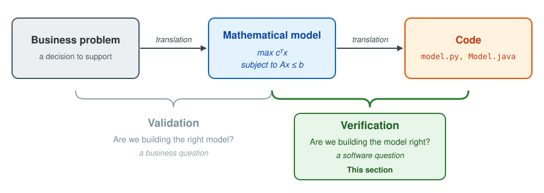
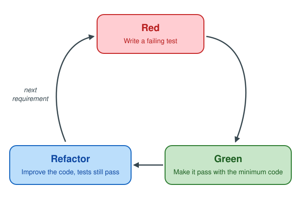
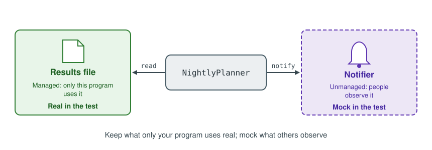
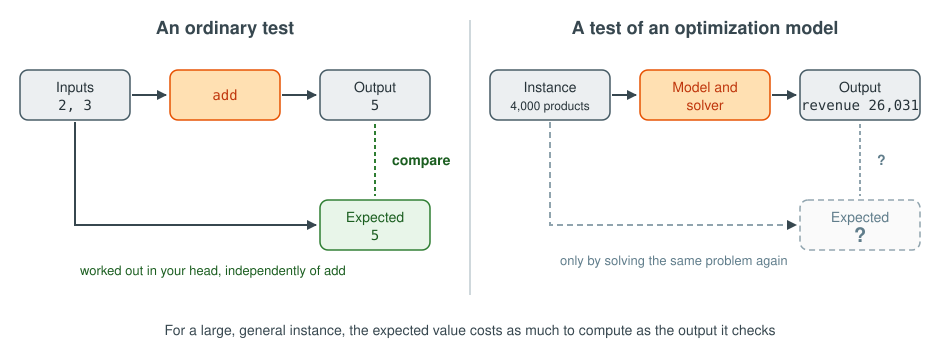

# Section 05 — Testing decision-support software

## Introduction

Testing matters in the [software development lifecycle](../appendix/glossary.md#software-development-lifecycle)
because it serves both abilities a team needs: [learning quickly](../03-software-development-lifecycle/README.md#ch-learning)
and [adapting quickly](../03-software-development-lifecycle/README.md#ch-adapting). For learning, a test is how the
scientific method reaches code: it writes a hypothesis about what the code must do in a form anyone can check, and
running it is the experiment that confirms or refutes it. For adapting, testing is one of two pillars. Design is the
other: it keeps each change small and confined to one part, as [the design section](../04-design/README.md) shows. An
[automated test suite](../appendix/glossary.md#test-suite) then shows, on every change, that everything that worked
before still works. With both pillars in place, a team can change working code as often as the business asks.
Decision-support software adds one difficulty ordinary software rarely poses: the correct answer of its optimization
model is hard to know in advance.

### Verification vs validation

A model reaches its users through two translations: a business problem becomes a mathematical model, and the
mathematical model becomes code. [Validation](../appendix/glossary.md#validation) checks the first translation and asks
*are we building the right model?*, a business question. [Verification](../appendix/glossary.md#verification) checks the
second and asks *are we building the model right?*, a software question: does the code do what the mathematical model
says? [Figure: verification and validation](#fig-verification-validation) places each question on its translation.

<a id="fig-verification-validation"></a>

**Figure: verification and validation**

<p align="center">
  
</p>

This section deals only with verification.

### Types of tests

Tests fall into two families, told apart by the question each one answers.

| Type | The question it answers | Examples |
|---|---|---|
| [Functional](../appendix/glossary.md#functional-test) | Does the program provide its services correctly? | A sum is right; bad input is rejected |
| [Non-functional](../appendix/glossary.md#non-functional-test) | How well does the program provide them? | Security, speed, usability, availability, scalability |

This section is about functional tests.

### Hierarchy of functional tests

Functional tests come in three levels, told apart by how much of the program each one runs. A
[unit test](../appendix/glossary.md#unit-test) checks one small piece of code in isolation. An
[integration test](../appendix/glossary.md#integration-test) combines several units and checks that they work
together. An [end-to-end test](../appendix/glossary.md#end-to-end-test) runs the whole application in a real-world
scenario, the way its users would.

<a id="fig-test-pyramid"></a>

**Figure: test pyramid**

<p align="center">
  
</p>

Take a small program that reads a user's records, computes their income and tax, and reports the result.
[Figure: test levels](#fig-test-levels) draws it once per level and colors what a single test of that level runs.

<a id="fig-test-levels"></a>

**Figure: test levels**

<p align="center">
  
</p>

As [Figure: test pyramid](#fig-test-pyramid) shows, each step up runs more of the program, so each test costs more to
write and runs slower. A healthy suite holds many unit tests, fewer integration tests and a handful of end-to-end
tests.

### Out of scope

- **Performance and scale.** No chapter tests how fast a solver is or how large an instance it handles.
- **Input validation.** Items are never checked for nonsense values such as a negative weight: every infeasible
  instance in this section comes from the capacities, never from a malformed item.
- **Pareto fronts.** Models with several objectives appear only in their lexicographic form.
- **Validation.** Whether a model captures the right decision is a business question, not covered in this book.
- **Reviewing a formulation.** Checking the mathematics of a model on paper is not covered: the tests here check the
  output of solving it.

[Interface vs implementation](#ch-interface) separates what a unit promises from how it keeps the promise, and every
later chapter tests the promise. [Unit testing](#ch-unit-testing), [Writing good tests](#ch-clear-tests) and
[Test-driven development](#ch-tdd) test one unit on its own. [Mocks](#ch-mocks) and
[Integration testing](#ch-integration) take a test beyond the unit, to the systems it calls and the files it reads.
[Testing an optimization model](#ch-model-testing) then meets the difficulty specific to decision-support software, in
models of growing difficulty, and [Testing a decision-support system](#ch-dss-testing) applies it to the whole system
behind its interface. Read them in order: each chapter uses only what the chapters before it defined.

<a id="ch-interface"></a>

## Interface vs implementation

Every unit of code has two parts. Its [interface](../appendix/glossary.md#interface) says what the unit does: its
name, the inputs it accepts, and the outputs and errors it returns. Programmers also call it the signature, the
application programming interface (API), the [contract](../appendix/glossary.md#contract), or the
[abstraction](../appendix/glossary.md#abstraction). Its implementation is how the unit does it, and everything in it
is an [implementation detail](../appendix/glossary.md#implementation-detail). Any code that calls the unit is one of
its *clients*. Implementation details include any [private](../appendix/glossary.md#public-and-private) method the
unit calls, such as `is_finite` in the figure: no client can call it, so it can change freely.
[Figure: interface and implementation](#fig-interface-implementation) marks the parts on the calculator's `add`.

<a id="fig-interface-implementation"></a>

**Figure: interface and implementation**

<p align="center">
  
</p>

Two design practices follow from the split. The interface states what the unit does and never how, and the comments
that state its promises belong to it as much as its first line does. The implementation stays hidden from the
clients, so it can change, or give way to a different implementation, without any client noticing.

A wall socket shows the same split. [Figure: socket](#fig-socket) draws it: the socket is the interface, a fixed shape
that delivers a fixed voltage. Behind the wall, the power may come from a gas plant, a wind farm or solar panels; that
is the implementation, and the utility can change it at any time. The lamp, the laptop and the phone are the clients,
and they rely on the socket alone. Telling the interface from the implementation is foundational knowledge, in
[design](../04-design/README.md) as much as in [testing](#ch-unit-testing).

<a id="fig-socket"></a>

**Figure: socket**

<p align="center">
  
</p>

<a id="ch-unit-testing"></a>

## Unit testing

A unit test sits at the base of the pyramid: it checks one unit of code, such as a function, on its own, and runs in
milliseconds.

### What to test

An interface has one or more *behaviors*, and each one is something to test. The interface in
[Figure: interface and implementation](#fig-interface-implementation) promises five:

1. **The base case**, also called the [happy path](../appendix/glossary.md#happy-path): `add(3, 4) = 7`.
2. **Commutativity**: `add(3, 4) = add(4, 3)`.
3. **Identity**: `add(3, 0) = 3`.
4. **Invalid input**: `add("3", 4)` fails with an invalid-input error.
5. **Overflow**: adding the largest representable number to itself fails with an overflow error.

A behavior may need more than one case: identity holds for 3, and also for a negative number and a very large one.

### How to write a unit test

A unit test's name says what it checks, in three parts: the unit, the behavior and case, and the expected result.
`test__add__given_two_numbers__returns_their_sum` tests `add`, given two ordinary numbers, and expects their sum. When
it fails, its name alone reports which behavior broke.

The body follows the [arrange, act, assert (AAA)](../appendix/glossary.md#arrange-act-assert) pattern: *arrange* the
objects and inputs the test needs, *act* by calling the unit once, and *assert* that the result meets the expectation.
In the pseudocode, `expect` makes the assertion: the test fails if its condition is false.

<a id="pseudo-add-test"></a>

**Pseudocode: add test**

```
// pseudocode: add-test
public test__add__given_two_numbers__returns_their_sum()
    // Arrange
    calculator = Calculator()

    // Act
    result = calculator.add(1, 2)

    // Assert
    expect result == 3
```

### A scientific experiment

A unit test is a scientific experiment in miniature, and it holds every part an experiment in a laboratory holds.
The table finds each part in [Pseudocode: add test](#pseudo-add-test).

| Part of the experiment | In Pseudocode: add test |
|---|---|
| Hypothesis | The name: `add`, given two numbers, returns their sum |
| Controlled conditions | *Arrange*: a new `Calculator` and the fixed inputs 1 and 2 |
| Intervention | *Act*: one call, `calculator.add(1, 2)` |
| Observation | `result`, the value the call returns |
| Prediction checked against the observation | *Assert*: `expect result == 3` |
| Conclusion | The test passes, and the evidence supports the hypothesis; or it fails, and refutes it |

The parts carry the principles of [the scientific method](../03-software-development-lifecycle/README.md#ch-learning)
with them. The hypothesis is testable, because the assertion states it as an objective, measurable condition. The
conditions are controlled, because the test runs one unit on its own, with inputs it fixes itself, so a failure has
one cause: `add`. And the experiment is reproducible: anyone can run it again, on any machine, and get the same result.

### Where to place the test

Test code lives apart from production code, in a folder tree that mirrors it, so each module's tests sit at the same
place in the tests tree as the module does in the source tree.

<a id="pseudo-test-layout"></a>

**Pseudocode: test layout**

```
// pseudocode: test-layout
project/
    src/
        calculator
    tests/
        test_calculator_add
        test_calculator_divide
```

### Code coverage

How do you know you tested every behavior? The starting point is
[code coverage](../appendix/glossary.md#code-coverage): a tool records which lines of the production code the tests
run, and reports the rest. [Pseudocode: add coverage](#pseudo-add-coverage) marks each line of `add` for a suite
that holds only the happy-path test.

<a id="pseudo-add-coverage"></a>

**Pseudocode: add coverage**

```
// pseudocode: add-coverage
public add(a, b) returns number
    if not is_finite(a)                     // ✓ run
        fail with invalid-input error       // ✗ not run
    if not is_finite(b)                     // ✓ run
        fail with invalid-input error       // ✗ not run
    result = a + b                          // ✓ run
    if result is too large to represent     // ✓ run
        fail with overflow error            // ✗ not run
    return result                           // ✓ run
```

> [!NOTE]
> The pseudocode is illustrative: a coverage tool reports the same pattern for `add` written in a real language, over
> more lines.

The three lines that never run belong to the invalid-input and overflow behaviors. Add a test for each, and every line
runs: coverage reaches 100%. Now delete the commutativity test. Coverage stays at 100%, because the happy-path test
already runs every line the commutativity test runs. Coverage points at lines no test runs; it cannot point at a
behavior no test checks. Use it to find what is missing, and use the list of behaviors to decide when you are done.

### Exercise: a calculator

The exercise lives in the practice repositories: test the calculator's `divide` the way this part tested `add`.

> **Practice it**
>
> - Python: [Unit testing exercise](https://github.com/sefop/training-testing-python/tree/main/src/unit_tests_and_coverage)
> - Java: [Unit testing exercise](https://github.com/sefop/sefop-training-java/tree/main/src/main/java/unit_tests_and_coverage)

<a id="ch-clear-tests"></a>

## Writing good tests

[Unit testing](#ch-unit-testing) gave a test its structure and its name; the practices below tell a good test from a
bad one.

### Complete and concise

A test is *complete* when its body holds everything a reader needs to understand its result, and *concise* when it
holds nothing else. [Pseudocode: cluttered test](#pseudo-cluttered-test) fails both ways: the constructor arguments
play no part in addition, and the numbers that decide the result hide inside helper functions.

<a id="pseudo-cluttered-test"></a>

**Pseudocode: cluttered test**

```
// pseudocode: cluttered-test
public test__add__given_two_numbers__returns_their_sum()
    calculator = Calculator(precision=10, rounding="half-even", log_file="calc.log")
    result = calculator.add(first_operand(), second_operand())
    expect result == 5
```

[Pseudocode: concise test](#pseudo-concise-test) keeps the numbers that matter in view and drops the rest.

<a id="pseudo-concise-test"></a>

**Pseudocode: concise test**

```
// pseudocode: concise-test
public test__add__given_two_numbers__returns_their_sum()
    calculator = Calculator()
    result = calculator.add(2, 3)
    expect result == 5
```

### One behavior per test

[Pseudocode: method test](#pseudo-method-test) checks three behaviors of `add` at once. When it fails, its name cannot
say which behavior broke, and the first failing `expect` stops the test, so the ones after it go unchecked.

<a id="pseudo-method-test"></a>

**Pseudocode: method test**

```
// pseudocode: method-test
public test__add__works()
    calculator = Calculator()
    expect calculator.add(3, 4) == 7
    expect calculator.add(3, 4) == calculator.add(4, 3)
    expect calculator.add(3, 0) == 3
```

[Pseudocode: behavior tests](#pseudo-behavior-tests) splits it into one test per behavior, each named for the
behavior it checks. A name that needs the word "and" describes two behaviors, and belongs to two tests.

<a id="pseudo-behavior-tests"></a>

**Pseudocode: behavior tests**

```
// pseudocode: behavior-tests
public test__add__given_two_numbers__returns_their_sum()
    calculator = Calculator()
    result = calculator.add(3, 4)
    expect result == 7

public test__add__given_swapped_operands__returns_the_same_sum()
    calculator = Calculator()
    expect calculator.add(3, 4) == calculator.add(4, 3)

public test__add__given_zero__returns_the_other_number()
    calculator = Calculator()
    result = calculator.add(3, 0)
    expect result == 3
```

### No logic in tests

Production code must handle any input, so it needs logic: loops, conditions, arithmetic. A test handles a few chosen
inputs, so it needs none, and each piece of logic it carries is a computation its reader must run in their head.
[Pseudocode: logic test](#pseudo-logic-test) loops over six pairs of numbers and computes each expected value with
`a + b`, the very operation `add` performs. The test repeats the implementation instead of checking it.

<a id="pseudo-logic-test"></a>

**Pseudocode: logic test**

```
// pseudocode: logic-test
public test__add__given_two_numbers__returns_their_sum()
    calculator = Calculator()
    for each a in [1, 2, 3]
        for each b in [4, 5]
            expect calculator.add(a, b) == a + b
```

[Pseudocode: concise test](#pseudo-concise-test) is straight-line code with a literal expected value: a reader checks
that 2 plus 3 is 5 at a glance.

### Clear failure messages

When a test fails, its failure message is often the first thing a reader sees, and sometimes the only one. A good
message states the inputs, the expected value and the actual value. So far, `expect` has taken a condition; it also
takes a message after a comma, which the test reports when the condition is false.
[Pseudocode: vague failure](#pseudo-vague-failure) reduces the comparison to true or false before asserting it, so
its failure reads only "expected true, got false".

<a id="pseudo-vague-failure"></a>

**Pseudocode: vague failure**

```
// pseudocode: vague-failure
public test__add__given_two_numbers__returns_their_sum()
    calculator = Calculator()
    result = calculator.add(2, 3)
    expect (result == 5) is true
```

[Pseudocode: clear failure](#pseudo-clear-failure) fails with "add(2, 3) returned 6, expected 5", which points at the
broken behavior before anyone opens the test.

<a id="pseudo-clear-failure"></a>

**Pseudocode: clear failure**

```
// pseudocode: clear-failure
public test__add__given_two_numbers__returns_their_sum()
    calculator = Calculator()
    result = calculator.add(2, 3)
    expect result == 5, "add(2, 3) returned {result}, expected 5"
```

### Descriptive and meaningful

Production code follows [don't repeat yourself (DRY)](../appendix/glossary.md#dont-repeat-yourself): each piece of
knowledge lives in one place, so a change is one edit. Test code follows
[descriptive and meaningful phrases (DAMP)](../appendix/glossary.md#descriptive-and-meaningful-phrases) instead: a
little repetition is welcome when it lets each test be read on its own.
[Pseudocode: too-DRY tests](#pseudo-too-dry-tests) shares its calculator and its numbers across the file, so to check
either test, a reader must first scroll up to learn what `a` and `b` are.

<a id="pseudo-too-dry-tests"></a>

**Pseudocode: too-DRY tests**

```
// pseudocode: too-dry-tests
calculator = Calculator()
a = 3
b = 4

public test__add__given_two_numbers__returns_their_sum()
    expect calculator.add(a, b) == 7

public test__add__given_swapped_operands__returns_the_same_sum()
    expect calculator.add(a, b) == calculator.add(b, a)
```

[Pseudocode: behavior tests](#pseudo-behavior-tests) repeats `calculator = Calculator()` and its numbers in every
test, and each test reads on its own.

### Further reading

- Titus Winters, Tom Manshreck and Hyrum Wright, *Software Engineering at Google*, O'Reilly, 2020, chapter 12, "Unit
  Testing": the source of these five practices, each shown on tests from a code base of Google's size.
- Vladimir Khorikov, *Unit Testing: Principles, Practices and Patterns*, Manning, 2020, chapter 3, "The anatomy of a
  unit test": the same ground from another angle, on one behavior per test, no branching in tests, and setup shared
  between tests.

<a id="ch-tdd"></a>

## Test-driven development

[Test-driven development (TDD)](../appendix/glossary.md#test-driven-development) writes each test before the code it
checks. In the terms of the scientific experiment in [Unit testing](#ch-unit-testing), it states the hypothesis
before it builds the experiment: the test says what the code must do while that code does not exist yet.

### The cycle: red, green, refactor

TDD advances in short cycles of three steps, named after the colors a test tool shows:

1. **Red.** Write one test for the next requirement, run it, and watch it fail.
2. **Green.** Write the minimum code that makes it pass.
3. **Refactor.** Improve the code while every test keeps passing. Changing code without changing what it does is
   called [refactoring](../appendix/glossary.md#refactoring).

Then the next requirement starts the next cycle. [Figure: TDD cycle](#fig-tdd-cycle) draws the loop.

<a id="fig-tdd-cycle"></a>

**Figure: TDD cycle**

<p align="center">
  
</p>

### Why each step matters

**Red shows that the test can fail.** A test that has never failed has never been shown to test anything: it may
check the wrong value, or not run at all. Watching it fail first is the evidence that it can tell working code from
missing code.

**Red, then green, shows causality.** The test failed, one change was made, and now the test passes: that change is
why it passes. This is the causality principle of
[the scientific method](../03-software-development-lifecycle/README.md#ch-learning) applied to code: change one thing
at a time, so the result shows what caused it. A test written after the code passes on its first run, and cannot tell
whether the code made it pass or whether it would have passed anyway.

**Green with the minimum code keeps every line accountable.** Each line of production code exists because a test
demanded it, so no line goes untested and no behavior is built that nobody asked for.

**Refactor is safe because the tests check the interface.** The tests pin down what the code does, never how, as
[Interface vs implementation](#ch-interface) set out. The code can change shape underneath them, and a test that
turns red means a promise broke, not that the code merely moved.

### A linear expression example

A linear expression has the form $a_0 + a_1 x_1 + \dots + a_n x_n$: a scalar $a_0$, and a coefficient $a_i$ for each
variable $x_i$. The class `LinearExpression` represents one. The scalar and the coefficients are floating-point
numbers, and each variable is identified by its name, a string. For example:

| Expression | Scalar | Coefficients |
|---|---|---|
| $0$ | 0.0 | none |
| $1 + 2x$ | 1.0 | `"x"`: 2.0 |
| $-1 - x + 2y$ | -1.0 | `"x"`: -1.0, `"y"`: 2.0 |

This example builds the scalar part test-first, in three cycles, with these requirements:

- An expression built with no arguments has scalar 0.0.
- An expression built with a scalar has that scalar.
- Adding a value to the scalar increases the scalar by that value.

**Cycle 1.** [Pseudocode: empty expression test](#pseudo-empty-expression-test) states the first requirement. It is
red: `LinearExpression` does not exist yet.

<a id="pseudo-empty-expression-test"></a>

**Pseudocode: empty expression test**

```
// pseudocode: empty-expression-test
public test__linear_expression__given_no_arguments__has_scalar_zero()
    expression = LinearExpression()
    expect expression.scalar() == 0.0
```

The minimum code that turns it green returns a constant, as
[Pseudocode: constant scalar](#pseudo-constant-scalar) shows. It looks like cheating, and on purpose: one test
demands no more than this, and the next test will force the real code.

<a id="pseudo-constant-scalar"></a>

**Pseudocode: constant scalar**

```
// pseudocode: constant-scalar
class LinearExpression
    public scalar() returns number
        return 0.0
```

**Cycle 2.** [Pseudocode: scalar-only test](#pseudo-scalar-only-test) states the second requirement. It is red: the
constant 0.0 is not 3.0.

<a id="pseudo-scalar-only-test"></a>

**Pseudocode: scalar-only test**

```
// pseudocode: scalar-only-test
public test__linear_expression__given_a_scalar__has_that_scalar()
    expression = LinearExpression(scalar = 3.0)
    expect expression.scalar() == 3.0
```

To pass both tests, the expression must keep the scalar it receives, with 0.0 when it receives none.
[Pseudocode: stored scalar](#pseudo-stored-scalar) does that, and the constant is gone. The refactor step finds
nothing to improve yet, and a cycle may end that way.

<a id="pseudo-stored-scalar"></a>

**Pseudocode: stored scalar**

```
// pseudocode: stored-scalar
class LinearExpression
    private stored_scalar

    public constructor(scalar = 0.0)
        stored_scalar = scalar

    public scalar() returns number
        return stored_scalar
```

**Cycle 3.** [Pseudocode: add scalar test](#pseudo-add-scalar-test) states the third requirement. It is red:
`add_scalar` does not exist yet.

<a id="pseudo-add-scalar-test"></a>

**Pseudocode: add scalar test**

```
// pseudocode: add-scalar-test
public test__add_scalar__given_a_value__increases_the_scalar_by_it()
    expression = LinearExpression(scalar = 1.0)
    expression.add_scalar(3.0)
    expect expression.scalar() == 4.0
```

[Pseudocode: add scalar](#pseudo-add-scalar) adds the method, and all three tests pass.

<a id="pseudo-add-scalar"></a>

**Pseudocode: add scalar**

```
// pseudocode: add-scalar
class LinearExpression
    private stored_scalar

    public constructor(scalar = 0.0)
        stored_scalar = scalar

    public scalar() returns number
        return stored_scalar

    public add_scalar(value)
        stored_scalar = stored_scalar + value
```

The scalar part is done. The variables are the exercise: building an expression with a term, adding a term to a
variable that is already present, merging two expressions, and reading back the variables and their coefficients,
one cycle at a time.

### Further reading

- Kent Beck, *Test-Driven Development: By Example*, Addison-Wesley, 2002: the book that named the cycle, worked
  through at the same small step size as this chapter.

> **Practice it**
>
> - Python: [Test-driven development exercise](https://github.com/sefop/training-testing-python/tree/main/src/test_driven_development)
> - Java: [Test-driven development exercise](https://github.com/sefop/sefop-training-java/tree/main/src/main/java/test_driven_development)

<a id="ch-mocks"></a>

## Mocks

A unit test checks the behaviors a unit promises through its [interface](../appendix/glossary.md#interface). A unit
rarely works alone: it calls another unit, its [dependency](../appendix/glossary.md#dependency), to do part of its
work. A behavior may be visible in a returned value or error, in an outgoing call, or in both: `add` returns a sum,
while a nightly planning job asks a notifier to wake someone up. The earlier tests checked the first kind. The second
raises a problem: a unit test must not make an external call for real.

### Why the real dependency stays out of the test

A test runs many times a day, on developers' laptops and on shared servers. When a dependency's calls reach a person
or an external system, every run would wake a real person or write to a real system. That system may also be slow,
or out of reach from the machine that runs the test. And whatever record it keeps lives outside the program, where
the test has no dependable way to read it.

### What a mock is

A [mock](../appendix/glossary.md#mock) is a stand-in that the test puts in place of the dependency. It accepts the
same calls as the real one, does nothing else, and records every call it receives, with its arguments. The unit
receives it the way it would receive the real dependency, from outside, through
[dependency injection](../appendix/glossary.md#dependency-injection). After acting, the test asserts on the record.

[Figure: real notifier and mock](#fig-mocks-real-vs-mock) sets the two side by side. They share the same
[interface](#ch-interface); only what sits behind it differs.

<a id="fig-mocks-real-vs-mock"></a>

**Figure: real notifier and mock**

<p align="center">
  
</p>

Nothing more is needed to build one. [Pseudocode: recording notifier](#pseudo-recording-notifier) is a complete mock
of a notifier: it keeps the messages it is asked to send, and sends none.

<a id="pseudo-recording-notifier"></a>

**Pseudocode: recording notifier**

```
// pseudocode: recording-notifier
class RecordingNotifier implements Notifier
    private messages = empty list

    public notify(message)
        append message to messages
```

Test tools build such an object for any interface, so tests rarely write one by hand. The pseudocode writes
`notifier = mock(Notifier)` to create one, and reads its record with two assertions:

- `expect notifier.notify called once with "<message>"` holds when exactly one call was made, with that argument.
- `expect notifier.notify never called` holds when no call was made.

### A worked example

Every night, a planning job solves tomorrow's plan. When the model reports that no feasible plan exists, someone must
act before morning, so the job notifies the planner on call. [Pseudocode: nightly planner](#pseudo-nightly-planner)
receives the result of the solve and the notifier; it never calls the solver itself.

<a id="pseudo-nightly-planner"></a>

**Pseudocode: nightly planner**

```
// pseudocode: nightly-planner
interface Notifier
    public notify(message)

class NightlyPlanner
    private notifier

    public constructor(notifier)
        keep notifier

    public review(result)
        if result.status is infeasible
            notifier.notify("Instance " + result.instance_id + ": no feasible plan exists.")
```

The notification is the behavior, so the test checks the notification.
[Pseudocode: infeasible notifies test](#pseudo-infeasible-notifies-test) hands `NightlyPlanner` a mock and an infeasible
result, then asserts on the one call the mock recorded.

<a id="pseudo-infeasible-notifies-test"></a>

**Pseudocode: infeasible notifies test**

```
// pseudocode: infeasible-notifies-test
public test__review__given_an_infeasible_plan__notifies_once_with_the_instance()
    // arrange
    notifier = mock(Notifier)
    planner = NightlyPlanner(notifier)
    result = SolveResult(instance_id = "2026-09-26", status = infeasible)

    // act
    planner.review(result)

    // assert
    expect notifier.notify called once with "Instance 2026-09-26: no feasible plan exists."
```

A feasible night must stay quiet. [Pseudocode: feasible silent test](#pseudo-feasible-silent-test) asserts that no
notification was sent, which only a record of calls can show.

<a id="pseudo-feasible-silent-test"></a>

**Pseudocode: feasible silent test**

```
// pseudocode: feasible-silent-test
public test__review__given_a_feasible_plan__sends_no_notification()
    // arrange
    notifier = mock(Notifier)
    planner = NightlyPlanner(notifier)
    result = SolveResult(instance_id = "2026-09-26", status = feasible)

    // act
    planner.review(result)

    // assert
    expect notifier.notify never called
```

### What to mock

Mock the dependencies whose calls reach people or external systems. Those calls are behaviors a client relies on,
so checking them checks the [interface](#ch-interface). Keep the unit's own internal parts real. A test that mocks
them checks how the unit does its work, and breaks the day that work is reorganized, even though no promise changed.

### Further reading

- Vladimir Khorikov, *Unit Testing: Principles, Practices and Patterns*, Manning, 2020, chapters 5, "Mocks and test
  fragility", and 9, "Mocking best practices": when a mock protects a test and when it makes the test brittle.
- Titus Winters, Tom Manshreck and Hyrum Wright, *Software Engineering at Google*, O'Reilly, 2020, chapter 13, "Test
  Doubles": the other kinds of stand-ins, such as stubs and fakes, and when to prefer the real dependency.

> **Practice it**
>
> - Python: [Mocks exercise](https://github.com/sefop/training-testing-python/tree/main/src/mocks)
> - Java: [Mocks exercise](https://github.com/sefop/sefop-training-java/tree/main/src/main/java/mocks)

<a id="ch-integration"></a>

## Integration testing

The [integration test](../appendix/glossary.md#integration-test) is the middle level of
[Figure: test pyramid](#fig-test-pyramid). A program's units do not only call each other: they also meet real things
outside the program, such as files, databases and other systems, and many bugs live in that meeting. A file written
in one format and read in another, a folder that is not where the code expects it: a unit test with a
[mock](../appendix/glossary.md#mock) cannot see such bugs, because the mock stands exactly where the bug is. An
integration test runs the units together with those real dependencies.

### Which dependencies stay real

Not every dependency should be real in an integration test. The rule depends on who else can see it.

- A [managed dependency](../appendix/glossary.md#managed-dependency) is used only by your program, such as its own
  files or its own database. It stays real: how the program uses it is an implementation detail, and only the real
  one shows whether that detail works.
- An [unmanaged dependency](../appendix/glossary.md#unmanaged-dependency) is observed by other people or systems,
  such as the notifier. It stays a mock, as in [Mocks](#ch-mocks): a test must not wake a real person, and the call
  itself is the behavior to check.

[Figure: real and mocked dependencies](#fig-integration-dependencies) applies the rule to the nightly planner.

<a id="fig-integration-dependencies"></a>

**Figure: real and mocked dependencies**

<p align="center">
  
</p>

### What an integration test covers

An integration test is slower and costlier than a unit test, so it covers one happy path per scenario, through every
real dependency. The edge cases stay in unit tests, with one exception: an edge case that only the real dependency
can produce, such as tonight's file being missing, belongs in an integration test.

### A worked example

The nightly planner no longer receives the result of the solve as an argument. The solve job saves each night's
result to a file with a `ResultsWriter`, and the planner reads it back with its own `ResultsReader`. They are two
units, owned by two teams, and they share no code: each one encodes its own idea of the file's format.
[Pseudocode: nightly planner with reader](#pseudo-nightly-planner-with-reader) shows the planner.

<a id="pseudo-nightly-planner-with-reader"></a>

**Pseudocode: nightly planner with reader**

```
// pseudocode: nightly-planner-with-reader
class NightlyPlanner
    private reader
    private notifier

    public constructor(reader, notifier)
        keep reader and notifier

    public review_tonight(instance_id)
        result = reader.read(instance_id)
        if result.status is infeasible
            notifier.notify("Instance " + instance_id + ": no feasible plan exists.")
```

[Pseudocode: infeasible night integration test](#pseudo-infeasible-night-integration-test) writes a real file with
the real writer, runs the planner with the real reader, and keeps only the notifier a mock.

<a id="pseudo-infeasible-night-integration-test"></a>

**Pseudocode: infeasible night integration test**

```
// pseudocode: infeasible-night-integration-test
public test__review_tonight__given_an_infeasible_result_on_disk__notifies_once()
    // Arrange
    folder = a new, empty temporary folder
    ResultsWriter(folder).write(SolveResult(instance_id = "2026-09-26", status = infeasible))
    notifier = mock(Notifier)
    planner = NightlyPlanner(ResultsReader(folder), notifier)

    // Act
    planner.review_tonight("2026-09-26")

    // Assert
    expect notifier.notify called once with "Instance 2026-09-26: no feasible plan exists."
```

Suppose the solve job's team changes how it writes the status, `Infeasible` instead of `infeasible`, and updates its
own tests to match. The writer's tests pass, and so do the reader's, each against its own idea of the format. Only
this test, which joins the two, fails.

### Further reading

- Vladimir Khorikov, *Unit Testing: Principles, Practices and Patterns*, Manning, 2020, chapters 8, "Why integration
  testing?", and 10, "Testing the database": the rule for managed and unmanaged dependencies, and how many
  integration tests to write.
- Titus Winters, Tom Manshreck and Hyrum Wright, *Software Engineering at Google*, O'Reilly, 2020, chapter 14,
  "Larger Testing": tests beyond the unit, and the gaps in unit tests they close.

> **Practice it**
>
> - Python: [Integration testing exercise](https://github.com/sefop/training-testing-python/tree/main/src/integration_testing)
> - Java: [Integration testing exercise](https://github.com/sefop/sefop-training-java/tree/main/src/main/java/integration_testing)

---

<a id="ch-model-testing"></a>

## Testing an optimization model

Every test so far compared an output with an expected value that someone could work out before running the code:
`add(2, 3)` is 5, and a notification carries a known message. An optimization model breaks that assumption, because
its expected output is the very thing it exists to compute.

Testing a model can mean reviewing its formulation or checking the output of solving it. This chapter does the second,
as [verification](../appendix/glossary.md#verification). The model is implemented in code, and a *solver*, the program
that finds a provably optimal solution of a model, solves it: a commercial one such as Gurobi or Xpress, or an
open-source one such as HiGHS. The tests check what comes back, with full access to the solver.

<a id="model-difficulties"></a>

### Why an optimization model is harder to test

Six properties of an optimization model make its output harder to test than the output of the calculator:

1. [The oracle problem](#difficulty-oracle): the expected answer costs as much to compute as the output it checks.
2. [The answer may or may not be unique](#difficulty-uniqueness): a correct solver can return any of several optimal
   solutions.
3. [An empty feasible region is an answer](#difficulty-infeasible): "no solution exists" can be the correct output.
4. [Numbers are floating point](#difficulty-floating-point): two correct answers can differ in their last digits.
5. [Optimality may not be promised](#difficulty-optimality): some solvers return a good answer, not the best one.
6. [The algorithm may change](#difficulty-algorithm): the solver behind the model can be replaced.

<a id="difficulty-oracle"></a>

#### The oracle problem

Whatever decides whether an output is correct is called a [test oracle](../appendix/glossary.md#test-oracle). For the
calculator, the oracle is arithmetic you already know: 2 plus 3 is 5, worked out without reading a line of `add`. For a
model, writing `expect result.objective_value == ???` needs the optimal value, and for an instance large enough to be
interesting, computing it independently means solving the very problem the model exists to solve. The difficulty has a
name in the software testing literature: the [oracle problem](../appendix/glossary.md#oracle-problem).
[Figure: the oracle problem](#fig-oracle-problem) sets the two situations side by side.

<a id="fig-oracle-problem"></a>

**Figure: the oracle problem**

<p align="center">
  
</p>

<a id="difficulty-uniqueness"></a>

#### The answer may or may not be unique

A model can have a single optimal solution, or several that tie at the same objective value. When two variables have the
same objective coefficient and appear in the constraints in the same way, setting one or the other is equally optimal,
and a correct solver may return either solution. Which one comes back depends on the solver, its settings, even the
order of the input. A test cannot know in advance which of the optimal solutions it will receive, nor whether there is
more than one.

<a id="difficulty-infeasible"></a>

#### An empty feasible region is an answer

Constraints can contradict each other: one demands $x \ge 2$ while another allows at most $x \le 1$. Then no solution
exists, and "infeasible" is the correct output, not a failure. A correct model must say so rather than return a
solution, and a test must treat that statement as an answer to check, like any other. Other models can also be
unbounded, a second answer of the same kind.

<a id="difficulty-floating-point"></a>

#### Numbers are floating point

A computer stores most decimal numbers approximately: 0.1 + 0.2 is not exactly 0.3. A solver computes with that finite
precision, and it accepts a constraint as satisfied when it is violated by less than a small tolerance. Two correct
answers can therefore differ in their last digits, an objective value can come back as 25.999999998 instead of 26, and a
constraint $x \le 10$ can be met at 10.000000001. Equality can only mean equality within a tolerance.

<a id="difficulty-optimality"></a>

#### Optimality may not be promised

A [heuristic](../appendix/glossary.md#heuristic) gives up the guarantee of optimality on purpose, in exchange for speed
on large instances. An exact solver stopped by a time limit does the same without announcing it: it returns the best
solution found so far, which need not be the best one. For such solvers, "the optimal value" is not something the
output promises, and two runs may even return different solutions.

<a id="difficulty-algorithm"></a>

#### The algorithm may change

The solver behind a model is rarely permanent. A team moves from one commercial solver to another, from a commercial
solver to an open-source one, or to a heuristic when instances grow too large. The promise the model makes to its users
stays the same through each change, while everything about how the answer is found, and which of several optimal
answers comes back, can change.

### The model under test

The chapter tests the cargo loading system of [the appendix](../appendix/running-example.md): for one departure, how
much of each tendered product to load, so that the revenue carried is as large as possible without exceeding the
aircraft's maximum weight or the capacity of its hold. It starts from the
[bulk variant](../appendix/running-example.md#ev-bulk), where products are loaded by the tonne and each quantity can
take any value between its bounds.

The symbols the chapter uses, all fixed, **non-negative** parameters except the decision variable:

| Symbol | Meaning | Unit |
|:---:|---|---|
| $r_i$ | revenue of one pallet of product $i$ | thousands of USD |
| $w_i$ | weight of one pallet | tonnes |
| $v_i$ | volume of one pallet | m³ |
| $u_i$ | pallets of product $i$ tendered | count |
| $l_i$ | pallets of product $i$ that must fly | count |
| $W$, $V$ | max weight and hold capacity | tonnes, m³ |
| $x_i$ | quantity of product $i$ loaded | continuous |

A load is *loadable* when it respects both capacities, loads no more of a product than was tendered, and loads at
least what must fly.

The tests write an instance and a solve in a few pseudocode forms:

- `item(name, weight, volume, revenue, max_quantity, min_quantity)` describes one product; `min_quantity`, what must
  fly, defaults to 0.
- `solve(items, weight_capacity, volume_capacity)` runs whichever solver is under test. When a test needs a specific
  one, it writes `enumeration_solver().solve(...)`, `mip_solver().solve(...)` or `greedy_solver().solve(...)`.
- `result` has five fields: `feasible`, `quantities` (product name to quantity loaded), `total_revenue`,
  `total_weight` and `total_volume`.
- `==` on numbers means equal within a small numerical tolerance.

<a id="model-lp"></a>

### A linear program

With continuous quantities, a linear objective and linear constraints, the bulk model is a [linear
program](../appendix/glossary.md#linear-program): an algorithm such as the simplex method, run by a solver like Gurobi,
finds a provably optimal load.

<a id="model-contract"></a>

#### Test the contract

For a linear program, the [algorithm that may change](#difficulty-algorithm) is, for example, the simplex method
giving way to an interior-point method or to another solver.

When tests check *how* the answer was computed, a legitimate swap turns them red even though nothing a user cares about
got worse. A [regression](../appendix/glossary.md#regression), a behavior that used to work and no longer does,
never happened, yet the tests report one. Teams in that situation learn to rewrite tests with every change, or to
ignore red tests altogether. Both defeat the purpose of having tests.

A [contract](../appendix/glossary.md#contract) is the promise a piece of code makes to its callers: what it needs as
input and what it guarantees as output, and nothing about how. Everything else — the algorithm, its running time, its
internal data structures — is an [implementation detail](../appendix/glossary.md#implementation-detail).

For the load planner, the contract fits in one sentence: *given a catalogue of items and two capacities, return the
revenue-maximizing loadable selection if one exists, or report that the instance is infeasible.* Two clauses make it
precise:

1. When `feasible` is false, the other result fields carry no meaning.
2. When several selections tie for the best revenue total, any one of them may be returned.

You already make this separation in optimization. The formulation says *what* the optimal solution is; branch-and-bound,
cutting planes, or enumeration say *how* to find it. That is why you can swap solvers without rewriting the model. A
contract test checks the formulation's promise, so it runs unchanged against every solver that keeps it.

Writing contract tests [first](#ch-tdd) has a useful side effect. Each test is a question about the contract —
"what does `solve` promise when nothing is affordable?" — so the contract must be made explicit before any solver
exists. It also pushes the design toward modularity: a component that can be tested without looking at its
internals is, by construction, a component whose internals do not leak into its interface.

An example of a contract test on the bulk model will show a test that reads only the promised fields, the status
and the revenue, so that it survives a change of solver.

<a id="model-feasibility"></a>

#### Check feasibility

Checking that a load is *feasible* is cheap: substitute the returned quantities into each constraint, and recompute
the revenue from them to compare with the one the solver reports. Proving that the load is *optimal* is expensive.
This part will show the feasibility check as a test that applies to every returned load, whatever the instance. On
its own it does not certify optimality: a feasible load can still leave revenue behind.

<a id="model-duality"></a>

#### Duality as an oracle

Linear programming is the exception to the cost of proving optimality. By strong
[duality](../appendix/glossary.md#duality), a primal feasible solution and a dual feasible solution with equal objective
values prove each other optimal. A test can therefore ask the solver for both, and verify optimality with a few
matrix-vector products: an oracle that checks rather than computes.

<a id="model-mip"></a>

### A mixed-integer program

The business moves from bulk cargo to pallets, and a pallet flies whole or not at all: each $x_i$ becomes an integer, as
in the [appendix model](../appendix/running-example.md#an-optimization-model-for-this-problem), and the model becomes a
[mixed-integer program](../appendix/glossary.md#mixed-integer-program) (MIP). Integrality breaks the certificate of
[Duality as an oracle](#model-duality): the best load of whole pallets can fall short of the best load of the linear
program, so the dual no longer proves the optimum, and the oracle problem returns in full.

<a id="model-hand-oracles"></a>

#### Oracles by hand

The simplest oracle is a person. Take the
[two-pallet instance](../appendix/running-example.md#ex-two-pallet): each $x_i \in \{0, 1\}$, so there are
$2 	imes 2 = 4$ candidate selections, few enough to list.

| $x_A$ | $x_B$ | Weight (≤ 2) | Volume (≤ 2) | Revenue | Feasible? |
|:---:|:---:|:---:|:---:|:---:|---|
| 0 | 0 | 0 | 0 | 0 | yes |
| 1 | 0 | 2 | 1 | 10 | yes |
| 0 | 1 | 1 | 2 | 6 | yes |
| 1 | 1 | 3 | 3 | 16 | no — both capacities exceeded |

The best feasible selection is $x_A = 1$, $x_B = 0$, worth a revenue of 10. Nobody needed a solver to produce that
answer, so it can serve as the expected value of a test:


<a id="pseudo-two-pallet-test"></a>

**Pseudocode: two-pallet test**

```
// pseudocode: two-pallet-test
a = item(name="A", weight=2, volume=1, revenue=10, max_quantity=1)
b = item(name="B", weight=1, volume=2, revenue=6,  max_quantity=1)

result = solve([a, b], weight_capacity=2, volume_capacity=2)

expect result.feasible == true
expect result.total_revenue == 10
```

The price of a human oracle grows fast. The number of candidate selections is $\prod_{i \in I} (u_i - l_i + 1)$: 4
for this instance, but $4^{30} \approx 1.2 \times 10^{18}$ for 30 items that can each be loaded up to 3 times. A
person can only be the oracle at teaching scale, which is exactly how this part uses one.

The knapsack, however, is only *weakly* NP-hard: a pseudo-polynomial dynamic
program solves it exactly, so a cheap independent oracle does exist for this particular problem. The oracle problem
bites hardest on general MIPs, where no such shortcut is available. The knapsack is used here because it is small
enough to reason about by hand, not because it is the hardest case.

A person can solve a two-item instance by hand. The harder question is *which* instances to write. Small instances
picked at random tend to cover whatever comes to mind first, which is usually the ordinary case. Bugs, however, cluster
at the edges: an empty catalogue, a capacity of exactly zero, two items that tie. Without a method, those edges are left
to luck.

This part uses the first of three oracle families that the MIP tests build on:

| Oracle | How it decides whether an output is correct | Where |
|---|---|---|
| [Specified oracle](../appendix/glossary.md#specified-oracle) | The expected answer is stated in advance, worked out by a person | [Oracles by hand](#model-hand-oracles) |
| [Metamorphic relation](../appendix/glossary.md#metamorphic-relation) | A relation between two runs must hold, whatever their answers are | [Metamorphic relations](#model-metamorphic) |
| [Pseudo-oracle](../appendix/glossary.md#pseudo-oracle) | A second, independent implementation must agree | [Differential testing](#model-differential) |

A fourth kind comes for free in every test: an [implicit oracle](../appendix/glossary.md#implicit-oracle) catches what
is wrong in any program at all — a crash, a hang, a corrupted result. A solver that raises an error fails its test
regardless of what was asserted.

A specified oracle only needs a person and a small instance. To choose the instances, two standard techniques help:

- **[Equivalence partitioning](../appendix/glossary.md#equivalence-partitioning)** splits the input space into classes
  expected to behave the same way, then tests one instance per class.
- **[Boundary value analysis](../appendix/glossary.md#boundary-value-analysis)** adds instances exactly on the border
  between two classes, where behavior changes character.

If you have done sensitivity analysis, you have seen this structure. As you vary a right-hand side, the optimal basis
stays the same over a range, then changes at a breakpoint. The ranges are equivalence classes; the breakpoints are
boundary values. You would never probe sensitivity only in the middle of each range, and the same holds for tests.

Applied to the load planner, the two techniques produce the table below, ordered from the simplest instance to the most
involved:

| # | Situation | Expected behavior |
|:---:|---|---|
| 1 | No items at all | Nothing to pick: a feasible, zero-revenue empty selection. |
| 2 | Must-go cargo exceeds the payload | The committed pallets alone weigh more than the aircraft may carry: infeasible. |
| 3 | Must-go cargo exceeds the hold | The mirror of situation 2, for volume. |
| 4 | Must-go cargo fits exactly | The boundary between 2–3 and the rest: the committed load is the only one that fits, and nothing can be added. |
| 5 | An item that cannot be loaded | An item with maximum quantity zero is ignored, however attractive its revenue. |
| 6 | Nothing fits on its own | Every item exceeds a capacity on its own; the empty selection is still feasible, worth zero. |
| 7 | Unique optimum | One item dominates the other; the basic case. |
| 8 | Only the payload capacity binds | The optimum exhausts the payload capacity and leaves volume unused. |
| 9 | Only the hold capacity binds | The mirror of situation 8. |
| 10 | Both capacities bind at once | The optimum exhausts both capacities simultaneously. |
| 11 | Several optimal selections | Two interchangeable items tie; only the shared revenue total is asserted, never which item was picked. |
| 12 | More than one unit of an item | Quantities are genuine integers, not 0/1 choices in disguise. |
| 13 | One item too heavy to load | A single item that exceeds the payload on its own is excluded without disturbing the rest of the selection. |

Read situations 2 and 3 against 4 and 6. All four leave the aircraft carrying the committed load and nothing more,
and only two of them are infeasible. That distinction is exactly what a boundary is for.

Take one row of the table, situation 2, written as a specified-oracle test. Two pallets of mail are committed to this
departure, one tonne each, and the aircraft may carry one tonne:


<a id="pseudo-committed-mail-test"></a>

**Pseudocode: committed mail test**

```
// pseudocode: committed-mail-test
m = item(name="M", weight=1, volume=1, revenue=4, min_quantity=2, max_quantity=2)

result = solve([m], weight_capacity=1, volume_capacity=5)

expect result.feasible == false
```

The expected answer was derived by hand, without a solver: both pallets of mail must fly, they weigh 2 tonnes
together, and the aircraft may carry 1. Every permitted selection violates the payload constraint, so none exists.
Notice what the test does *not* assert: quantities and revenue. The [contract](#model-contract) says those fields carry
no meaning when the instance is infeasible, so asserting them would test a promise that was never made.

Thirteen situations pin down thirteen points in an input space that is effectively unbounded, and every one of them
required a person to work out the answer first. That is the ceiling of a specified oracle: it does not scale to a
catalogue of thousands of items, and it is not meant to. Its job is to fix expected behavior across a representative
slice of the input space. Two further assumptions are worth naming: the instances are small enough to solve by hand, and
the solver promises exact optimality. [When optimality is not guaranteed](#model-no-optimality) drops the second one.

<a id="model-contract-applied"></a>

#### The contract, applied

In code, a contract usually lives in an [abstraction](../appendix/glossary.md#abstraction): a named interface with a
single method, `solve`, that several implementations fulfill. In the Python exercise it is an abstract class with two
implementations, one enumerating every selection and one calling the HiGHS solver.

The contract defined for the linear program carries over unchanged; only the examples change. The
[two-pallet instance](../appendix/running-example.md#ex-two-pallet), tested two ways. First, a test
coupled to the algorithm:


<a id="pseudo-algorithm-coupled-test"></a>

**Pseudocode: algorithm-coupled test**

```
// pseudocode: algorithm-coupled-test
solver = enumeration_solver()
result = solver.solve([a, b], weight_capacity=2, volume_capacity=2)

expect solver.combinations_checked == 4      // how the answer was found
expect result.total_revenue == 10
```

Replace `enumeration_solver()` with `mip_solver()` and this test breaks: a MIP solver never enumerates combinations,
so there is no count to check. The optimum is still 10, yet the test fails.

Second, a test against the contract:


<a id="pseudo-contract-test"></a>

**Pseudocode: contract test**

```
// pseudocode: contract-test
for solver in [enumeration_solver(), mip_solver()]:
    result = solver.solve([a, b], weight_capacity=2, volume_capacity=2)

    expect result.feasible == true
    expect result.total_revenue == 10
```

This test only calls `solve` and reads the promised fields. Running it against two very different solvers is itself
the evidence that it asserts on the contract: if it depended on either algorithm's internals, one of the two would
fail.

They tell you *that* a solver is wrong, not *why*: a failing situation does not point at the line that caused it.
Tests written against an algorithm's internals, say the table a dynamic program fills, catch bugs earlier and
closer to their cause. They are legitimate, as long as everyone agrees that they may be deleted together with the
algorithm they test. Keep them separate from the contract tests. What contract tests
buy in exchange is a suite that survives a solver swap, which in a production pipeline happens more often than most
test suites assume.

<a id="model-metamorphic"></a>

#### Metamorphic relations

Every expected answer in [Oracles by hand](#model-hand-oracles) required a person to work it out first. That
caps testing at instances small enough to enumerate by hand. The instances you care about in practice — a real
catalogue, a real network — are far beyond that, and no one can tell you their optimal value.

A [metamorphic relation](../appendix/glossary.md#metamorphic-relation) is a relation that must hold between the
outputs of two related runs, even when you know neither output. The recipe has three steps:

1. Take an instance, any instance.
2. Transform it in a way whose effect on the optimum you can prove.
3. Solve both versions and check that the relation holds.

In the survey's vocabulary, a metamorphic relation is a *derived* oracle: it derives correctness from a relation
rather than from a known answer.

You already prove relations like these as theorems. Relaxing a constraint cannot make the optimal value worse — the
same reasoning that makes an LP relaxation a valid bound. A metamorphic relation turns such a theorem into a test. For
the load planner, four of them hold on every instance:

| Transformation | Relation on the optimal revenue total | Why it holds |
|---|---|---|
| Add an item that need not fly | Never decreases | Every previous selection is still available, with the new item at quantity zero. |
| Raise the payload or hold capacity | Never decreases | Relaxing a constraint only enlarges the feasible region. |
| Multiply every revenue by $k > 0$ | Scales by exactly $k$ | The feasible region is unchanged; only the objective is rescaled. |
| Cap an item's maximum quantity at zero | Equals the value with that item removed | An item that cannot be loaded cannot take part in any selection. |

The first and last both require the item in question to be uncommitted. Adding an item that *must* fly can lower the
optimum or empty the feasible region outright, and an item with pallets committed cannot have its maximum capped at
zero at all — the two bounds would cross.

None of the four compares the selected quantities. A transformation can turn a near-tie into an exact tie, and the
[contract](#model-contract) never promised which selection wins among equals.

Written as a test, the first relation — raising a capacity never decreases the optimum — looks like this:


<a id="pseudo-capacity-relation-test"></a>

**Pseudocode: capacity relation test**

```
// pseudocode: capacity-relation-test
a = item(name="A", weight=2, volume=1, revenue=10, max_quantity=2)
b = item(name="B", weight=1, volume=2, revenue=6,  max_quantity=1)
c = item(name="C", weight=3, volume=1, revenue=14, max_quantity=1)

before = solve([a, b, c], weight_capacity=5, volume_capacity=4)
after  = solve([a, b, c], weight_capacity=8, volume_capacity=4)

expect after.total_revenue >= before.total_revenue
```

The optimum of the first instance happens to be 26 revenue (two units of A plus one of B), but the test never needs
to know that. The same three lines work unchanged on a catalogue of four thousand items, which is what makes
metamorphic relations the part of this toolkit that scales.

**Numerical tolerance.** "Scales by exactly $k$" means within a small tolerance once revenues are real numbers.

<a id="model-differential"></a>

#### Differential testing

The relations of [Metamorphic relations](#model-metamorphic) check that runs are consistent with each other, but a model
can be consistently wrong. The mistakes that matter most in practice live in the formulation: a coefficient attached to
the wrong sum, a capacity applied to the wrong constraint, an index set that silently drops an item. The solver then
optimizes the wrong model faithfully.

It is worth being precise here. A mature MIP solver such as HiGHS is very unlikely to compute a wrong optimum for the
model it was given. The realistic risk is that the model does not say what you meant.

A [pseudo-oracle](../appendix/glossary.md#pseudo-oracle) is a second, independent implementation of the same contract.
[Differential testing](../appendix/glossary.md#differential-testing) runs both implementations on the same inputs and
compares their outputs. For small instances, brute-force enumeration makes a good pseudo-oracle: it is slow,
but correct by inspection. When it disagrees with the MIP solver, the disagreement points at the formulation.

This is the disciplined version of a sanity check most modelers already run informally — "let me compare my new model
against brute force on a toy case." Three details turn that habit into a reliable test:

1. **Generate many instances instead of picking a few.** Hundreds of small random instances explore corners that
   nobody would think to write by hand, including infeasible ones whenever the generator commits more cargo than the
   aircraft can carry.
2. **Fix the [random seed](../appendix/glossary.md#random-seed).** Reproducibility works here the way it does in a
   controlled experiment: the same inputs must always produce the same outputs. A failure that vanishes on the retry
   cannot be investigated, so the test must also report the instance that failed.
3. **Compare only what the contract promises.** Feasibility and the revenue total, never the selected quantities. When
   several selections tie, the [contract](#model-contract) allows the two implementations to
   return different ones.

In code, the comparison over generated instances looks like this:


<a id="pseudo-differential-sweep"></a>

**Pseudocode: differential sweep**

```
// pseudocode: differential-sweep
rng = random_generator(seed=20260908)

repeat 200 times:
    items = a list of rng.integer(1, 4) items, each with
                weight       = rng.integer(0, 5),  volume       = rng.integer(0, 5),
                revenue      = rng.integer(0, 20), max_quantity = rng.integer(1, 3),
                min_quantity = rng.integer(0, max_quantity)
    weight_capacity = rng.integer(0, 8)
    volume_capacity = rng.integer(0, 8)

    reference = enumeration_solver().solve(items, weight_capacity, volume_capacity)
    candidate = mip_solver().solve(items, weight_capacity, volume_capacity)

    expect candidate.feasible == reference.feasible
    if reference.feasible:
        expect candidate.total_revenue == reference.total_revenue
```

The largest generated instance has 4 items with up to 4 quantity values each, so enumeration checks at most
$4^4 = 256$ selections. The reference stays cheap.

What does this catch that the oracles written by hand do not? Suppose the formulation mistakenly uses each item's volume
in the weight constraint. Some of the thirteen hand-written situations will catch that mistake and some will not,
because they were chosen to cover the contract, not this particular error. A sweep over 200 generated instances is far
more likely to hit one that exposes it. Neither approach guarantees detection; the difference is how reliably each one
finds a mistake that nobody anticipated.

- **The reference must stay tractable.** Differential testing against enumeration lives in the same small-instance
  regime as [Oracles by hand](#model-hand-oracles). It broadens coverage considerably within that regime; it does not
  reach the large instances where you would most want an answer.
- **The two implementations must be independent.** If both share the same misunderstanding of the problem — say, both
  treat every item as a 0/1 choice — they agree with each other and are both wrong. A pseudo-oracle only protects
  against mistakes the two implementations do not have in common.

<a id="model-no-optimality"></a>

### When optimality is not guaranteed

Every expected answer in [Oracles by hand](#model-hand-oracles) and every relation in [Metamorphic
relations](#model-metamorphic) assumes that the solver returns a truly optimal answer. That assumption fails for a
[heuristic](../appendix/glossary.md#heuristic): a method that gives up the guarantee of optimality on purpose, in
exchange for finishing in reasonable time on instances too large to solve exactly.

It also fails, less visibly, for an exact MIP solver with a time limit. When the clock runs out, the solver returns its
best incumbent and an optimality gap. From the contract's point of view, that solver is a heuristic. Testing either one
against "did you find the exact optimum" fails it for doing precisely what it was designed to do.

Start again from the [contract](#model-contract). A heuristic's contract is weaker:

- return a *feasible* selection, or report infeasibility when no selection exists;
- its revenue total is at most the optimum;
- if, and only if, the method carries an approximation guarantee, its revenue total is at least a known fraction of the
  optimum.

A test survives exactly as far as it checks something this weaker contract still promises. This is the asymmetry of
[Check feasibility](#model-feasibility) coming back: tests that rely on *feasibility* survive untouched, because
checking feasibility never needed the optimum. Tests that rely on *optimality* must be weakened into bounds, or dropped.

**[Oracles by hand](#model-hand-oracles).** One reasonable sorting of the thirteen situations:

| Verdict | Situations | Why |
|---|:---:|---|
| Unchanged | 1, 2, 3, 4, 6 | The feasible region is empty, or holds a single selection — the committed load and nothing more — so any correct solver is forced to the same answer. |
| Weakened | 5, 8, 9, 10, 13 | The feasibility half survives — the capped item and the too-heavy item stay at zero, and capacities are respected. The claims about the optimal total or about which capacity binds do not. |
| Lose their purpose | 7, 11, 12 | They exist to check which value is optimal. Weakened to feasibility, they only repeat the rows above. |

**[Metamorphic relations](#model-metamorphic).** These are theorems about the optimal value, not about algorithms, so
they do not transfer automatically. A perfectly correct heuristic can violate them — the worked example below shows one.
What survives is applying a feasibility check to every transformed instance.

**[Differential testing](#model-differential).** It survives in weakened form. Keep the exact reference and compare
`candidate.feasible == reference.feasible` and `candidate.total_revenue <= reference.total_revenue`, plus a floor
if the heuristic has a guarantee.

Take a greedy heuristic that sorts items by revenue per tonne and takes each one while it still fits. One item, a
payload capacity of 2, and a hold capacity of 10 that never binds:


<a id="pseudo-greedy-relation-test"></a>

**Pseudocode: greedy relation test**

```
// pseudocode: greedy-relation-test
a = item(name="A", weight=2, volume=1, revenue=10, max_quantity=1)
d = item(name="D", weight=1, volume=1, revenue=6,  max_quantity=1)

before = greedy_solver().solve([a],    weight_capacity=2, volume_capacity=10)   // takes A: 10 revenue
after  = greedy_solver().solve([a, d], weight_capacity=2, volume_capacity=10)   // takes D first (6 per tonne
                                                                                # beats 5), then A no longer
                                                                                # fits: 6
expect after.total_revenue >= before.total_revenue                              // fails: 6 < 10
```

The relation "adding an item never decreases the optimum" still holds for the optimum itself, which stays at 10. It is
the heuristic that dropped to 6, and it did so while behaving exactly as designed. The test that fits its weaker
contract is a bound against an exact reference:


<a id="pseudo-greedy-bound-test"></a>

**Pseudocode: greedy bound test**

```
// pseudocode: greedy-bound-test
exact = enumeration_solver().solve([a, d], weight_capacity=2, volume_capacity=10)

expect after.feasible == exact.feasible
expect after.total_revenue <= exact.total_revenue
```

- **Bounds are weak tests.** "At most the optimum" is satisfied by returning the empty selection every time. Without an
  approximation guarantee there is no floor to assert. One practical option is to track solution quality as a
  benchmark over time — the average gap to the exact reference, say — rather than as a pass/fail test.
- **An exact reference is still needed** for the weakened differential test, so it remains limited to small instances,
  as in [Differential testing](#model-differential).

<a id="model-multi-objective"></a>

### Several objectives

Among the loads that carry the most revenue, the airline prefers the lightest, because weight burns fuel: the [second
objective](../appendix/running-example.md#ev-second-objective) minimizes total weight among the revenue-optimal loads, a
[lexicographic optimization](../appendix/glossary.md#lexicographic-optimization). This part will show how each level is
checked. The first level's revenue equals the optimum of the single-objective MIP. Multiplying every revenue by the same
$k > 0$ multiplies that revenue by $k$ and leaves the minimum weight unchanged, because it keeps every tie between
loads. On small instances, enumeration checks the second level directly.

<a id="model-multi-no-optimality"></a>

### Several objectives without optimality

When the solver may stop before proving the first level optimal, the second level is chosen among loads whose revenue
is itself uncertain. This part will set out what a test can still assert about each level in that case, once the
promise the model makes about its second objective is settled.

### Check yourself

**Test the contract**

1. Is "the solver finishes in under one second" part of the contract as stated above?
2. Two selections tie at 5 revenue. Solver A returns one of them and solver B returns the other. Which contract test
   should fail?
3. Which assertion is about the contract: (a) `result.total_weight <= weight_capacity`, or (b) "the MIP model has two
   constraints"?

**A mixed-integer program**

1. For the calculator, what plays the role of the test oracle?
2. In the two-pallet instance, the payload capacity rises from 2 to 3 and the hold capacity stays at 2. What is
   the optimal revenue total?
3. How many candidate selections does an instance with three items and maximum quantities 1, 2, and 4 have?

1. One item with weight 1, a payload capacity of 0, and a hold capacity of 0. Feasible or infeasible?
2. Which situation would fail for a solver that treats every item as a take-it-or-leave-it (0/1) choice?
3. Why does situation 11 assert only the revenue total and not the quantities?

1. You double every item's weight. Does the optimal revenue total never decrease, never increase, or neither?
2. A broken solver always returns a feasible, empty selection worth 0 revenue. Which of the four relations does it
   violate?
3. You remove an item from the catalogue. What happens to the optimal revenue total?

1. The candidate selects item E and the reference selects item F. Both are worth 5 revenue. Should the test fail?
2. Why is the random seed fixed rather than drawn fresh on every run?
3. Why is enumeration a good reference for 4 items but not for 50?

**When optimality is not guaranteed**

1. A MIP solver reaches its 60-second time limit and returns an incumbent with a 3% gap. Should the exact-value
   assertion of situation 7 apply to it?
2. Does situation 2 (must-go cargo exceeds the payload → infeasible) still hold for a heuristic?
3. On the same instance, a heuristic reports 12 revenue and enumeration reports 10. Is that a bug?

<details>
<summary>Answers</summary>

**Test the contract**

1. No. Running time is an implementation detail here. If users need a time guarantee, it has to be written into the
   contract explicitly.
2. None. Clause 2 of the contract allows any optimal selection, so the test should assert only the revenue total.
3. (a). The number of constraints describes how one solver models the problem, not what `solve` promises.

**A mixed-integer program**

1. Arithmetic you already know: you compute 2 + 3 in your head, independently of the code.
2. Still 10. Loading both now fits the payload capacity (3 ≤ 3) but uses volume 3 > 2, so item A alone remains
   best.
3. $2 \times 3 \times 5 = 30$.

1. Feasible. Nothing must fly, so the committed load is the empty one; it weighs 0, which fits a capacity of 0, and
   the item cannot be added (situation 4).
2. Situation 12.
3. The contract allows any optimal selection when several tie, so the chosen quantities may legitimately differ.

1. Never increases. With non-negative weights, every selection that fits the doubled weights also fits the original
   ones, so the feasible region can only shrink.
2. None of them: 0 ≥ 0, 0 = k × 0, and 0 = 0. See the next section.
3. It never increases — the reverse of adding an item.

1. No. The contract allows any optimal selection when several tie; only feasibility and the revenue total are compared.
2. So that a failure reproduces on the next run and can be investigated.
3. The number of selections grows as $\prod_i (u_i - l_i + 1)$ — already about $1.3 \times 10^{30}$ for 50 items with
   up to 3 units each and nothing committed to fly.

**When optimality is not guaranteed**

1. No. Under a time limit the solver is a heuristic for contract purposes: assert feasibility and a bound, or use
   instances small enough to guarantee it finishes.
2. Yes. No feasible selection exists, so any correct solver must report infeasibility.
3. Yes. No feasible selection can beat the optimum, so either the heuristic's selection is infeasible or its totals are
   miscomputed.

</details>

### Further reading

- Barr et al., ["The Oracle Problem in Software Testing: A Survey"](https://ieeexplore.ieee.org/document/6963470),
  IEEE Transactions on Software Engineering, 2015: the survey that names the oracle problem and defines specified,
  derived, pseudo- and implicit oracles.
- Vladimir Khorikov, *Unit Testing: Principles, Practices and Patterns*, Manning, 2020: the distinction between
  observable behavior and implementation details that contract tests rest on.
- Maurício Aniche, *Effective Software Testing: A developer's guide*, Manning, 2022: equivalence partitioning and
  boundary analysis in depth, under the name specification-based testing.
- T. Y. Chen et al., "Metamorphic Testing: A Review of Challenges and Opportunities," *ACM Computing Surveys*, 2018: a
  broad review of the technique and where it has been applied.
- William M. McKeeman, "Differential Testing for Software," *Digital Technical Journal*, 1998: the paper that named
  the technique.
- David P. Williamson and David B. Shmoys, *The Design of Approximation Algorithms*, Cambridge University Press, 2011:
  where approximation guarantees, the floor a heuristic test can assert, come from.

> **Practice it**
>
> - Python: [LP testing exercise](https://github.com/sefop/training-testing-python/tree/main/exercises/4-testing-lp-single-objective) (in preparation), [MIP testing exercise](https://github.com/sefop/training-testing-python/blob/main/exercises/5-testing-mip-single-objective/instructions.md)
> - Java: coming soon

---

<a id="ch-dss-testing"></a>

## Testing a decision-support system

A decision-support system promises its users a decision, not an algorithm: behind its [interface](#ch-interface),
the load may come from enumeration, a heuristic or a solver, and the choice may change. Its tests therefore see only
what the interface returns.

A decision-support system is more than its optimization model. Data arrives from other systems, business rules turn it
into model parameters, the model computes a decision, and the decision flows back to the people and systems that act
on it. Each of these parts can break. For most of them, the expected output is cheap to write down: you know what a
data check or a business rule should return before running it. The model is the exception, because its expected
output is the very thing it exists to compute. The chapter will map each part of the system to the kind of test that
fits it.

The chapter will also sort the techniques of [Testing an optimization model](#ch-model-testing) by what survives
behind an interface. The contract, the feasibility check, the oracles written by hand, the metamorphic relations and
differential testing only need the system's output. Duality and a solver's bounds and gaps need the solver itself.

---

<a id="ch-conclusion"></a>

## Conclusion

A test is an experiment with an expected answer, and each chapter of this section is a way of obtaining that answer,
up to the case where the answer is the very thing the model computes.

- **Test the promise, not the mechanism** ([Interface vs implementation](#ch-interface)). What a unit does outlives
  how it does it.
- **A unit test is a small experiment** ([Unit testing](#ch-unit-testing)). One behavior, fixed inputs and a stated
  prediction.
- **Nothing tests the test** ([Writing good tests](#ch-clear-tests)). A test must be obviously correct at a glance.
- **Red first shows the cause** ([Test-driven development](#ch-tdd)). A test that failed before the code existed shows
  that the code made it pass.
- **Record the calls you cannot observe** ([Mocks](#ch-mocks)). When a behavior is a call to another system, a mock
  keeps the record the test checks.
- **Keep what only your program uses real** ([Integration testing](#ch-integration)). Mock what others observe, and
  let the real files and databases show where units disagree.
- **Checking is cheaper than solving** ([Testing an optimization model](#ch-model-testing)). Each harder model keeps
  the cheap checks and weakens the expensive ones into bounds.
- **Behind an interface, only the output counts** ([Testing a decision-support system](#ch-dss-testing)). The
  techniques that read the output survive a hidden algorithm; the ones that need the solver do not.

With the system tested, the next section puts it in front of its users.

---

[← Book contents](../../README.md) · [Next section: 06 Deploying decision-support software →](../06-deployment/README.md)
