# Section 05 — Testing decision-support software

## Introduction

Testing matters in the [software development lifecycle](../appendix/glossary.md#software-development-lifecycle)
because it serves both abilities a team needs: [learning quickly](../03-software-development-lifecycle/README.md#ch-learning)
and [adapting quickly](../03-software-development-lifecycle/README.md#ch-adapting). For learning, a test is how the
scientific method reaches code: it writes a hypothesis about what the code must do in a form anyone can check, and
running it is the experiment that confirms or refutes it. For adapting, testing is one of two pillars. Design is the
other: it keeps each change small and confined to one part, as [the design section](../04-design/README.md) shows. An
[automated test suite](../appendix/glossary.md#test-suite) then shows, on every change, that everything that worked
before still works. With both pillars in place, a team can change working code as often as the business asks.
Decision-support software adds one difficulty ordinary software rarely poses: the correct answer of its optimization
model is hard to know in advance.

### Verification vs validation

A model reaches its users through two translations: a business problem becomes a mathematical model, and the
mathematical model becomes code. [Validation](../appendix/glossary.md#validation) checks the first translation and asks
*are we building the right model?*, a business question. [Verification](../appendix/glossary.md#verification) checks the
second and asks *are we building the model right?*, a software question: does the code do what the mathematical model
says? [Figure: verification and validation](#fig-verification-validation) places each question on its translation.

<a id="fig-verification-validation"></a>

**Figure: verification and validation**

<p align="center">
  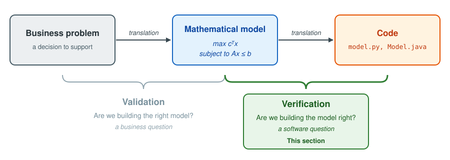
</p>

This section deals only with verification.

### Types of tests

Tests fall into two families, told apart by the question each one answers.

| Type | The question it answers | Examples |
|---|---|---|
| [Functional](../appendix/glossary.md#functional-test) | Does the program provide its services correctly? | A sum is right; bad input is rejected |
| [Non-functional](../appendix/glossary.md#non-functional-test) | How well does the program provide them? | Security, speed, usability, availability, scalability |

This section is about functional tests.

### Hierarchy of functional tests

Functional tests come in three levels, told apart by how much of the program each one runs. A
[unit test](../appendix/glossary.md#unit-test) checks one small piece of code in isolation. An
[integration test](../appendix/glossary.md#integration-test) combines several units and checks that they work
together. An [end-to-end test](../appendix/glossary.md#end-to-end-test) runs the whole application in a real-world
scenario, the way its users would.

<a id="fig-test-pyramid"></a>

**Figure: test pyramid**

<p align="center">
  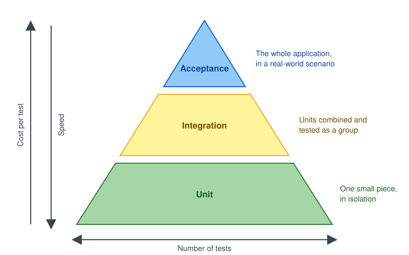
</p>

Take a small program that reads a user's records, computes their income and tax, and reports the result.
[Figure: test levels](#fig-test-levels) draws it once per level and colors what a single test of that level runs.

<a id="fig-test-levels"></a>

**Figure: test levels**

<p align="center">
  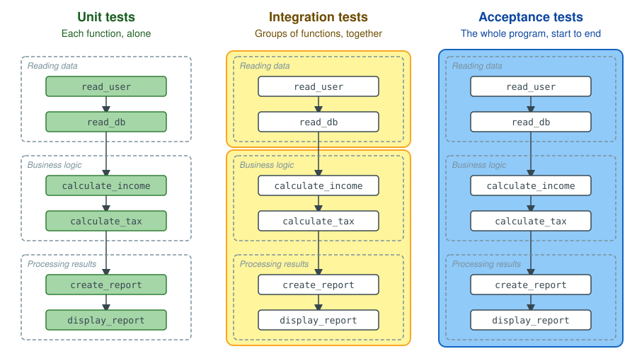
</p>

As [Figure: test pyramid](#fig-test-pyramid) shows, each step up runs more of the program, so each test costs more to
write and runs slower. A healthy suite holds many unit tests, fewer integration tests and a handful of end-to-end
tests.

### Out of scope

- **Performance and scale.** No chapter tests how fast a solver is or how large an instance it handles.
- **Input validation.** Items are never checked for nonsense values such as a negative weight: every infeasible
  instance in this section comes from the capacities, never from a malformed item.
- **Several objectives.** Models with more than one objective are not covered yet.
- **Validation.** Whether a model captures the right decision is a business question, not covered in this book.
- **Reviewing a formulation.** Checking the mathematics of a model on paper is not covered: the tests here check the
  output of solving it.

[Interface vs implementation](#ch-interface) separates what a unit promises from how it keeps the promise, and every
later chapter tests the promise. [Unit testing](#ch-unit-testing), [Writing good tests](#ch-clear-tests) and
[Test-driven development](#ch-tdd) test one unit on its own. [Mocks](#ch-mocks) and
[Integration testing](#ch-integration) take a test beyond the unit, to the systems it calls and the files it reads.
[Testing an optimization model](#ch-model-testing) then meets the difficulty specific to decision-support software and
sets up the contract that the next two chapters test: first with [optimality guaranteed](#ch-mip-optimal), then
[without it](#ch-mip-no-optimality). [Testing a decision-support system](#ch-dss-testing) applies them to the whole
system behind its interface. Read them in order: each chapter uses only what the chapters before it defined.

<a id="ch-interface"></a>

## Interface vs implementation

Every unit of code has two parts. Its [interface](../appendix/glossary.md#interface) says what the unit does: its
name, the inputs it accepts, and the outputs and errors it returns. Programmers also call it the signature, the
application programming interface (API), the [contract](../appendix/glossary.md#contract), or the
[abstraction](../appendix/glossary.md#abstraction). Its implementation is how the unit does it, and everything in it
is an [implementation detail](../appendix/glossary.md#implementation-detail). Any code that calls the unit is one of
its *clients*. Implementation details include any [private](../appendix/glossary.md#public-and-private) method the
unit calls, such as `is_finite` in the figure: no client can call it, so it can change freely.
[Figure: interface and implementation](#fig-interface-implementation) marks the parts on the calculator's `add`.

<a id="fig-interface-implementation"></a>

**Figure: interface and implementation**

<p align="center">
  
</p>

Two design practices follow from the split. The interface states what the unit does and never how, and the comments
that state its promises belong to it as much as its first line does. The implementation stays hidden from the
clients, so it can change, or give way to a different implementation, without any client noticing.

A wall socket shows the same split. [Figure: socket](#fig-socket) draws it: the socket is the interface, a fixed shape
that delivers a fixed voltage. Behind the wall, the power may come from a gas plant, a wind farm or solar panels; that
is the implementation, and the utility can change it at any time. The lamp, the laptop and the phone are the clients,
and they rely on the socket alone. Telling the interface from the implementation is foundational knowledge, in
[design](../04-design/README.md) as much as in [testing](#ch-unit-testing).

<a id="fig-socket"></a>

**Figure: socket**

<p align="center">
  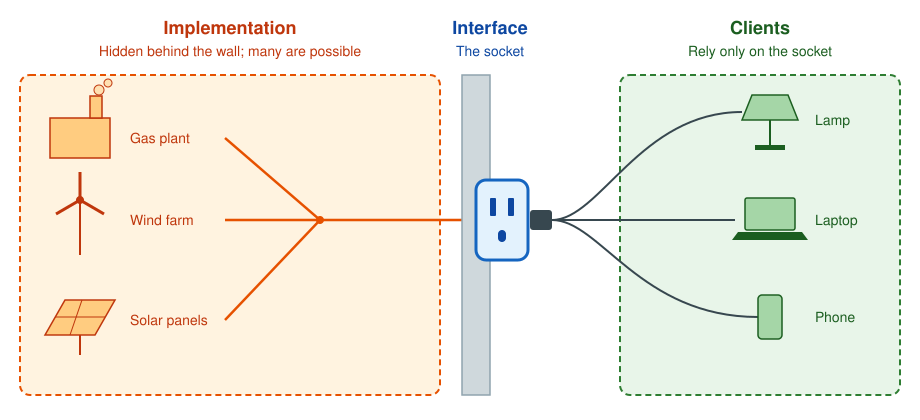
</p>

<a id="ch-unit-testing"></a>

## Unit testing

A unit test sits at the base of the pyramid: it checks one unit of code, such as a function, on its own, and runs in
milliseconds.

### What to test

An interface has one or more *behaviors*, and each one is something to test. The interface in
[Figure: interface and implementation](#fig-interface-implementation) promises five:

1. **The base case**, also called the [happy path](../appendix/glossary.md#happy-path): `add(3, 4) = 7`.
2. **Commutativity**: `add(3, 4) = add(4, 3)`.
3. **Identity**: `add(3, 0) = 3`.
4. **Invalid input**: `add("3", 4)` fails with an invalid-input error.
5. **Overflow**: adding the largest representable number to itself fails with an overflow error.

A behavior may need more than one case: identity holds for 3, and also for a negative number and a very large one.

### How to write a unit test

A unit test's name says what it checks, in three parts: the unit, the behavior and case, and the expected result.
`test__add__given_two_numbers__returns_their_sum` tests `add`, given two ordinary numbers, and expects their sum. When
it fails, its name alone reports which behavior broke.

The body follows the [arrange, act, assert (AAA)](../appendix/glossary.md#arrange-act-assert) pattern: *arrange* the
objects and inputs the test needs, *act* by calling the unit once, and *assert* that the result meets the expectation.
In the pseudocode, `expect` makes the assertion: the test fails if its condition is false.

<a id="pseudo-add-test"></a>

**Pseudocode: add test**

```
// pseudocode: add-test
public test__add__given_two_numbers__returns_their_sum()
    // Arrange
    calculator = Calculator()

    // Act
    result = calculator.add(1, 2)

    // Assert
    expect result == 3
```

### A scientific experiment

A unit test is a scientific experiment in miniature, and it holds every part an experiment in a laboratory holds.
The table finds each part in [Pseudocode: add test](#pseudo-add-test).

| Part of the experiment | In Pseudocode: add test |
|---|---|
| Hypothesis | The name: `add`, given two numbers, returns their sum |
| Controlled conditions | *Arrange*: a new `Calculator` and the fixed inputs 1 and 2 |
| Intervention | *Act*: one call, `calculator.add(1, 2)` |
| Observation | `result`, the value the call returns |
| Prediction checked against the observation | *Assert*: `expect result == 3` |
| Conclusion | The test passes, and the evidence supports the hypothesis; or it fails, and refutes it |

The parts carry the principles of [the scientific method](../03-software-development-lifecycle/README.md#ch-learning)
with them. The hypothesis is testable, because the assertion states it as an objective, measurable condition. The
conditions are controlled, because the test runs one unit on its own, with inputs it fixes itself, so a failure has
one cause: `add`. And the experiment is reproducible: anyone can run it again, on any machine, and get the same result.

### Where to place the test

Test code lives apart from production code, in a folder tree that mirrors it, so each module's tests sit at the same
place in the tests tree as the module does in the source tree.

<a id="pseudo-test-layout"></a>

**Pseudocode: test layout**

```
// pseudocode: test-layout
project/
    src/
        calculator
    tests/
        test_calculator_add
        test_calculator_divide
```

### Code coverage

How do you know you tested every behavior? The starting point is
[code coverage](../appendix/glossary.md#code-coverage): a tool records which lines of the production code the tests
run, and reports the rest. [Pseudocode: add coverage](#pseudo-add-coverage) marks each line of `add` for a suite
that holds only the happy-path test.

<a id="pseudo-add-coverage"></a>

**Pseudocode: add coverage**

```
// pseudocode: add-coverage
public add(a, b) returns number
    if not is_finite(a)                     // ✓ run
        fail with invalid-input error       // ✗ not run
    if not is_finite(b)                     // ✓ run
        fail with invalid-input error       // ✗ not run
    result = a + b                          // ✓ run
    if result is too large to represent     // ✓ run
        fail with overflow error            // ✗ not run
    return result                           // ✓ run
```

> [!NOTE]
> The pseudocode is illustrative: a coverage tool reports the same pattern for `add` written in a real language, over
> more lines.

The three lines that never run belong to the invalid-input and overflow behaviors. Add a test for each, and every line
runs: coverage reaches 100%. Now delete the commutativity test. Coverage stays at 100%, because the happy-path test
already runs every line the commutativity test runs. Coverage points at lines no test runs; it cannot point at a
behavior no test checks. Use it to find what is missing, and use the list of behaviors to decide when you are done.

### Exercise: a calculator

The exercise lives in the practice repositories: test the calculator's `divide` the way this part tested `add`.

> **Practice it**
>
> - Python: [Unit testing exercise](https://github.com/sefop/training-testing-python/tree/main/src/unit_tests_and_coverage)
> - Java: [Unit testing exercise](https://github.com/sefop/sefop-training-java/tree/main/src/main/java/unit_tests_and_coverage)

<a id="ch-clear-tests"></a>

## Writing good tests

[Unit testing](#ch-unit-testing) gave a test its structure and its name; the practices below tell a good test from a
bad one.

### Complete and concise

A test is *complete* when its body holds everything a reader needs to understand its result, and *concise* when it
holds nothing else. [Pseudocode: cluttered test](#pseudo-cluttered-test) fails both ways: the constructor arguments
play no part in addition, and the numbers that decide the result hide inside helper functions.

<a id="pseudo-cluttered-test"></a>

**Pseudocode: cluttered test**

```
// pseudocode: cluttered-test
public test__add__given_two_numbers__returns_their_sum()
    calculator = Calculator(precision=10, rounding="half-even", log_file="calc.log")
    result = calculator.add(first_operand(), second_operand())
    expect result == 5
```

[Pseudocode: concise test](#pseudo-concise-test) keeps the numbers that matter in view and drops the rest.

<a id="pseudo-concise-test"></a>

**Pseudocode: concise test**

```
// pseudocode: concise-test
public test__add__given_two_numbers__returns_their_sum()
    calculator = Calculator()
    result = calculator.add(2, 3)
    expect result == 5
```

### One behavior per test

[Pseudocode: method test](#pseudo-method-test) checks three behaviors of `add` at once. When it fails, its name cannot
say which behavior broke, and the first failing `expect` stops the test, so the ones after it go unchecked.

<a id="pseudo-method-test"></a>

**Pseudocode: method test**

```
// pseudocode: method-test
public test__add__works()
    calculator = Calculator()
    expect calculator.add(3, 4) == 7
    expect calculator.add(3, 4) == calculator.add(4, 3)
    expect calculator.add(3, 0) == 3
```

[Pseudocode: behavior tests](#pseudo-behavior-tests) splits it into one test per behavior, each named for the
behavior it checks. A name that needs the word "and" describes two behaviors, and belongs to two tests.

<a id="pseudo-behavior-tests"></a>

**Pseudocode: behavior tests**

```
// pseudocode: behavior-tests
public test__add__given_two_numbers__returns_their_sum()
    calculator = Calculator()
    result = calculator.add(3, 4)
    expect result == 7

public test__add__given_swapped_operands__returns_the_same_sum()
    calculator = Calculator()
    expect calculator.add(3, 4) == calculator.add(4, 3)

public test__add__given_zero__returns_the_other_number()
    calculator = Calculator()
    result = calculator.add(3, 0)
    expect result == 3
```

### No logic in tests

Production code must handle any input, so it needs logic: loops, conditions, arithmetic. A test handles a few chosen
inputs, so it needs none, and each piece of logic it carries is a computation its reader must run in their head.
[Pseudocode: logic test](#pseudo-logic-test) loops over six pairs of numbers and computes each expected value with
`a + b`, the very operation `add` performs. The test repeats the implementation instead of checking it.

<a id="pseudo-logic-test"></a>

**Pseudocode: logic test**

```
// pseudocode: logic-test
public test__add__given_two_numbers__returns_their_sum()
    calculator = Calculator()
    for each a in [1, 2, 3]
        for each b in [4, 5]
            expect calculator.add(a, b) == a + b
```

[Pseudocode: concise test](#pseudo-concise-test) is straight-line code with a literal expected value: a reader checks
that 2 plus 3 is 5 at a glance.

### Clear failure messages

When a test fails, its failure message is often the first thing a reader sees, and sometimes the only one. A good
message states the inputs, the expected value and the actual value. So far, `expect` has taken a condition; it also
takes a message after a comma, which the test reports when the condition is false.
[Pseudocode: vague failure](#pseudo-vague-failure) reduces the comparison to true or false before asserting it, so
its failure reads only "expected true, got false".

<a id="pseudo-vague-failure"></a>

**Pseudocode: vague failure**

```
// pseudocode: vague-failure
public test__add__given_two_numbers__returns_their_sum()
    calculator = Calculator()
    result = calculator.add(2, 3)
    expect (result == 5) is true
```

[Pseudocode: clear failure](#pseudo-clear-failure) fails with "add(2, 3) returned 6, expected 5", which points at the
broken behavior before anyone opens the test.

<a id="pseudo-clear-failure"></a>

**Pseudocode: clear failure**

```
// pseudocode: clear-failure
public test__add__given_two_numbers__returns_their_sum()
    calculator = Calculator()
    result = calculator.add(2, 3)
    expect result == 5, "add(2, 3) returned {result}, expected 5"
```

### Descriptive and meaningful

Production code follows [don't repeat yourself (DRY)](../appendix/glossary.md#dont-repeat-yourself): each piece of
knowledge lives in one place, so a change is one edit. Test code follows
[descriptive and meaningful phrases (DAMP)](../appendix/glossary.md#descriptive-and-meaningful-phrases) instead: a
little repetition is welcome when it lets each test be read on its own.
[Pseudocode: too-DRY tests](#pseudo-too-dry-tests) shares its calculator and its numbers across the file, so to check
either test, a reader must first scroll up to learn what `a` and `b` are.

<a id="pseudo-too-dry-tests"></a>

**Pseudocode: too-DRY tests**

```
// pseudocode: too-dry-tests
calculator = Calculator()
a = 3
b = 4

public test__add__given_two_numbers__returns_their_sum()
    expect calculator.add(a, b) == 7

public test__add__given_swapped_operands__returns_the_same_sum()
    expect calculator.add(a, b) == calculator.add(b, a)
```

[Pseudocode: behavior tests](#pseudo-behavior-tests) repeats `calculator = Calculator()` and its numbers in every
test, and each test reads on its own.

### Further reading

- Titus Winters, Tom Manshreck and Hyrum Wright, *Software Engineering at Google*, O'Reilly, 2020, chapter 12, "Unit
  Testing": the source of these five practices, each shown on tests from a code base of Google's size.
- Vladimir Khorikov, *Unit Testing: Principles, Practices and Patterns*, Manning, 2020, chapter 3, "The anatomy of a
  unit test": the same ground from another angle, on one behavior per test, no branching in tests, and setup shared
  between tests.

<a id="ch-tdd"></a>

## Test-driven development

[Test-driven development (TDD)](../appendix/glossary.md#test-driven-development) writes each test before the code it
checks. In the terms of the scientific experiment in [Unit testing](#ch-unit-testing), it states the hypothesis
before it builds the experiment: the test says what the code must do while that code does not exist yet.

### The cycle: red, green, refactor

TDD advances in short cycles of three steps, named after the colors a test tool shows:

1. **Red.** Write one test for the next requirement, run it, and watch it fail.
2. **Green.** Write the minimum code that makes it pass.
3. **Refactor.** Improve the code while every test keeps passing. Changing code without changing what it does is
   called [refactoring](../appendix/glossary.md#refactoring).

Then the next requirement starts the next cycle. [Figure: TDD cycle](#fig-tdd-cycle) draws the loop.

<a id="fig-tdd-cycle"></a>

**Figure: TDD cycle**

<p align="center">
  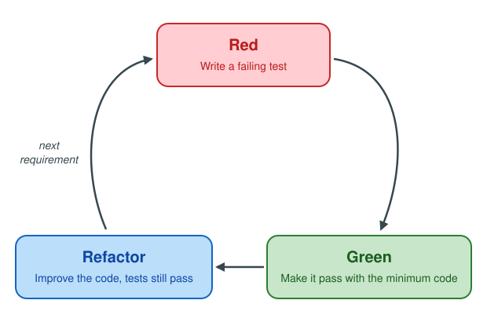
</p>

### Why each step matters

**Red shows that the test can fail.** A test that has never failed has never been shown to test anything: it may
check the wrong value, or not run at all. Watching it fail first is the evidence that it can tell working code from
missing code.

**Red, then green, shows causality.** The test failed, one change was made, and now the test passes: that change is
why it passes. This is the causality principle of
[the scientific method](../03-software-development-lifecycle/README.md#ch-learning) applied to code: change one thing
at a time, so the result shows what caused it. A test written after the code passes on its first run, and cannot tell
whether the code made it pass or whether it would have passed anyway.

**Green with the minimum code keeps every line accountable.** Each line of production code exists because a test
demanded it, so no line goes untested and no behavior is built that nobody asked for.

**Refactor is safe because the tests check the interface.** The tests pin down what the code does, never how, as
[Interface vs implementation](#ch-interface) set out. The code can change shape underneath them, and a test that
turns red means a promise broke, not that the code merely moved.

### A linear expression example

A linear expression has the form $a_0 + a_1 x_1 + \dots + a_n x_n$: a scalar $a_0$, and a coefficient $a_i$ for each
variable $x_i$. The class `LinearExpression` represents one. The scalar and the coefficients are floating-point
numbers, and each variable is identified by its name, a string. For example:

| Expression | Scalar | Coefficients |
|---|---|---|
| $0$ | 0.0 | none |
| $1 + 2x$ | 1.0 | `"x"`: 2.0 |
| $-1 - x + 2y$ | -1.0 | `"x"`: -1.0, `"y"`: 2.0 |

This example builds the scalar part test-first, in three cycles, with these requirements:

- An expression built with no arguments has scalar 0.0.
- An expression built with a scalar has that scalar.
- Adding a value to the scalar increases the scalar by that value.

**Cycle 1.** [Pseudocode: empty expression test](#pseudo-empty-expression-test) states the first requirement. It is
red: `LinearExpression` does not exist yet.

<a id="pseudo-empty-expression-test"></a>

**Pseudocode: empty expression test**

```
// pseudocode: empty-expression-test
public test__linear_expression__given_no_arguments__has_scalar_zero()
    expression = LinearExpression()
    expect expression.scalar() == 0.0
```

The minimum code that turns it green returns a constant, as
[Pseudocode: constant scalar](#pseudo-constant-scalar) shows. It looks like cheating, and on purpose: one test
demands no more than this, and the next test will force the real code.

<a id="pseudo-constant-scalar"></a>

**Pseudocode: constant scalar**

```
// pseudocode: constant-scalar
class LinearExpression
    public scalar() returns number
        return 0.0
```

**Cycle 2.** [Pseudocode: scalar-only test](#pseudo-scalar-only-test) states the second requirement. It is red: the
constant 0.0 is not 3.0.

<a id="pseudo-scalar-only-test"></a>

**Pseudocode: scalar-only test**

```
// pseudocode: scalar-only-test
public test__linear_expression__given_a_scalar__has_that_scalar()
    expression = LinearExpression(scalar = 3.0)
    expect expression.scalar() == 3.0
```

To pass both tests, the expression must keep the scalar it receives, with 0.0 when it receives none.
[Pseudocode: stored scalar](#pseudo-stored-scalar) does that, and the constant is gone. The refactor step finds
nothing to improve yet, and a cycle may end that way.

<a id="pseudo-stored-scalar"></a>

**Pseudocode: stored scalar**

```
// pseudocode: stored-scalar
class LinearExpression
    private stored_scalar

    public constructor(scalar = 0.0)
        stored_scalar = scalar

    public scalar() returns number
        return stored_scalar
```

**Cycle 3.** [Pseudocode: add scalar test](#pseudo-add-scalar-test) states the third requirement. It is red:
`add_scalar` does not exist yet.

<a id="pseudo-add-scalar-test"></a>

**Pseudocode: add scalar test**

```
// pseudocode: add-scalar-test
public test__add_scalar__given_a_value__increases_the_scalar_by_it()
    expression = LinearExpression(scalar = 1.0)
    expression.add_scalar(3.0)
    expect expression.scalar() == 4.0
```

[Pseudocode: add scalar](#pseudo-add-scalar) adds the method, and all three tests pass.

<a id="pseudo-add-scalar"></a>

**Pseudocode: add scalar**

```
// pseudocode: add-scalar
class LinearExpression
    private stored_scalar

    public constructor(scalar = 0.0)
        stored_scalar = scalar

    public scalar() returns number
        return stored_scalar

    public add_scalar(value)
        stored_scalar = stored_scalar + value
```

The scalar part is done. The variables are the exercise: building an expression with a term, adding a term to a
variable that is already present, merging two expressions, and reading back the variables and their coefficients,
one cycle at a time.

### Further reading

- Kent Beck, *Test-Driven Development: By Example*, Addison-Wesley, 2002: the book that named the cycle, worked
  through at the same small step size as this chapter.

> **Practice it**
>
> - Python: [Test-driven development exercise](https://github.com/sefop/training-testing-python/tree/main/src/test_driven_development)
> - Java: [Test-driven development exercise](https://github.com/sefop/sefop-training-java/tree/main/src/main/java/test_driven_development)

<a id="ch-mocks"></a>

## Mocks

A unit test checks the behaviors a unit promises through its [interface](../appendix/glossary.md#interface). A unit
rarely works alone: it calls another unit, its [dependency](../appendix/glossary.md#dependency), to do part of its
work. A behavior may be visible in a returned value or error, in an outgoing call, or in both: `add` returns a sum,
while a nightly planning job asks a notifier to wake someone up. The earlier tests checked the first kind. The second
raises a problem: a unit test must not make an external call for real.

### Why the real dependency stays out of the test

A test runs many times a day, on developers' laptops and on shared servers. When a dependency's calls reach a person
or an external system, every run would wake a real person or write to a real system. That system may also be slow,
or out of reach from the machine that runs the test. And whatever record it keeps lives outside the program, where
the test has no dependable way to read it.

### What a mock is

A [mock](../appendix/glossary.md#mock) is a stand-in that the test puts in place of the dependency. It accepts the
same calls as the real one, does nothing else, and records every call it receives, with its arguments. The unit
receives it the way it would receive the real dependency, from outside, through
[dependency injection](../appendix/glossary.md#dependency-injection). After acting, the test asserts on the record.

[Figure: real notifier and mock](#fig-mocks-real-vs-mock) sets the two side by side. They share the same
[interface](#ch-interface); only what sits behind it differs.

<a id="fig-mocks-real-vs-mock"></a>

**Figure: real notifier and mock**

<p align="center">
  
</p>

Nothing more is needed to build one. [Pseudocode: recording notifier](#pseudo-recording-notifier) is a complete mock
of a notifier: it keeps the messages it is asked to send, and sends none.

<a id="pseudo-recording-notifier"></a>

**Pseudocode: recording notifier**

```
// pseudocode: recording-notifier
class RecordingNotifier implements Notifier
    private messages = empty list

    public notify(message)
        append message to messages
```

Test tools build such an object for any interface, so tests rarely write one by hand. The pseudocode writes
`notifier = mock(Notifier)` to create one, and reads its record with two assertions:

- `expect notifier.notify called once with "<message>"` holds when exactly one call was made, with that argument.
- `expect notifier.notify never called` holds when no call was made.

### A worked example

Every night, a planning job solves tomorrow's plan. When the model reports that no feasible plan exists, someone must
act before morning, so the job notifies the planner on call. [Pseudocode: nightly planner](#pseudo-nightly-planner)
receives the result of the solve and the notifier; it never calls the solver itself.

<a id="pseudo-nightly-planner"></a>

**Pseudocode: nightly planner**

```
// pseudocode: nightly-planner
interface Notifier
    public notify(message)

class NightlyPlanner
    private notifier

    public constructor(notifier)
        keep notifier

    public review(result)
        if result.status is infeasible
            notifier.notify("Instance " + result.instance_id + ": no feasible plan exists.")
```

The notification is the behavior, so the test checks the notification.
[Pseudocode: infeasible notifies test](#pseudo-infeasible-notifies-test) hands `NightlyPlanner` a mock and an infeasible
result, then asserts on the one call the mock recorded.

<a id="pseudo-infeasible-notifies-test"></a>

**Pseudocode: infeasible notifies test**

```
// pseudocode: infeasible-notifies-test
public test__review__given_an_infeasible_plan__notifies_once_with_the_instance()
    // arrange
    notifier = mock(Notifier)
    planner = NightlyPlanner(notifier)
    result = SolveResult(instance_id = "2026-09-26", status = infeasible)

    // act
    planner.review(result)

    // assert
    expect notifier.notify called once with "Instance 2026-09-26: no feasible plan exists."
```

A feasible night must stay quiet. [Pseudocode: feasible silent test](#pseudo-feasible-silent-test) asserts that no
notification was sent, which only a record of calls can show.

<a id="pseudo-feasible-silent-test"></a>

**Pseudocode: feasible silent test**

```
// pseudocode: feasible-silent-test
public test__review__given_a_feasible_plan__sends_no_notification()
    // arrange
    notifier = mock(Notifier)
    planner = NightlyPlanner(notifier)
    result = SolveResult(instance_id = "2026-09-26", status = feasible)

    // act
    planner.review(result)

    // assert
    expect notifier.notify never called
```

### What to mock

Mock the dependencies whose calls reach people or external systems. Those calls are behaviors a client relies on,
so checking them checks the [interface](#ch-interface). Keep the unit's own internal parts real. A test that mocks
them checks how the unit does its work, and breaks the day that work is reorganized, even though no promise changed.

### Further reading

- Vladimir Khorikov, *Unit Testing: Principles, Practices and Patterns*, Manning, 2020, chapters 5, "Mocks and test
  fragility", and 9, "Mocking best practices": when a mock protects a test and when it makes the test brittle.
- Titus Winters, Tom Manshreck and Hyrum Wright, *Software Engineering at Google*, O'Reilly, 2020, chapter 13, "Test
  Doubles": the other kinds of stand-ins, such as stubs and fakes, and when to prefer the real dependency.

> **Practice it**
>
> - Python: [Mocks exercise](https://github.com/sefop/training-testing-python/tree/main/src/mocks)
> - Java: [Mocks exercise](https://github.com/sefop/sefop-training-java/tree/main/src/main/java/mocks)

<a id="ch-integration"></a>

## Integration testing

The [integration test](../appendix/glossary.md#integration-test) is the middle level of
[Figure: test pyramid](#fig-test-pyramid). A program's units do not only call each other: they also meet real things
outside the program, such as files, databases and other systems, and many bugs live in that meeting. A file written
in one format and read in another, a folder that is not where the code expects it: a unit test with a
[mock](../appendix/glossary.md#mock) cannot see such bugs, because the mock stands exactly where the bug is. An
integration test runs the units together with those real dependencies.

### Which dependencies stay real

Not every dependency should be real in an integration test. The rule depends on who else can see it.

- A [managed dependency](../appendix/glossary.md#managed-dependency) is used only by your program, such as its own
  files or its own database. It stays real: how the program uses it is an implementation detail, and only the real
  one shows whether that detail works.
- An [unmanaged dependency](../appendix/glossary.md#unmanaged-dependency) is observed by other people or systems,
  such as the notifier. It stays a mock, as in [Mocks](#ch-mocks): a test must not wake a real person, and the call
  itself is the behavior to check.

[Figure: real and mocked dependencies](#fig-integration-dependencies) applies the rule to the nightly planner.

<a id="fig-integration-dependencies"></a>

**Figure: real and mocked dependencies**

<p align="center">
  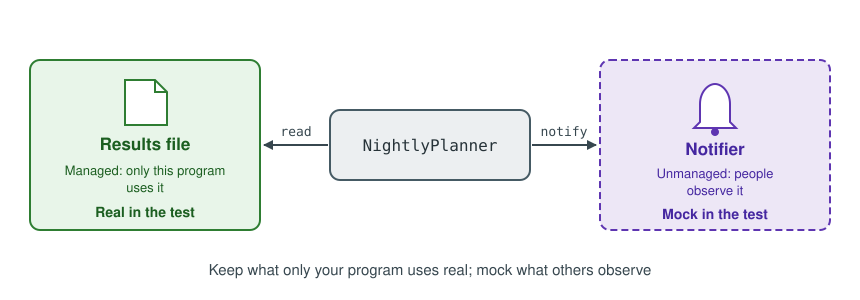
</p>

### What an integration test covers

An integration test is slower and costlier than a unit test, so it covers one happy path per scenario, through every
real dependency. The edge cases stay in unit tests, with one exception: an edge case that only the real dependency
can produce, such as tonight's file being missing, belongs in an integration test.

### A worked example

The nightly planner no longer receives the result of the solve as an argument. The solve job saves each night's
result to a file with a `ResultsWriter`, and the planner reads it back with its own `ResultsReader`. They are two
units, owned by two teams, and they share no code: each one encodes its own idea of the file's format.
[Pseudocode: nightly planner with reader](#pseudo-nightly-planner-with-reader) shows the planner.

<a id="pseudo-nightly-planner-with-reader"></a>

**Pseudocode: nightly planner with reader**

```
// pseudocode: nightly-planner-with-reader
class NightlyPlanner
    private reader
    private notifier

    public constructor(reader, notifier)
        keep reader and notifier

    public review_tonight(instance_id)
        result = reader.read(instance_id)
        if result.status is infeasible
            notifier.notify("Instance " + instance_id + ": no feasible plan exists.")
```

[Pseudocode: infeasible night integration test](#pseudo-infeasible-night-integration-test) writes a real file with
the real writer, runs the planner with the real reader, and keeps only the notifier a mock.

<a id="pseudo-infeasible-night-integration-test"></a>

**Pseudocode: infeasible night integration test**

```
// pseudocode: infeasible-night-integration-test
public test__review_tonight__given_an_infeasible_result_on_disk__notifies_once()
    // Arrange
    folder = a new, empty temporary folder
    ResultsWriter(folder).write(SolveResult(instance_id = "2026-09-26", status = infeasible))
    notifier = mock(Notifier)
    planner = NightlyPlanner(ResultsReader(folder), notifier)

    // Act
    planner.review_tonight("2026-09-26")

    // Assert
    expect notifier.notify called once with "Instance 2026-09-26: no feasible plan exists."
```

Suppose the solve job's team changes how it writes the status, `Infeasible` instead of `infeasible`, and updates its
own tests to match. The writer's tests pass, and so do the reader's, each against its own idea of the format. Only
this test, which joins the two, fails.

### Further reading

- Vladimir Khorikov, *Unit Testing: Principles, Practices and Patterns*, Manning, 2020, chapters 8, "Why integration
  testing?", and 10, "Testing the database": the rule for managed and unmanaged dependencies, and how many
  integration tests to write.
- Titus Winters, Tom Manshreck and Hyrum Wright, *Software Engineering at Google*, O'Reilly, 2020, chapter 14,
  "Larger Testing": tests beyond the unit, and the gaps in unit tests they close.

> **Practice it**
>
> - Python: [Integration testing exercise](https://github.com/sefop/training-testing-python/tree/main/src/integration_testing)
> - Java: [Integration testing exercise](https://github.com/sefop/sefop-training-java/tree/main/src/main/java/integration_testing)

---

<a id="ch-model-testing"></a>

## Testing an optimization model

Every test so far compared an output with an expected value that someone could work out before running the code:
`add(2, 3)` is 5, and a notification carries a known message. An optimization model breaks that assumption, because its
expected output is the very thing it exists to compute.

Before jumping into the details, lets clarify some things first. Testing an optimization model can mean two different things:
1. Given some instance data, test the formulation is coded correctly.
2. Given some instance data, test the output of the solved model is correct.

What should we do? the difference is subtle, but very important. Both are plausible, indeed. Let's go back to the first
principles to answer the question.

Testing the formulation is possible, but I advise against it. This idea has 2 flaws. The first flaw is that it
assumes there is a formulation coded in the first place, which might not necessarily be true in some situations. For
example, if you are solving a problem with a heuristic or metaheuristic, then there is no formulation coded. The
second flaw is that it does not test the public behavior of interest (the optimization model output). The
formulation is indeed, an implementation detail. Thus, we should only test the output of the solved model. That is
the correct public behavior that (should) be offered by this abstraction. If the abstraction is promising that a
particular solver is being used (Gurobi, XPress, Cplex, etc.), that is a design problem (known as a leaky abstraction).

<a id="model-difficulties"></a>

### Why an optimization model is harder to test

Six properties of an optimization model make its output harder to test than the output of the calculator.

<a id="difficulty-oracle"></a>

**The oracle problem.** Whatever decides whether an output is correct is called a
[test oracle](../appendix/glossary.md#test-oracle). For the calculator, the oracle is arithmetic you already know: 2
plus 3 is 5, worked out without reading a line of `add`. For an optimization model, writing `expect result.objective_value == ???`
needs the optimal value, and for an instance large enough, computing it independently means solving
the problem the model exists to solve. The difficulty has a name in the software testing literature: the
[oracle problem](../appendix/glossary.md#oracle-problem). [Figure: the oracle problem](#fig-oracle-problem) sets the two
situations side by side.

<a id="fig-oracle-problem"></a>

**Figure: the oracle problem**

<p align="center">
  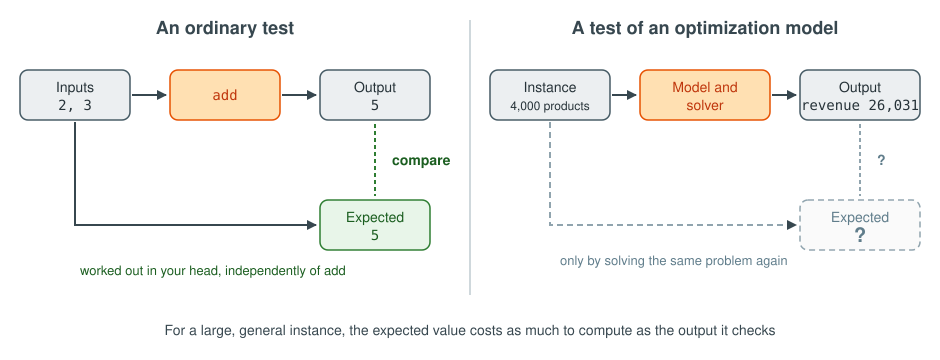
</p>

<a id="difficulty-uniqueness"></a>

**The answer may not be unique.** A model instance can have a single optimal solution, or several that tie at the same
objective value. Which one comes back depends on the solver, its settings, even the order of the input. A test cannot know
in advance which of the optimal solutions it will receive, nor whether there is more than one.

<a id="difficulty-infeasible"></a>

**An empty feasible region is an answer.** Constraints can contradict each other: one demands $x \ge 2$ while another
allows at most $x \le 1$. Then no solution exists, and "infeasible" is the correct output, not a failure. A correct
model must say so rather than return a solution, and a test must treat that statement as an answer to check, like any
other.

<a id="difficulty-floating-point"></a>

**Numbers are floating point.** A computer stores most decimal numbers approximately: 0.1 + 0.2 is not exactly 0.3. A
solver computes with that finite precision, and it accepts a constraint as satisfied when it is violated by less than a
small tolerance. Two correct answers can therefore differ in their last digits, an objective value can come back as
25.999999998 instead of 26, and a constraint $x \le 10$ can be met at 10.000000001. Equality can only mean equality
within a tolerance.

<a id="difficulty-optimality"></a>

**Optimality may not be guaranteed.** A [heuristic](../appendix/glossary.md#heuristic) gives up the guarantee of
optimality on purpose, in exchange for speed on large instances. An exact solver stopped by a time limit does the same
without announcing it: it returns the best solution found so far, which need not be the best one. For such solvers, "the
optimal value" is not something the output promises, and two runs may even return different solutions.

<a id="difficulty-algorithm"></a>

**The algorithm may change.** An optimization model can be solved with many algorithms, such as a commercial-solver,
a heuristic, a metaheuristic, dynamic programming, etc. Thus, the tests should not use leaked information from the
algorithm to assert correctness.

<a id="model-cargo"></a>

### A cargo model example

For the next parts of the section we are going to use this example. The full definition of the cargo loading system is
written in [the appendix](../appendix/running-example.md#an-optimization-model-for-this-problem). for one cargo
flight, the question is what cargo to load to maximize revenue and respect operational constraints. The model is
is a [mixed-integer program](../appendix/glossary.md#mixed-integer-program) (MIP).

The symbols are defined in the following table:

| Symbol | Meaning                                                      | Unit |
|:---:|--------------------------------------------------------------|---|
| $r_i$ | revenue of one pallet of product $i$, non-negative           | thousands of USD |
| $w_i$ | weight of one pallet, positive                               | tonnes |
| $v_i$ | volume of one pallet, positive                               | m³ |
| $l_i$ | pallets of product $i$ that must fly, a non-negative integer | pallets |
| $W$, $V$ | max weight and hold capacity, non-negative                   | tonnes, m³ |
| $x_i$ | pallets of product $i$ to load                               | pallets |

The optimization model is:

$$
\begin{aligned}
\max_{x} \quad & \sum_{i \in I} r_i x_i & \text{maximize revenue} \\
\text{s.t.} \quad &
\sum_{i \in I} w_i x_i \le W & \text{weight capacity} \\ &
\sum_{i \in I} v_i x_i \le V & \text{hold capacity} \\ &
x_i \ge l_i \quad \forall i \in I & \text{committed freight} \\ &
x_i \in \mathbb{Z} \quad \forall i \in I & \text{whole pallets}
\end{aligned}
$$

<a id="model-contract"></a>

### The optimization contract

[Interface vs implementation](#ch-interface) showed that a caller relies on what the abstraction promises, never on
how it keeps the promise. What, then, does the cargo model promise to its caller? Let's write these promises
explicitly before testing them.

The cargo model sits behind one class, `Optimization`, with a single public method, `run`. It receives an `Instance`
object and returns a `Solution` object. [Pseudocode: optimization contract](#pseudo-optimization-contract) defines the
three classes and the method. A comment starting with `requires` states what the caller must provide, and one starting with `returns` what
the method guarantees; `or null` means the method may return no object at all.

<a id="pseudo-optimization-contract"></a>

**Pseudocode: optimization contract**

```
// pseudocode: optimization-contract
class Product
    public name
    public weight                        // per pallet
    public volume                        // per pallet
    public revenue                       // per pallet
    public committed_quantity            // pallets that must fly, 0 by default

class Instance
    public products                      // list of Product
    public weight_capacity
    public volume_capacity

class Solution
    public picked                        // product name -> whole number of pallets, 0 when left behind
    public objective_value               // revenue of the load
    public total_weight                  // weight of the load
    public total_volume                  // volume of the load

class Optimization
    // requires: instance is not null
    // returns:  a Solution filled with the load found, or null when the optimization phase
    //           could not provide a feasible solution
    // raises:   an error if instance is null
    public run(instance) returns Solution or null
```

A caller writes two lines, as shown in [Pseudocode: optimization usage](#pseudo-optimization-usage):

<a id="pseudo-optimization-usage"></a>

**Pseudocode: optimization usage**

```
// pseudocode: optimization-usage
optimization = Optimization()
solution = optimization.run(instance)
```

Note that the contract says nothing about the algorithm behind `run`, and nothing about why
the optimization module could fail to provide one. This design is deliberate on purpose, we don't want to **leak
implementation details** to the contract.

Behind `run`, five private steps make up the *optimization phase*,
as [Figure: the optimization phase](#fig-model-pipeline) shows: receive the instance, build the model, solve it,
assemble the solution, and return it. They are implementation details: a caller cannot reach them and does not know
anything about them.

<a id="fig-model-pipeline"></a>

**Figure: the optimization module**

<p align="center">
  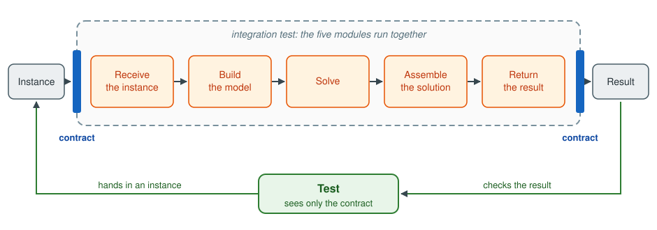
</p>

So what does this contract offers? There are two types of promises: software promises (derived from the software design)
and mathematical promises (derived from optimization theory).

**Software promises**:
1. There is a single public method called `run` which receives a non-null `Instance` object.
2. If the provided `Instance` is null, then an error is going to be thrown by the program.
3. If the provided `Instance` is not null, this method returns an `Solution` object. The `Solution` object could
be null, which means a solution could not be found. It its `non-null`, it means a feasible solution was found.

Mathematical promises varies if the underlying algorithm solving the model guarantees optimality or not. The promises
that hold for any algorithm come first; those that hold only when optimality is guaranteed follow from it. Mathematical
promises usually are implicit and not written as concrete comments in the abstraction, nonetheless, I think it would
be a good idea to write them as comments in your project.

Assume a model as $\max \{ f(x) : x \in X \}$, where $f$ is the objective and $X$ the feasible set, and let $z = f(x)$
for the objective value of a solution $x$. A first run solves $(f, X')$ and returns $x'$ with $z' = f(x')$; a second
run solves $(f, X'')$ and returns $x''$ with $z'' = f(x'')$. Every relation between two runs assumes that both
returned a solution. In a test, $=$ means equal within the tolerance of
[floating point numbers](#difficulty-floating-point).

**Mathematical promises without optimality guarantees**:

1. **Valid solution.**

   $x' \in X'$ and $z' = f(x')$: the solution is feasible, and its value is reported correctly.

   *Cargo model example:* all the constraints are respected, `objective_value` equals $\sum_i r_i x'_i$, and the
   reported totals equal $\sum_i w_i x'_i$ and $\sum_i v_i x'_i$.

2. **No solution from an empty feasible set.**

   If $X' = \emptyset$, no solution is returned.

   *Cargo model example:* `null` whenever the committed pallets exceed a capacity: $\sum_i w_i l_i > W$ or
   $\sum_i v_i l_i > V$.

**Mathematical promises with optimality guaranteed**:

Every item below follows from optimality, $f(x) \le z'$ for every $x \in X'$, and every relation between two runs
assumes that both were solved to optimality.

3. **Existence.**

   If $X' \ne \emptyset$, an optimal solution $x'$ is returned with objective function value $z'=f(x')$.

   *Cargo model example:* `null` exactly when the committed pallets exceed a capacity.

4. **Optimality conditions.**

   $f'(x) \le z'$ for every $x \in X'$. Two checks follow from it:
   - a necessary condition, cheap at any size: $f'(x) \le z'$ for every $x \in N(x') \cap X'$, where $N(x')$ is the set
     of solutions one step away from $x'$. A solution that fails it is not optimal; one that passes may still not be.
   - the full condition: $z'$ equals an optimal value known in advance, worked out by hand or by enumeration, which only
     small instances allow.

   Unlike a linear program, whose optimality duality certifies, a mixed-integer program has no cheap certificate of
   optimality: proving a solution optimal is as hard as solving the model.

   *Cargo model example:* no product with $r_i > 0$ fits one more pallet, $\sum_j w_j x'_j + w_i > W$ or
   $\sum_j v_j x'_j + v_i > V$; and on a small instance, $z'$ equals the optimum.

5. **Permutation invariance.**

   If a second instance is a reordering of the first instance, then $z'' = z'$, even when
   $x'' \ne x'$. It generalizes the commutativity property for an optimization model.

   *Cargo model example:* the same products listed in another order earn the same revenue.

6. **Objective changed, feasible set unchanged** ($X'' = X'$).
   - If $f'' = k f'$ with $k > 0$, then $z'' = k z'$.
   - If $f''(x) \ge f'(x)$ for every $x \in X'$, then $z'' \ge z'$.

   *Cargo model example:* multiplying every revenue by $k$ multiplies $z$ by $k$, and raising one revenue never lowers
   $z$.

7. **Feasible set changed, objective unchanged** ($f'' = f'$).
   - If $X'' \supseteq X'$, then $z'' \ge z'$.
   - If $X'' \subseteq X'$, then $z'' \le z'$.
   - If $x' \in X'' \subseteq X'$, then $z'' = z'$.

   *Cargo model example:* raising a capacity never lowers $z$, and committing more pallets never raises it.
   Committing exactly the pallets of $x'$ leaves $z$ unchanged.


<a id="model-what-to-test"></a>

### Testing the black box

A test builds an `Instance`, calls `run`, and checks one promise of [the contract](#model-contract) on what comes back.
It runs the real solver: a stand-in that returns a fixed answer could never show whether the answer is right.
[Figure: testing the black box](#fig-black-box-test) shows the two shapes such a test takes: one run checked against
one promise, or two runs checked against a relation between them.

<a id="fig-black-box-test"></a>

**Figure: testing the black box**

<p align="center">
  
</p>

Such a test is a [unit test](../appendix/glossary.md#unit-test), even though five private steps and a solver run behind
`run`. A unit test checks one unit of behavior, quickly and in isolation from other tests, and one unit of behavior can
span several pieces of code: here, everything `run` does to keep one promise. The solver could be a library inside the
program, and each test builds its own model, so no test affects another. The test could become an
[integration test](../appendix/glossary.md#integration-test) in two cases: when its instance is large enough to make it
slow, and when the solver checks its license against a server outside the program.

---

<a id="ch-mip-optimal"></a>

## Testing a mixed-integer program with optimality guaranteed

This chapter tests a `run` that guarantees optimality, so all seven behaviors of [the contract](#model-contract) apply.
[Pseudocode: optimal contract](#pseudo-optimal-contract) states the promise.

<a id="pseudo-optimal-contract"></a>

**Pseudocode: optimal contract**

```
// pseudocode: optimal-contract
class Optimization
    // requires: instance is not null
    // returns:  an optimal Solution whenever a feasible load exists: no feasible load earns more revenue;
    //           null if and only if no feasible load exists
    public run(instance) returns Solution or null
```

A test needs a way to decide whether `run` kept its promise, a [test oracle](../appendix/glossary.md#test-oracle). For
most behaviors that way is plain: a load is checked against the constraints by substituting it into them, and a
relation between two runs needs the value of neither. The full check of behavior 4 is different. It needs the optimal
value, and for an instance large enough to be interesting, computing it means solving the model again: the
[oracle problem](#difficulty-oracle). Three kinds of oracle answer it, sorted by what the test knows before it runs: the
expected answer, worked out beforehand, for a [known oracle](../appendix/glossary.md#known-oracle); a second,
independent way to compute it, for a [pseudo-oracle](../appendix/glossary.md#pseudo-oracle); nothing about the answer,
for an [unknown oracle](../appendix/glossary.md#unknown-oracle).

The literature on the [oracle problem](../appendix/glossary.md#oracle-problem) sorts oracles by mechanism rather than by
what a test knows, so its terms do not map one to one onto these three: a known oracle is its
[specified oracle](../appendix/glossary.md#specified-oracle), and it counts both pseudo-oracles and metamorphic
relations as [derived oracles](../appendix/glossary.md#derived-oracle). It also names an
[implicit oracle](../appendix/glossary.md#implicit-oracle), a failure wrong in any program: a crash, and a hang once the
test sets a time limit that turns it into a failure.

[Figure: the reach of each oracle](#fig-oracle-classes) shows why a suite needs all three.

<a id="fig-oracle-classes"></a>

**Figure: the reach of each oracle**

<p align="center">
  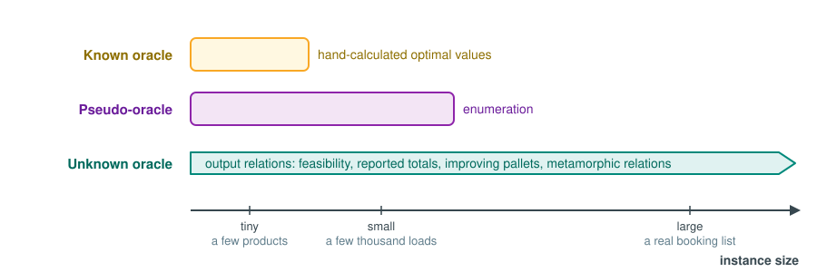
</p>

> [!NOTE]
> The unknown oracle reaches any size because it never establishes optimality: a load that meets every condition can
> still leave revenue behind.

<a id="mip-known-oracle"></a>

### Known oracle

A known oracle tests behaviors 2, 3 and the full check of 4. The simplest one is a person. In the
[example instance](../appendix/running-example.md#ex-two-pallet) of the appendix, with nothing committed to fly,
chocolate fits at most once by weight and water at most once by volume, so each $x_i \in \{0, 1\}$ and there are
$2 \times 2 = 4$ candidate loads, few enough to list:

| $x_A$ | $x_B$ | Weight (≤ 2) | Volume (≤ 2) | Revenue | Feasible? |
|:---:|:---:|:---:|:---:|:---:|---|
| 0 | 0 | 0 | 0 | 0 | yes |
| 1 | 0 | 2 | 1 | 10 | yes |
| 0 | 1 | 1 | 2 | 6 | yes |
| 1 | 1 | 3 | 3 | 16 | no, both capacities exceeded |

The best feasible load is $x_A = 1$, $x_B = 0$, worth a revenue of 10. Nobody needed a solver to produce that answer, so
it can serve as the expected value of a test:

<a id="pseudo-two-pallet-test"></a>

**Pseudocode: two-pallet test**

```
// pseudocode: two-pallet-test
a = Product(name="A", weight=2, volume=1, revenue=10)
b = Product(name="B", weight=1, volume=2, revenue=6)
instance = Instance(products=[a, b], weight_capacity=2, volume_capacity=2)

solution = Optimization().run(instance)

expect solution != null
expect solution.objective_value == 10
```

The price of a human oracle grows fast. The capacities allow at most $m_i = \lfloor \min(W / w_i, V / v_i) \rfloor$
pallets of product $i$, so the candidate loads number $\prod_{i \in I} (m_i - l_i + 1)$: 4 for this instance, but
$4^{30} \approx 1.2 \times 10^{18}$ for 30 products that each fit up to 3 times. A person can only be the oracle at
teaching scale.

The harder question is *which* instances to write. Small instances picked at random tend to cover whatever comes to mind
first, which is usually the ordinary case. Bugs, however, cluster at the edges: an empty catalogue, a capacity of
exactly zero, two products that tie. Two standard techniques find the edges:

- **[Equivalence partitioning](../appendix/glossary.md#equivalence-partitioning)** splits the input space into classes
  expected to behave the same way, then tests one instance per class.
- **[Boundary value analysis](../appendix/glossary.md#boundary-value-analysis)** adds instances exactly on the border
  between two classes, where behavior changes character.

If you have done sensitivity analysis, you have seen this structure. As you vary a right-hand side, the optimal basis
stays the same over a range, then changes at a breakpoint. The ranges are equivalence classes; the breakpoints are
boundary values. You would never probe sensitivity only in the middle of each range, and the same holds for tests.
Applied to the cargo model, the two techniques produce the situations below, from the simplest to the most involved:

| # | Situation | Expected behavior |
|:---:|---|---|
| 1 | No products at all | Nothing to load: a Solution with an empty load worth zero. |
| 2 | Committed cargo exceeds the payload | The committed pallets alone weigh more than the aircraft may carry: `null`. |
| 3 | Committed cargo exceeds the hold | The mirror of situation 2, for volume. |
| 4 | Committed cargo fits exactly | The boundary between 2–3 and the rest: the committed load is the only feasible one. |
| 5 | Nothing fits on its own | Every product exceeds a capacity on its own; the empty load is still feasible, worth zero. |
| 6 | Unique optimum | One product dominates the other; the basic case. |
| 7 | Only the payload capacity binds | The optimum exhausts the payload and leaves volume unused. |
| 8 | Only the hold capacity binds | The mirror of situation 7. |
| 9 | Both capacities bind at once | The optimum exhausts both capacities. |
| 10 | Several optimal loads | Two interchangeable products tie; only the revenue is asserted, never which product was picked. |
| 11 | Several pallets of one product | The optimum loads a product more than once: quantities are integers, not 0/1 choices. |
| 12 | One product too heavy to load | A product that exceeds the payload on its own is left behind without disturbing the rest of the load. |

Read situations 2 and 3 against 4 and 5. All four leave the aircraft carrying the committed load and nothing more, and
only two of them have no feasible load. That distinction is exactly what a boundary is for.
[Pseudocode: committed mail test](#pseudo-committed-mail-test) writes situation 2: two pallets of mail are committed,
one tonne each, and the aircraft may carry one tonne.

<a id="pseudo-committed-mail-test"></a>

**Pseudocode: committed mail test**

```
// pseudocode: committed-mail-test
m = Product(name="M", weight=1, volume=1, revenue=4, committed_quantity=2)
instance = Instance(products=[m], weight_capacity=1, volume_capacity=5)

solution = Optimization().run(instance)

expect solution == null
```

The expected `null` was derived without a solver: the mail weighs 2 tonnes, and the aircraft may carry 1. The same sum
gives the expected answer for an instance of any size, so for this model the known oracle of feasibility scales, while
the known oracle of the optimal value stops at teaching scale. That shortcut belongs to this model: every pallet weighs
something and takes room, so the committed pallets alone are the lightest and smallest load allowed. For a MIP in
general, deciding feasibility can be as hard as solving it.

<a id="mip-pseudo-oracle"></a>

### Pseudo-oracle

A pseudo-oracle tests behaviors 2, 3 and the optimal value of 4. It is a second, independent implementation of the same
contract.
[Differential testing](../appendix/glossary.md#differential-testing) runs both on the same inputs and compares their
outputs. Here the second implementation is an `EnumerationSolver`: a class that exists only in the tests, has a `run`
method with the same contract, and tries every candidate load. It is slow, but correct by inspection, and it only makes
sense for instances small enough to enumerate. A MIP solver such as Gurobi is very unlikely to compute a wrong optimum
for the model it was given; the realistic risk is that the code builds a different model from the one on paper, and a
disagreement with enumeration points at that.

This is the disciplined version of a sanity check most modelers already run by hand, comparing a new model with brute
force on a toy case. Three details turn that habit into a reliable test:

1. **Generate many instances instead of picking a few.** Hundreds of small random instances explore corners that nobody
   would think to write by hand, including ones with no feasible load whenever the generator commits more cargo than the
   aircraft can carry.
2. **Fix the [random seed](../appendix/glossary.md#random-seed).** The same inputs must always produce the same outputs,
   as in a controlled experiment. A failure that vanishes on the retry cannot be investigated, so the test must also
   report the instance that failed.
3. **Compare only what the contract promises.** Whether a Solution came back and its objective value, never `picked`:
   when several loads tie, the contract allows the two implementations to return different ones. An equal value proves
   the load optimal only together with the [load checks](#pseudo-load-checks): a load that misreports its revenue could
   match the optimum by accident.

<a id="pseudo-differential-sweep"></a>

**Pseudocode: differential sweep**

```
// pseudocode: differential-sweep
rng = random_generator(seed=20260908)

repeat 200 times:
    products = a list of rng.integer(1, 4) products, each with
                   weight  = rng.integer(1, 5),  volume             = rng.integer(1, 5),
                   revenue = rng.integer(0, 20), committed_quantity = rng.integer(0, 2)
    instance = Instance(products, weight_capacity=rng.integer(0, 8), volume_capacity=rng.integer(0, 8))

    reference = EnumerationSolver().run(instance)
    candidate = Optimization().run(instance)

    expect (candidate == null) == (reference == null)
    if reference != null:
        expect candidate.objective_value == reference.objective_value
```

Weights and volumes start at 1, so no product fits more than 8 times, and enumeration checks at most $9^4 = 6561$ loads.
The reference stays cheap.

What does this catch that the known oracle does not? Suppose the code mistakenly uses each product's volume in the
weight constraint. Some of the twelve situations catch that mistake and some do not, because they were chosen to cover
the contract, not this particular error. A sweep over 200 generated instances is far more likely to hit one that exposes
it. Neither guarantees detection; the difference is how reliably each one finds a mistake nobody anticipated.

- **The reference must stay tractable.** Differential testing against enumeration lives in the same small-instance
  regime as the known oracle. It broadens coverage within that regime; it does not reach the large instances.
- **The two implementations must be independent.** If both share the same misunderstanding, say both treat every product
  as a 0/1 choice, they agree with each other and are both wrong.

<a id="mip-unknown-oracle"></a>

### Unknown oracle

An unknown oracle tests behavior 1, the necessary condition of 4, and behaviors 5 to 7. The known oracle and the
pseudo-oracle both stop at small instances, and the instances that matter in practice, a real booking list on a real
aircraft, are far beyond them. For such an instance a test knows nothing about the answer. It still knows what every
correct answer must satisfy: the behaviors of [The optimization contract](#model-contract) that need no expected value.

**Checking is cheaper than solving.** Proving a load optimal is expensive; checking that it is feasible and reported
correctly takes one pass over the products. [Pseudocode: load checks](#pseudo-load-checks) checks behavior 1, a valid
solution, on every Solution that `run` returns, whatever the instance.

<a id="pseudo-load-checks"></a>

**Pseudocode: load checks**

```
// pseudocode: load-checks
private expect_valid_load(instance, solution)
    for each product in instance.products:
        expect solution.picked[product.name] is a whole number, "pallet split"
        expect solution.picked[product.name] >= product.committed_quantity, "committed pallets left behind"
    expect solution.total_weight == sum of product.weight × solution.picked[product.name], "weight misreported"
    expect solution.total_volume == sum of product.volume × solution.picked[product.name], "volume misreported"
    expect solution.objective_value == sum of product.revenue × solution.picked[product.name], "revenue misreported"
    expect solution.total_weight <= instance.weight_capacity, "payload exceeded"
    expect solution.total_volume <= instance.volume_capacity, "hold exceeded"
```

The helper holds logic, which [No logic in tests](#no-logic-in-tests) warns against. The warning is about a test that
repeats the implementation; these sums do not: the optimization phase searches for a load, and the helper only adds one
up. On its own, it does not certify optimality: a feasible load can leave revenue behind.

**No room left for revenue.** The necessary condition of behavior 4 checks the load's neighbors. If one more pallet of a
product with positive revenue still fit, adding it would earn more, and the load would not be optimal.
[Pseudocode: no improving pallet test](#pseudo-no-improving-pallet-test) checks every such neighbor in one pass:

<a id="pseudo-no-improving-pallet-test"></a>

**Pseudocode: no improving pallet test**

```
// pseudocode: no-improving-pallet-test
solution = Optimization().run(instance)

expect_valid_load(instance, solution)
for each product in instance.products:
    if product.revenue > 0:
        expect solution.total_weight + product.weight > instance.weight_capacity
                   or solution.total_volume + product.volume > instance.volume_capacity,
               "one more pallet of " + product.name + " fits and earns more"
```

It catches a phase that stops too early and leaves room in the hold. It cannot catch a load that a swap would improve:
neighbors one pallet away are only some of the loads that optimality rules out.

**Metamorphic relations.** Behaviors 5 to 7 relate two runs. A
[metamorphic relation](../appendix/glossary.md#metamorphic-relation) is a relation that must hold between the outputs of
two related runs, even when neither output is known. The recipe has three steps:

1. Take an instance, any instance.
2. Transform it in a way whose effect on the optimum you can prove.
3. Solve both versions and check that the relation holds.

You already prove relations like these as theorems: behaviors 5 to 7 are such theorems, and a metamorphic relation turns
each into a test, as [Figure: a metamorphic relation](#fig-metamorphic-relation) shows.

<a id="fig-metamorphic-relation"></a>

**Figure: a metamorphic relation**

<p align="center">
  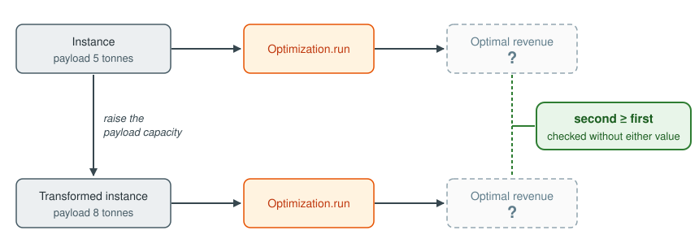
</p>

None of the tests below compares `picked`. A transformation can turn a near-tie into an exact tie, and the contract
never promised which load wins among equals. [Pseudocode: reordered products test](#pseudo-reordered-products-test)
checks behavior 5, permutation invariance: the same products in reverse order earn the same revenue.

<a id="pseudo-reordered-products-test"></a>

**Pseudocode: reordered products test**

```
// pseudocode: reordered-products-test
first    = Optimization().run(instance)
reversed = Optimization().run(a copy of instance with its products in reverse order)

expect reversed.objective_value == first.objective_value
```

[Pseudocode: objective change test](#pseudo-objective-change-test) checks behavior 6: the feasible set is unchanged, and
the revenues change. Multiplying every revenue by the same $k > 0$ multiplies the best revenue by $k$; raising one
revenue never lowers it.

<a id="pseudo-objective-change-test"></a>

**Pseudocode: objective change test**

```
// pseudocode: objective-change-test
original = Optimization().run(instance)
rescaled = Optimization().run(a copy of instance with every revenue multiplied by 3)
raised   = Optimization().run(a copy of instance with the first product's revenue raised by 1)

expect rescaled.objective_value == 3 × original.objective_value
expect raised.objective_value >= original.objective_value
```

Behavior 7 changes the feasible set. [Pseudocode: capacity relation test](#pseudo-capacity-relation-test) enlarges it by
raising the payload capacity:

<a id="pseudo-capacity-relation-test"></a>

**Pseudocode: capacity relation test**

```
// pseudocode: capacity-relation-test
a = Product(name="A", weight=2, volume=1, revenue=10)
b = Product(name="B", weight=1, volume=2, revenue=6)
c = Product(name="C", weight=3, volume=1, revenue=14)

before = Optimization().run(Instance(products=[a, b, c], weight_capacity=5, volume_capacity=4))
after  = Optimization().run(Instance(products=[a, b, c], weight_capacity=8, volume_capacity=4))

expect after.objective_value >= before.objective_value
```

The optimum of the first instance happens to be 26 (two pallets of A and one of B), but the test never needs to know
that. [Pseudocode: committed picked test](#pseudo-committed-picked-test) shrinks the feasible set while keeping the
first load in it: committing exactly the pallets of the first solution leaves that load feasible, so the best revenue
cannot change.

<a id="pseudo-committed-picked-test"></a>

**Pseudocode: committed picked test**

```
// pseudocode: committed-picked-test
first  = Optimization().run(instance)
second = Optimization().run(a copy of instance in which each product's committed_quantity
                            is first.picked[product.name])

expect second != null
expect second.objective_value == first.objective_value
```

Every test of this subsection works unchanged on a booking list of four thousand products, which is what makes the
unknown oracle the part of the suite that scales.

<a id="mip-conditions"></a>

### A test for each behavior

Each of the seven behaviors of [The optimization contract](#model-contract) gets at least one test:

| Behavior | Test | Oracle |
|---|---|---|
| 1 Valid solution | [load checks](#pseudo-load-checks) | Unknown |
| 2 No solution from an empty feasible set | [committed mail test](#pseudo-committed-mail-test) | Known |
| 3 Existence | [two-pallet test](#pseudo-two-pallet-test) | Known |
| 4 Optimality conditions | Necessary, any size: [no improving pallet test](#pseudo-no-improving-pallet-test). Full, small instances: [two-pallet test](#pseudo-two-pallet-test), [differential sweep](#pseudo-differential-sweep) | Unknown; known, pseudo |
| 5 Permutation invariance | [reordered products test](#pseudo-reordered-products-test) | Unknown |
| 6 Objective changed | [objective change test](#pseudo-objective-change-test) | Unknown |
| 7 Feasible set changed | [capacity relation test](#pseudo-capacity-relation-test), [committed picked test](#pseudo-committed-picked-test) | Unknown |

### Check yourself

1. Two loads tie at 5 revenue. Version 1 of `Optimization` returns one of them and version 2 the other. Which contract
   test should fail?
2. An instance has 4,000 products, and its committed pallets weigh 1 tonne more than the aircraft may carry. What must
   `run` return, and did you need a solver to know?
3. A broken `Optimization` always returns a Solution with an empty load worth 0. Which behaviors catch it on an
   instance with nothing committed?
4. Why is the random seed of the differential sweep fixed rather than drawn fresh on every run?

<details>
<summary>Answers</summary>

1. None. The contract promises an optimal load, not a particular one, so a contract test asserts only the revenue.
2. `null`, known from one sum over the committed pallets, with no solver. That shortcut belongs to this model.
3. The necessary condition of behavior 4, whenever a product with positive revenue fits: the no improving pallet
   test fails. Behaviors 5 to 7 all pass, since every value is 0.
4. So that a failure reproduces on the next run and can be investigated.

</details>

### Further reading

- Barr et al., ["The Oracle Problem in Software Testing: A Survey"](https://ieeexplore.ieee.org/document/6963470), IEEE
  Transactions on Software Engineering, 2015: the survey that names the oracle problem and sorts oracles by mechanism.
- Maurício Aniche, *Effective Software Testing: A developer's guide*, Manning, 2022: equivalence partitioning and
  boundary analysis in depth, under the name specification-based testing.
- T. Y. Chen et al., "Metamorphic Testing: A Review of Challenges and Opportunities," *ACM Computing Surveys*, 2018: a
  broad review of the technique and where it has been applied.
- William M. McKeeman, "Differential Testing for Software," *Digital Technical Journal*, 1998: the paper that named the
  technique.

> **Practice it**
>
> - Python: MIP with optimality exercise (coming soon)
> - Java: MIP with optimality exercise (coming soon)

---

<a id="ch-mip-no-optimality"></a>

## Testing a mixed-integer program without optimality guaranteed

A mixed-integer program (MIP) can take hours to solve to proven optimality once its instance grows, and a load planner
cannot wait hours before the aircraft closes. The optimization phase has to answer in time, even when the best load has
not been proven best yet: its solver stops at a time limit and returns the best load found so far, the
[incumbent](../appendix/glossary.md#incumbent). The contract can then no longer promise the optimum, and
[Pseudocode: time-limited contract](#pseudo-time-limited-contract) says so.

<a id="pseudo-time-limited-contract"></a>

**Pseudocode: time-limited contract**

```
// pseudocode: time-limited-contract
class Optimization
    // requires: instance is not null
    // returns:  a Solution, which is feasible but may not be optimal,
    //           or null when the optimization phase could not provide a feasible solution
    public run(instance) returns Solution or null
```

What can a test still ask for?

### What survives

A test can only check a promise the contract still makes. Without optimality, that leaves the two behaviors of
[The optimization contract](#model-contract) that hold for any algorithm:

- **Behavior 1, a valid solution.** [Pseudocode: load checks](#pseudo-load-checks) applies unchanged to every Solution
  `run` returns: it never needed the optimum.
- **Behavior 2, no solution from an empty feasible set.** An instance whose committed pallets exceed a capacity has no
  feasible load, so `run` must return `null`, as in [Pseudocode: committed mail test](#pseudo-committed-mail-test). The
  converse is gone: a phase stopped early may return `null` on an instance that does have a feasible load, and the
  contract allows it.

Behaviors 3 to 7 follow from optimality, so they no longer hold. The relations of behaviors 5 to 7 are theorems about
the optimum, and an incumbent is not the optimum. A [heuristic](../appendix/glossary.md#heuristic) shows it most
plainly: take a greedy one that sorts products by revenue per tonne and loads each while it fits.

<a id="pseudo-greedy-relation-test"></a>

**Pseudocode: greedy relation test**

```
// pseudocode: greedy-relation-test
a = Product(name="A", weight=3, volume=1, revenue=10)
d = Product(name="D", weight=2, volume=1, revenue=7)

before = GreedyOptimization().run(Instance(products=[a],    weight_capacity=3, volume_capacity=10))   // loads A: 10
after  = GreedyOptimization().run(Instance(products=[a, d], weight_capacity=3, volume_capacity=10))   // loads D: 7

expect after.objective_value >= before.objective_value                                                // fails: 7 < 10
```

`GreedyOptimization` keeps the time-limited contract: its loads are feasible and may not be optimal. D earns 3.5 per
tonne and A 3.3, so it loads D, and the tonne left takes nothing. The optimum with D available is still 10, one pallet
of A. The heuristic dropped to 7 while behaving exactly as designed, so the failure is in the test, which asked a load
that may not be optimal for a theorem about optima.

### Measuring quality instead

The two surviving tests cannot tell a good load from a poor one: the committed pallets alone pass both. Quality is
still worth watching, but it needs a different tool. A [benchmark](../appendix/glossary.md#benchmark) runs `run` on a
fixed set of instances and records how far each load falls short, every time the code changes, so that a change for the
worse shows up and gets investigated rather than failing a build.

The shortfall is measured against a number the test computes itself. Drop the requirement that pallets be whole, and the
model becomes its [linear relaxation](../appendix/glossary.md#linear-relaxation), a linear program that solves fast even
for large instances; its best revenue is at least the best revenue of whole pallets. `lp_relaxation_value(instance)` is
a helper that exists only in the tests and computes it. The *upper-bound gap* of a load is then
$(z_{\text{LP}} - z) / z_{\text{LP}}$, where $z$ is the load's revenue and $z_{\text{LP}}$ the value of the relaxation.
On an instance small enough to enumerate, `EnumerationSolver` gives the optimum $z^*$, and the *exact gap*
$(z^* - z) / z^*$ can be measured as well. [Figure: the gap a benchmark measures](#fig-bounds) places the three values
on one line.

<a id="fig-bounds"></a>

**Figure: the gap a benchmark measures**

<p align="center">
  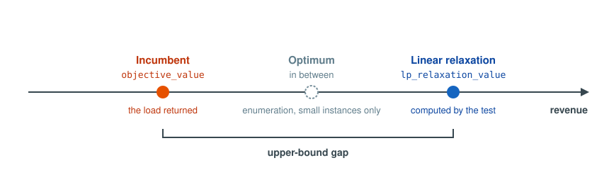
</p>

[Pseudocode: quality benchmark](#pseudo-quality-benchmark) keeps the two gaps apart, since they measure different
things, and counts the `null` returns separately, since the contract allows them and they have no gap. It holds no
`expect`: it reports, and a person reads the report.

<a id="pseudo-quality-benchmark"></a>

**Pseudocode: quality benchmark**

```
// pseudocode: quality-benchmark
upper_bound_gaps = empty list
exact_gaps       = empty list
null_count       = 0

for each instance in the fixed benchmark instances:
    solution = Optimization().run(instance)
    if solution == null:
        null_count = null_count + 1
    else:
        bound = lp_relaxation_value(instance)
        add (bound − solution.objective_value) / bound to upper_bound_gaps
        if the instance is small enough to enumerate:
            optimum = EnumerationSolver().run(instance).objective_value
            add (optimum − solution.objective_value) / optimum to exact_gaps

report the average of upper_bound_gaps, the average of exact_gaps, and null_count
```

### Where this stops working

- **The relaxation can be loose.** The upper-bound gap includes the distance between the relaxation and the optimum, so
  it overstates how far a load falls short, sometimes by a lot.
- **Exact gaps exist only for small instances.** On a large one, only the upper-bound gap is available.

### Check yourself

1. `run` reaches its time limit and returns a Solution. Should the exact-value assertion of situation 6 apply to it?
2. On the same small instance, `Optimization` reports 12 revenue and `EnumerationSolver` reports 10. Is that a bug?
3. `run` returns `null` on an instance whose committed pallets fit. Does that break the time-limited contract?

<details>
<summary>Answers</summary>

1. No. The contract does not promise an optimal load, so assert the load checks, and track the load's quality in the
   benchmark.
2. Yes. No feasible load beats the optimum, so either the load is infeasible or its revenue is misreported, and the load
   checks show which.
3. No. `null` means only that the phase could not provide a feasible solution. The contract forces `null` on an instance
   with no feasible load, but it never forces a Solution.

</details>

### Further reading

- Laurence A. Wolsey, *Integer Programming*, 2nd edition, Wiley, 2020: linear relaxations, the bounds they give, and how
  branch-and-bound closes the gap between a load and its bound.
- David P. Williamson and David B. Shmoys, *The Design of Approximation Algorithms*, Cambridge University Press, 2011:
  where approximation guarantees, a floor a heuristic test could assert, come from.

> **Practice it**
>
> - Python: MIP without optimality exercise (coming soon)
> - Java: MIP without optimality exercise (coming soon)

---

<a id="ch-dss-testing"></a>

## Testing a decision-support system

A decision-support system promises its users a decision, not an algorithm: behind its [interface](#ch-interface), the
load may come from enumeration, a heuristic or a solver, and the choice may change. Its tests therefore see only what
the interface returns.

A decision-support system is more than its optimization model. Data arrives from other systems, business rules turn it
into model parameters, the model computes a decision, and the decision flows back to the people and systems that act on
it. Each of these parts can break. For most of them, the expected output is cheap to write down: you know what a data
check or a business rule should return before running it. The model is the exception, because its expected output is the
very thing it exists to compute. The chapter will map each part of the system to the kind of test that fits it.

The chapter will also sort the oracles of the model chapters by what survives behind an interface. All of them already
treat `Optimization` as a black box: they need only the instance and what `run` returns.

---

<a id="ch-conclusion"></a>

## Conclusion

A test is an experiment with an expected answer, and each chapter of this section is a way of obtaining that answer, up
to the case where the answer is the very thing the model computes.

- **Test the promise, not the mechanism** ([Interface vs implementation](#ch-interface)). What a unit does outlives how
  it does it.
- **A unit test is a small experiment** ([Unit testing](#ch-unit-testing)). One behavior, fixed inputs and a stated
  prediction.
- **Nothing tests the test** ([Writing good tests](#ch-clear-tests)). A test must be obviously correct at a glance.
- **Red first shows the cause** ([Test-driven development](#ch-tdd)). A test that failed before the code existed shows
  that the code made it pass.
- **Record the calls you cannot observe** ([Mocks](#ch-mocks)). When a behavior is a call to another system, a mock
  keeps the record the test checks.
- **Keep what only your program uses real** ([Integration testing](#ch-integration)). Mock what others observe, and let
  the real files and databases show where units disagree.
- **Test the pipeline through its contract** ([Testing an optimization model](#ch-model-testing)). `run` and the
  Solution it returns are the promise; the five private steps behind them are not.
- **Sort the checks by what the test knows**
  ([Testing a mixed-integer program with optimality guaranteed](#ch-mip-optimal)). A known answer, a second
  implementation, or only conditions every answer meets.
- **Without optimality, test what is still promised**
  ([Testing a mixed-integer program without optimality guaranteed](#ch-mip-no-optimality)). Load validity and `null` on
  an impossible instance remain tests; solution quality is tracked over time as a benchmark.
- **Behind an interface, only the output counts** ([Testing a decision-support system](#ch-dss-testing)). The techniques
  that read the output survive a hidden algorithm; the ones that need the solver do not.

With the system tested, the next section puts it in front of its users.

---

## Ideas to develop

- Testing models with a [second objective](../appendix/running-example.md#ev-second-objective), with and without
  optimality.

---

[← Book contents](../../README.md) · [Next section: 06 Deploying decision-support software →](../06-deployment/README.md)
