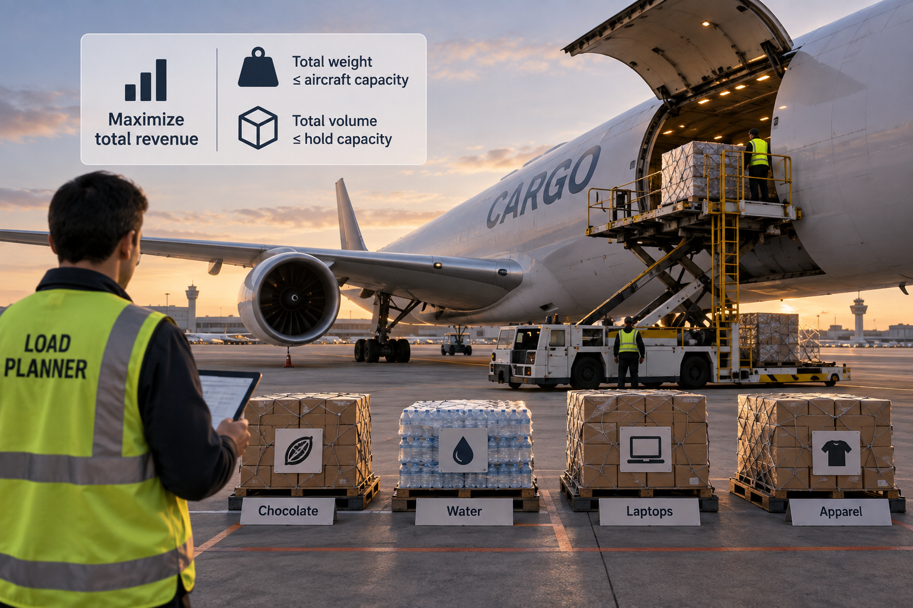

# The running example

A cargo airline flies freighters on scheduled departures. Shippers want to send pallets of goods — boxed chocolate,
bottled water, cartons of laptops — and a departure can rarely carry everything that was tendered. A load planner
decides how many pallets of each product go on the aircraft.

> [!NOTE]
> This is a simplified example on purpose. A real freighter operation might also consider how the load is balanced,
> which pallets may be stacked on which, and how dangerous goods are kept apart. The subject of this book is the
> engineering around a model rather than the model itself.

---

## The business problem

### The decision

Given a cargo flight, how many pallets of each tendered product to load, so that the revenue the aircraft carries is
as large as possible, without exceeding what it can lift or what fits in the hold.

What is *not* decided here: which aircraft flies, where it flies, what a shipper is charged, and the order in which
pallets are physically placed.

  

### Who is our client

The load planner works once the booking list for a departure closes. They receive a load list, and they are
accountable for the operational decision of how to load the flight. They use this system as a guideline.

### The inputs

| Input             | Description                                                                    |
|-------------------|--------------------------------------------------------------------------------|
| Booking list      | How many pallets of each product were tendered, and how many of those must fly |
| Product catalogue | Weight, volume and revenue for one pallet of each product                      |
| Aircraft capacity | The maximum weight this aircraft may carry, and the volume of its hold         |

### The rules a proposal must respect

- A pallet is loaded whole. There is no such thing as loading part of one.
- A load may exceed neither the weight the aircraft may carry nor the volume of its hold.
- The system never loads more pallets of a product than were tendered.
- Revenue counts only for pallets actually loaded. A pallet left behind earns nothing.
- Some shipments are committed beforehand and must fly on this departure.

---

## An optimization model for this problem

This problem can be formulated as a classical knapsack problem. Given a booking list, a catalogue and the two
capacities, the system returns either a loadable selection of pallets that maximizes revenue, or the statement that
no selection is loadable. A selection is loadable when it respects all business constraints.

### Sets

- $I$ — the products on the booking list for this departure. The index $i$ runs over it.

### Parameters

Assume all these are deterministic.

For each product $i \in I$:

- $r_i \ge 0$ — the revenue of one pallet, in thousands of USD.
- $w_i \ge 0$ — the weight of one pallet, in tonnes.
- $v_i \ge 0$ — the volume of one pallet, in m³.
- $u_i$ — the number of pallets tendered, a non-negative integer.
- $l_i$ — the number of those pallets that are preloaded, an integer with $0 \le l_i \le u_i$.

For the aircraft:

- $W \ge 0$ — the maximum weight the aircraft may carry, in tonnes.
- $V \ge 0$ — the volume of its hold, in m³.

### Variables

- $x_i \in \mathbb{Z \ge }0$ — the number of pallets of product $i$ loaded, for each $i \in I$.

### Objective function

Maximize revenue:

$$
\max_{x} \quad \sum_{i \in I} r_i x_i
$$

### Constraints

**(C1) Weight capacity.** The loaded pallets weigh no more than the aircraft may carry.

$$
\sum_{i \in I} w_i x_i \le W
$$

**(C2) Hold capacity.** The loaded pallets fit in the hold.

$$
\sum_{i \in I} v_i x_i \le V
$$

**(C3) Tender limit.** No product loads more pallets than were tendered.

$$
x_i \le u_i \qquad \forall i \in I
$$

**(C4) Committed freight.** Every pallet that must fly is loaded.

$$
x_i \ge l_i \qquad \forall i \in I
$$

**(C5) Whole pallets.**

$$
x_i \in \mathbb{Z} \qquad \forall i \in I
$$

Put together, the complete model reads:

$$
\begin{aligned}
\max_{x} \quad & \sum_{i \in I} r_i x_i \\
\text{s.t.} \quad & \sum_{i \in I} w_i x_i \le W & \text{(C1) weight capacity} \\
& \sum_{i \in I} v_i x_i \le V & \text{(C2) hold capacity} \\
& x_i \le u_i \quad \forall i \in I & \text{(C3) tender limit} \\
& x_i \ge l_i \quad \forall i \in I & \text{(C4) committed freight} \\
& x_i \in \mathbb{Z} \quad \forall i \in I & \text{(C5) whole pallets}
\end{aligned}
$$

Note the feasible region could be empty if the commited freight exceeds either the weight or volume capacity.

### Notation

| Symbol | Type | Meaning | Unit | Domain |
|:---:|---|---|---|---|
| $I$ | set | products on the booking list | — | finite set |
| $i$ | index | one product | — | $i \in I$ |
| $r_i$ | parameter | revenue of one pallet of product $i$ | thousands of USD | $r_i \ge 0$ |
| $w_i$ | parameter | weight of one pallet of product $i$ | tonnes | $w_i \ge 0$ |
| $v_i$ | parameter | volume of one pallet of product $i$ | m³ | $v_i \ge 0$ |
| $u_i$ | parameter | pallets of product $i$ tendered | pallets | $u_i \in \mathbb{Z}_{\ge 0}$ |
| $l_i$ | parameter | pallets of product $i$ that must fly | pallets | $l_i \in \mathbb{Z}$, $0 \le l_i \le u_i$ |
| $W$ | parameter | maximum weight the aircraft may carry | tonnes | $W \ge 0$ |
| $V$ | parameter | volume of the hold | m³ | $V \ge 0$ |
| $x_i$ | variable | pallets of product $i$ loaded | pallets | $x_i \in \mathbb{Z}_{\ge 0}$, $l_i \le x_i \le u_i$ |

### An example instance

| Product | Weight $w_i$ | Volume $v_i$ | Revenue $r_i$ | Must fly $l_i$ | Tendered $u_i$ |
|---|:---:|:---:|:---:|:---:|:---:|
| A — boxed chocolate | 2 | 1 | 10 | 0 | 1 |
| B — bottled water | 1 | 2 | 6 | 0 | 1 |

with $W = 2$ tonnes and $V = 2$ m³, and nothing committed to fly:

$$
\begin{aligned}
\max_{x} \quad & 10 x_A + 6 x_B \\
\text{s.t.} \quad & 2 x_A + x_B \le 2 \\
& x_A + 2 x_B \le 2 \\
& x_A, x_B \in \{0, 1\}
\end{aligned}
$$

Loading both pallets weighs 3 tonnes, over the 2 the aircraft may carry, so at most one pallet flies, and chocolate
earns more than water. The optimal solution is $x_A = 1$, $x_B = 0$:

| Value | Computed as | Result |
|---|---|:---:|
| Revenue | $10 \cdot 1 + 6 \cdot 0$ | 10 thousand USD |
| Payload used | $2 \cdot 1 + 1 \cdot 0$ | 2 of 2 tonnes |
| Hold used | $1 \cdot 1 + 2 \cdot 0$ | 1 of 2 m³ |

## Evolutions of the model

The model above is held fixed across the book. Two explicit evolutions of it appear in
[Testing an optimization model](../05-testing/README.md#ch-model-testing), each a change in the business, not a side
effect of a chapter.

### Bulk variant: a linear program

Before the business moves to pallets, products are loaded in bulk, by the tonne. Each quantity $x_i$ becomes a real
number with $l_i \le x_i \le u_i$, measured in the unit the product is sold in, and every other element of the model
stays the same. With continuous variables, the model is a linear program.

### A second objective: minimum weight

Among the loads that carry the most revenue, the airline prefers the lightest, because weight burns fuel. The model
becomes lexicographic: first maximize revenue, then, among the loads that keep revenue at its maximum, minimize the
total weight

$$
\min_{x} \quad \sum_{i \in I} w_i x_i .
$$
